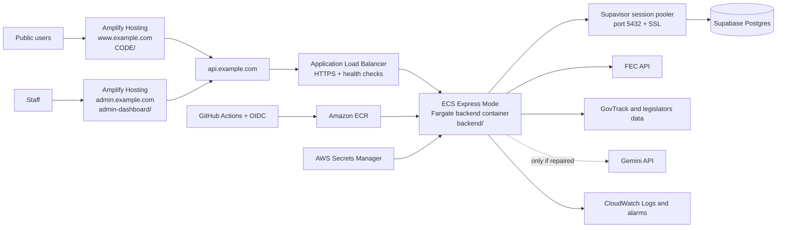

# VoteInformed AWS + Supabase Deployment Plan

**Prepared:** August 18, 2026  
**Target public launch:** August 25, 2026  
**Repository:** `2026Midterms`  
**Recommended region:** `us-east-1` for AWS and the new Supabase project, unless a Supabase project has already been created in another region. Keeping the API and database in the same AWS region reduces latency.

## Executive decision

Do **not** provision an EC2 instance for this launch, and do **not** try to deploy the whole system with Amplify.

Use this architecture:

| Layer | Service | Why |
|---|---|---|
| Public React/Vite site (`CODE/`) | AWS Amplify Hosting | Git-based deploys, CDN, HTTPS, custom domain, and SPA hosting without server maintenance |
| Admin React/Vite site (`admin-dashboard/`) | A second AWS Amplify Hosting app | Keeps the staff surface separate at `admin.<domain>` and supports independent access controls/deploys |
| Express/Prisma API (`backend/`) | Amazon ECS Express Mode on Fargate | Runs the existing Docker image without maintaining an EC2 server; provisions load balancing, TLS, autoscaling, networking, and CloudWatch integration |
| Container registry | Amazon ECR | Stores immutable backend images tagged by Git commit |
| PostgreSQL | Supabase Pro | Managed Postgres, dashboard, daily backups, and a supported Supavisor connection path for Prisma |
| Runtime secrets | AWS Secrets Manager | Keeps database and API credentials out of GitHub, Amplify, and the container image |
| Domain and TLS | Route 53 + ACM, or the current registrar with AWS DNS records | `www.<domain>`, `api.<domain>`, and `admin.<domain>` |
| CI/CD | GitHub Actions using AWS OIDC | Builds, tests, pushes to ECR, deploys ECS, and avoids permanent AWS access keys |
| Logs and alerts | CloudWatch + AWS Budgets + Supabase monitoring | Gives the launch an observable failure path and cost guardrails |

AWS has [closed App Runner to new customers](https://docs.aws.amazon.com/apprunner/latest/dg/apprunner-availability-change.html) and recommends ECS Express Mode as the simpler replacement. ECS Express Mode creates an ECS/Fargate service, Application Load Balancer, autoscaling, security groups, networking, and an application URL from a container image. That makes it a better current recommendation than either App Runner or a hand-managed EC2 instance.

Amplify is still the right choice for the two Vite applications. AWS documents Amplify as managed static/web-app hosting backed by S3 and CloudFront, with Git-based continuous deployment. It does not replace the long-running Express API or the FEC ingestion jobs.

## Target architecture



Suggested production hostnames:

- `www.<domain>` — public Amplify app
- `<domain>` — redirect to `www.<domain>`
- `api.<domain>` — ECS Express Mode API
- `admin.<domain>` — admin Amplify app

## Why not EC2, Amplify alone, or Lambda?

| Option | Decision | Assessment for this repository |
|---|---|---|
| EC2 + Supabase | Do not use for the one-week launch | It works, but adds OS patching, SSH/IAM hardening, Docker/process supervision, reverse proxy configuration, TLS, recovery, and manual scaling. None of that improves the product. |
| Amplify alone | Not sufficient | Amplify fits both static Vite builds, but the Express API is a persistent Node service with Prisma connections and long-running ingestion work. |
| Amplify + Lambda | Do not migrate this week | Moving the API to Lambda would require adapting Express, validating every Prisma connection pattern, and separating long-running jobs. It is unnecessary launch risk. |
| Amplify + ECS Express Mode + Supabase | **Recommended** | Reuses all three existing builds and the existing backend Dockerfile while removing server maintenance. |
| Amplify + standard ECS Fargate | Fallback | Use this if ECS Express Mode is unavailable in the chosen account/region or if more network/task-definition control is immediately required. |
| App Runner | Do not choose for a new AWS customer | AWS has closed it to new customers and recommends ECS Express Mode. |

## What is actually in the repository today

The repository contains three applications and approximately 41,000 tracked lines across code, workflow files, migrations, and documentation.

### Working foundation

- `CODE/`: React 18, Vite, TypeScript, React Router, TanStack Query, Tailwind, shadcn/ui.
- `admin-dashboard/`: React 18, Vite, TypeScript, and a database-backed admin login/session flow.
- `backend/`: Node 20, Express, TypeScript, Prisma 6, PostgreSQL, FEC sync services, GovTrack ideology sync, admin/researcher authentication, and Docker packaging.
- `backend/prisma/`: a complete baseline plus four follow-up migrations for finance integrity, itemized cursors, admin sessions, and cross-process sync leases.
- The backend, public site, and admin dashboard all build successfully as of August 18, 2026.
- The public frontend passes the repository's strict ESLint command.
- `.env` files are ignored; only example files are tracked.
- The backend exposes `/api/health` and already returns `503` when PostgreSQL cannot be reached.
- The backend has a database lease that prevents two full FEC syncs from doing the same work concurrently.

### Current deployment and data problems

- The local backend `DATABASE_URL` still points to the now-removed Railway database. It must be replaced; no current database is available to migrate in place.
- `.github/workflows/backend-deploy.yml` still deploys to Railway.
- The frontend and admin deploy workflows still target Vercel.
- The FEC sync exists both in the backend process and in a scheduled GitHub workflow. These are different schedules and must not both remain active in production.
- There are no automated unit, API, or browser tests. Current CI only compiles, lints, and builds.
- The public Vite JavaScript bundle is about 660 KB minified; this is a performance warning, not a launch blocker.
- `backend/src/controllers/chat.controller.ts` uses `gemini-1.5-flash`, which Google [shut down in September 2025](https://ai.google.dev/gemini-api/docs/changelog). The chat endpoint should be considered broken today.
- The chat is not grounded in this application's candidate/election database and stores conversation history only in process memory. It is unsafe to present as authoritative civic information.
- The repository does not contain the Census county seed CSV or MIT Election Lab result CSVs. The researcher race tracker/simulator cannot be reconstructed from code alone.
- Candidate biographies, campaign websites, social links, policy positions, roll-call voting records, primary election support, polling, and state-level offices are incomplete or missing.
- The public UI still contains “Primary Elections Coming Soon” and “Polling Data Coming Soon” placeholders, and its state voting-requirements language promises more than the current page delivers.

## What can be rebuilt after Railway was removed

| Data | Recoverable from code/external source? | Launch action |
|---|---|---|
| Database schema | Yes | Run the committed Prisma migrations against a fresh Supabase project. |
| Candidates, committees, and finance totals | Yes, from the FEC API | Run an initial full sync after migrations. Budget several hours and watch rate-limit/error logs. |
| Itemized receipts/disbursements | Yes, gradually from the FEC API | Let the bounded cursor-based job backfill over repeated runs; disclose partial coverage. |
| Election race shells | Yes | Generated by the FEC sync/election service. |
| Ideology scores | Yes, from GovTrack/legislator sources | Run the ideology sync once, then monthly. |
| Admin and researcher users | No | Recreate them with the repository scripts and new passwords. |
| Deadlines entered through admin | No | Re-enter and verify each against an official state source. |
| County seed and historical results | Not from this repo | Re-download the approved Census/MIT source files, verify licenses and columns, then import; otherwise keep research pages private/hidden. |
| Manually enriched candidate fields | No known source in this repo | Re-enter only if a backup/export exists; otherwise do not show empty claims as complete. |

If a Railway SQL dump exists anywhere, restore it into Supabase before running the syncs. If no dump exists, treat Supabase as a clean rebuild and do not spend launch week trying to recover a deleted service with no export.

## Supabase production setup

Use Supabase as managed PostgreSQL only for this first launch. The code does not use `supabase-js`, Supabase Auth, Storage, Realtime, or Edge Functions; all browser data access goes through Express and Prisma.

1. Create a **Supabase Pro** project in the same region as ECS. For a new deployment, use exact region `us-east-1` unless availability or an existing project dictates otherwise.
2. Generate a long random database password and store it in a password manager and AWS Secrets Manager.
3. Follow Supabase's current [Prisma connection guide](https://supabase.com/docs/guides/database/prisma). Use the **Supavisor session pooler on port 5432** for this persistent ECS service. Do not use the direct IPv6-only endpoint unless the ECS network is explicitly configured for it.
4. Require SSL. Supabase's [production checklist](https://supabase.com/docs/guides/deployment/going-into-prod) recommends enabling SSL Enforcement.
5. Because this application does not use PostgREST/GraphQL, turn off the Supabase Data API for the project. This reduces public attack surface and avoids accidentally exposing Prisma-managed `public` tables. If the Data API is enabled later, enable RLS and write table-specific policies before granting `anon` or `authenticated` access.
6. Run the Supabase Security Advisor after migrations.
7. Confirm daily backups in **Database > Backups**. Supabase documents seven days of daily backup access on Pro; use PITR if the data value or update rate justifies it. Also schedule an off-platform logical dump.
8. Do not enable database IP restrictions during the first deployment unless ECS has stable outbound addresses. Default Express Mode/Fargate egress can change. A later hardened design can use private subnets plus a NAT gateway/EIP and then allowlist that CIDR in Supabase.
9. Take and verify one logical backup after initial ingestion and before public launch.

Current Supabase guidance is important here: persistent servers should use a direct connection when IPv6 is available, otherwise the Supavisor session pooler; transaction mode is intended for temporary/serverless clients. See [Connect to Postgres](https://supabase.com/docs/guides/database/connecting-to-postgres) and [Connection management](https://supabase.com/docs/guides/database/connection-management).

### Database creation order

1. Create the Supabase project and Prisma database user.
2. Set the new production migration connection as the protected GitHub environment secret `PRODUCTION_DATABASE_URL`.
3. Add `workflow_dispatch` to `.github/workflows/db-migrate.yml` so the first migration can be run manually.
4. Run `npx prisma migrate deploy` from the `backend/` directory through the protected production environment.
5. Run `npx prisma migrate status` and confirm all five migrations are applied.
6. Deploy the backend and verify `/api/health` reports `database: connected`.
7. Create a new admin user using the `admin:create` script with `ADMIN_PASSWORD` injected from a secret; do not place the password in a shell command, GitHub log, or task definition as plain text.
8. Run the first full FEC sync and the first ideology sync.
9. Re-enter verified deadlines.
10. Import county/historical data only if the source files have been reacquired and validated.

## AWS backend setup

The existing `backend/Dockerfile` is suitable as the starting point. It builds the TypeScript app and Prisma client, runs on Node 20, exposes port `3001`, and intentionally leaves migrations as a separate operation.

### Required AWS resources

- One private ECR repository, for example `voteinformed-api`.
- One ECS Express Mode service, for example `voteinformed-api-production`.
- ECS task execution and Express infrastructure roles created through the console flow.
- A GitHub Actions deployment role trusted through GitHub OIDC.
- A CloudWatch log group with retention configured.
- Secrets Manager entries for runtime secrets.
- ACM certificate and DNS record for `api.<domain>`.
- An AWS Budget and billing alert before traffic is opened.

AWS's [ECS Express Mode first-run guide](https://docs.aws.amazon.com/AmazonECS/latest/developerguide/express-service-first-run.html) supports ECR images, port/health settings, plain environment variables, Secrets Manager references, security groups, CloudWatch logging, and scaling settings.

### Initial ECS settings

| Setting | Launch value |
|---|---|
| Container image | ECR image tagged with the Git commit SHA; never deploy only `latest` |
| Container port | `3001` |
| Health-check path | `/api/health` for launch; add separate `/api/live` and `/api/ready` endpoints during hardening |
| CPU/memory | Start with the Express Mode default of 1 vCPU / 2 GB, then adjust from CloudWatch evidence |
| Minimum tasks | `1` during the first week |
| Maximum tasks | `3` initially to cap cost and database connections |
| Public access | HTTPS through the Express Mode Application Load Balancer |
| Deployment | Canary/rollback behavior enabled by Express Mode |
| Logs | CloudWatch with structured application logs as a follow-up |

### Runtime configuration

Store these as ordinary environment variables:

- `NODE_ENV=production`
- `PORT=3001`
- `FEC_API_BASE_URL=https://api.open.fec.gov/v1`
- `FEC_API_MAX_REQUESTS_PER_HOUR=1000`
- `ITEMIZED_COMMITTEES_PER_RUN=10`
- `ITEMIZED_MAX_PAGES=5`
- `ITEMIZED_REFRESH_HOURS=72`
- `IDEOLOGY_CONGRESS=119`
- `FRONTEND_URL=https://www.<domain>`
- `ADMIN_URL=https://admin.<domain>`

Store these as Secrets Manager references:

- `DATABASE_URL`
- `FEC_API_KEY`
- `SYNC_API_KEY`
- `RESEARCHER_JWT_SECRET` — at least 32 random characters; production boot already rejects the development default
- `GEMINI_API_KEY` only if chat is deliberately repaired and enabled

`ADMIN_PASSWORD` and `ADMIN_EMAIL` are provisioning inputs, not permanent API runtime requirements. Inject them only into the one-off admin creation task.

### Backend changes required before deployment

1. Replace the Railway deploy workflow with GitHub OIDC → ECR → ECS Express Mode. AWS provides an [official Express Mode GitHub Actions pattern](https://docs.aws.amazon.com/apprunner/latest/dg/apprunner-availability-change.html#migrating-source-based-deployments).
2. Rename or remove `start:railway`; keep `npm start` as the production service command.
3. Add `app.set('trust proxy', 1)` before rate limiting so Express sees client addresses correctly behind the Application Load Balancer.
4. Add an `ENABLE_SCHEDULER` environment flag. Only one scheduling mechanism may be active.
5. For this one-week launch, keep the scheduler in the single minimum ECS task and disable `.github/workflows/sync-fec-data.yml`. The database lease protects against accidental overlap.
6. Immediately after launch, extract the scheduler into a one-off ECS task invoked by EventBridge Scheduler. AWS supports [scheduled ECS/Fargate tasks](https://docs.aws.amazon.com/AmazonECS/latest/developerguide/tasks-scheduled-eventbridge-scheduler.html). The one-off task must call the same complete sync function as the production scheduler, including itemized data, logs, and the lease.
7. Add a lightweight liveness endpoint and keep the database-aware endpoint as readiness. This prevents a temporary Supabase outage from causing endless healthy-process restarts.
8. Make chat optional behind a feature flag. For launch, disable it unless the model, grounding, citations, session storage, and civic-information safety behavior are repaired and tested.
9. Stop logging full successful API response payloads in the public frontend before launch; these logs add noise and can expose data in shared browser consoles.

## Amplify setup for both frontends

Create two Amplify Hosting applications connected to the same GitHub repository and `main` branch:

- Public app root: `CODE`
- Admin app root: `admin-dashboard`

Amplify supports monorepo app roots and requires `AMPLIFY_MONOREPO_APP_ROOT` to match each application's root. See [Amplify monorepo configuration](https://docs.aws.amazon.com/amplify/latest/userguide/monorepo-configuration.html).

Use these build values for each app:

| App | Install | Build | Artifact directory | Build-time variable |
|---|---|---|---|---|
| Public | `npm ci` | `npm run build` | `dist` | `VITE_API_URL=https://api.<domain>` |
| Admin | `npm ci` | `npm run build` | `dist` | `VITE_API_URL=https://api.<domain>` |

`VITE_API_URL` is public configuration embedded in browser JavaScript; it is not a secret.

Both apps use `BrowserRouter`, so configure an Amplify SPA rewrite:

```json
[
  {
    "source": "/<*>",
    "status": "200",
    "target": "/index.html",
    "condition": null
  }
]
```

AWS documents this exact single-page application pattern in [Amplify redirects and rewrites](https://docs.aws.amazon.com/amplify/latest/userguide/redirect-rewrite-examples.html).

Connect the domains only after the default Amplify and ECS URLs pass end-to-end testing. Then set the exact production `FRONTEND_URL` and `ADMIN_URL` values in ECS so CORS allows only those browser origins.

## CI/CD transition

### Remove or disable

- `.github/workflows/backend-deploy.yml` — Railway
- `.github/workflows/frontend-deploy.yml` — Vercel
- `.github/workflows/admin-deploy.yml` — Vercel
- `.github/workflows/sync-fec-data.yml` while the in-process scheduler is active
- `backend/railway.toml` after AWS production is confirmed

Keep the files during the first successful AWS deployment if rollback history is useful, but disable their triggers so a push cannot attempt a second provider deployment.

### Keep and improve

- Keep `.github/workflows/ci.yml`, but add tests before deploy jobs may run.
- Keep the database migration workflow and add `workflow_dispatch` plus the GitHub production approval gate.
- Change the Docker workflow from GHCR-only to ECR and tag images with the full commit SHA.
- Use GitHub OIDC (`id-token: write`) instead of `AWS_ACCESS_KEY_ID`/`AWS_SECRET_ACCESS_KEY` repository secrets.
- Deploy in this order: CI → database migration → ECR image → ECS canary deployment → health/smoke checks → Amplify production branch.
- Make production deploys manually approvable through the GitHub `production` environment until after launch week.

## Seven-day execution schedule

### Tuesday, August 18 — scope freeze and accounts

- Buy/confirm the domain and DNS ownership.
- Confirm AWS account MFA, billing alerts, GitHub access, FEC key, and Supabase ownership.
- Freeze the launch scope to the public candidate/election/finance experience plus the admin dashboard.
- Decide now to hide chat, primary/polling placeholders, and the research portal unless their launch gates are met.
- Create the Supabase Pro project and AWS ECR repository.

**Exit criteria:** region, domain, accounts, secrets owner, and public MVP are decided.

### Wednesday, August 19 — database rebuild

- Apply all Prisma migrations to Supabase.
- Verify migration status and database connectivity over the session pooler.
- Create a new admin account.
- Run a small FEC sync for one state before attempting all 50 states.
- Disable the Data API, enable SSL enforcement, run Security Advisor, and confirm backups.

**Exit criteria:** clean Supabase database, successful test query, admin login record, and one-state data visible through the local API.

### Thursday, August 20 — backend on AWS

- Add proxy trust, scheduler feature flag, chat feature flag, and liveness/readiness handling.
- Build the backend image, push it to ECR, and create the ECS Express Mode service.
- Inject Secrets Manager values and ordinary configuration.
- Test the default ECS URL before configuring `api.<domain>`.
- Add CloudWatch alarms for 5XX responses, unhealthy tasks, and task restarts.

**Exit criteria:** deployed API returns `200` with `database: connected`, restarts cleanly, and reads Supabase data.

### Friday, August 21 — public and admin sites

- Create both Amplify apps from the monorepo.
- Set `VITE_API_URL`, artifact directories, and SPA rewrites.
- Connect `www.<domain>` and `admin.<domain>`; connect `api.<domain>` to ECS/ACM.
- Set final CORS origins and retest.
- Verify admin login, logout, sync status, deadlines, and election generation.

**Exit criteria:** all three production URLs work over HTTPS and deep links do not 404.

### Saturday, August 22 — data and product truthfulness

- Run the complete FEC sync and ideology sync while watching FEC errors and Supabase connections.
- Verify candidate counts, state coverage, election counts, last-sync timestamps, finance totals, and several known FEC records.
- Re-enter sourced deadlines.
- Hide or rewrite unsupported claims and incomplete surfaces.
- Reacquire/import county data only if it can be completed and validated that day; otherwise keep the research portal non-public.

**Exit criteria:** production data coverage is measured, visible data has source/freshness language, and no public page pretends an incomplete feature is complete.

### Sunday, August 23 — test and security day

- Add minimum API integration tests for health, candidates, elections, admin auth, researcher auth, and protected sync routes.
- Add Playwright smoke tests for home, state selection, candidate detail, race detail, voter resources, admin login, and mobile navigation.
- Verify unauthenticated admin/research/sync requests fail.
- Verify CORS rejects an unknown website.
- Rotate any Railway-era database credentials and confirm no production secret is in Git or Amplify.
- Run dependency audit, CodeQL, browser accessibility checks, and link checks.
- Test a logical backup and document restore steps.

**Exit criteria:** CI is green, critical flows pass, no known high-severity security issue remains, and backup recovery is understood.

### Monday, August 24 — soft launch and go/no-go

- Invite a small group on real phones and browsers.
- Watch CloudWatch, ECS health, Supabase connections/query performance, and FEC sync behavior.
- Fix only launch-blocking bugs; do not add major features.
- Run the rollback drill: previous ECR image, prior ECS deployment, and Amplify redeploy.
- Freeze production after the final candidate/deadline refresh.

**Exit criteria:** 24-hour stable window has begun, no severe errors, and rollback is proven.

### Tuesday, August 25 — public launch

- Re-run the production smoke suite.
- Confirm backups, budget alerts, domain/HTTPS, CORS, admin access, and data freshness.
- Open public traffic and monitor closely for the first two hours.
- Publish a visible data-source/freshness/corrections note and a contact route.

**Exit criteria:** the public site is reachable, monitored, backed up, and honest about its coverage.

## Launch scope: what to ship and what to hide

### Ship publicly

- Homepage and state map
- Federal House/Senate election/race pages that have real data
- Candidate directory and candidate detail pages
- Campaign-finance totals and itemized/lobby views with coverage disclosures
- Verified deadlines
- Voter resource links
- About, methodology, data freshness, disclaimer, and correction/contact information

### Keep private or hide until repaired

- AI chat: current model endpoint is shut down and answers are not grounded in platform data
- Primary elections: current page is a placeholder
- Polling: current race page is a placeholder
- Research portal: keep private until Census/MIT input data is restored and tested
- Saved simulations: schema exists, but CRUD/UI is incomplete
- State voting requirements: link to official sources instead of implying the app has state-specific rules
- Policy positions and voting records: these core product promises do not yet exist in the data model

“Fully fleshed out” should mean a smaller, trustworthy production release next week—not publishing every unfinished screen. Policies, roll-call votes, state offices, primary ballot verification, grounded/cited chat, and live results belong in a post-launch roadmap unless additional people and validated data sources are available immediately.

## Go-live checklist

### Infrastructure

- [ ] Supabase and ECS are in the same region
- [ ] Supabase Pro backups and SSL enforcement are enabled
- [ ] Supabase Data API is disabled because the browser does not use it
- [ ] ECR image is tagged with the commit SHA
- [ ] ECS has one healthy minimum task and a bounded maximum
- [ ] `api.<domain>` has valid HTTPS and returns a healthy database status
- [ ] Both Amplify apps build with the production API URL
- [ ] SPA deep links return the application, not an S3/CloudFront 404
- [ ] AWS Budget and CloudWatch alarms are active

### Security

- [ ] AWS root account and administrators use MFA
- [ ] GitHub deploys through OIDC, not long-lived AWS access keys
- [ ] Runtime secrets are Secrets Manager references
- [ ] Old Railway database credential is rotated/revoked
- [ ] `RESEARCHER_JWT_SECRET` is unique and at least 32 random characters
- [ ] `SYNC_API_KEY` is unique and tested
- [ ] CORS contains only exact public/admin origins
- [ ] Express trusts exactly the load-balancer proxy hop
- [ ] Admin and sync endpoints reject unauthenticated traffic
- [ ] Dependency/CodeQL scans have no unresolved high/critical issue

### Data

- [ ] All Prisma migrations are applied
- [ ] Admin account is recreated with a new password
- [ ] Initial FEC sync completed and error counts were reviewed
- [ ] Ideology sync completed or its UI is hidden
- [ ] Deadlines were verified against official sources
- [ ] Itemized finance coverage is disclosed as partial while backfill continues
- [ ] County/research pages are hidden unless their datasets were restored
- [ ] A logical backup was created after initial ingestion

### Product quality

- [ ] No broken Gemini/chat feature is public
- [ ] No “Coming Soon” section appears in the primary launch journey
- [ ] Marketing copy matches implemented federal-election coverage
- [ ] Source, last-updated time, disclaimer, and correction contact are visible
- [ ] Mobile, Safari, Chrome, Firefox, and keyboard navigation were smoke-tested
- [ ] Core API and browser smoke tests run in CI
- [ ] A previous ECS image and Amplify deployment can be restored quickly

## Rollback and incident plan

- **Bad backend deploy:** point ECS Express Mode back to the previous commit-SHA ECR image or use its deployment rollback behavior.
- **Bad frontend deploy:** redeploy the previous successful Amplify build.
- **Bad migration:** do not auto-reverse a destructive migration. Restore from the pre-migration logical dump or Supabase backup, then redeploy the compatible application version.
- **Supabase outage:** serve a clear temporary-unavailable state; do not repeatedly restart every healthy Node process. This is why liveness and database readiness should be separate.
- **FEC sync failure:** keep serving the last successful data, mark freshness visibly, inspect `sync_logs`, and retry only after the cause is understood.
- **Credential exposure:** rotate the affected secret, force a new ECS deployment so tasks receive it, revoke active admin sessions if applicable, and review access logs.

## First work after launch

1. Move all scheduled ingestion into EventBridge Scheduler + one-off ECS Fargate tasks.
2. Add Redis or database-backed rate limits/session storage if the API scales past one task.
3. Split the public bundle with route-level lazy loading.
4. Restore the research datasets and add saved-simulation CRUD.
5. Build source-backed policy positions and roll-call voting records.
6. Add ballot verification and real primary data.
7. If chat returns, ground it exclusively in curated platform data and official sources, show citations/freshness, use a current model, persist sessions safely, and add strong political-information evaluation tests.
8. Add infrastructure as code after the first stable launch, so Supabase/AWS setup and recovery are repeatable.

## Official references

- [AWS App Runner availability change and ECS Express Mode recommendation](https://docs.aws.amazon.com/apprunner/latest/dg/apprunner-availability-change.html)
- [Create an ECS Express Mode service](https://docs.aws.amazon.com/AmazonECS/latest/developerguide/express-service-first-run.html)
- [ECS Express Mode production best practices](https://docs.aws.amazon.com/AmazonECS/latest/developerguide/express-service-best-practices.html)
- [Schedule ECS tasks with EventBridge Scheduler](https://docs.aws.amazon.com/AmazonECS/latest/developerguide/tasks-scheduled-eventbridge-scheduler.html)
- [Pass Secrets Manager secrets to ECS](https://docs.aws.amazon.com/AmazonECS/latest/developerguide/secrets-envvar-secrets-manager.html)
- [Amplify monorepo configuration](https://docs.aws.amazon.com/amplify/latest/userguide/monorepo-configuration.html)
- [Amplify SPA redirects and rewrites](https://docs.aws.amazon.com/amplify/latest/userguide/redirect-rewrite-examples.html)
- [Supabase Prisma guide](https://supabase.com/docs/guides/database/prisma)
- [Supabase Postgres connection choices](https://supabase.com/docs/guides/database/connecting-to-postgres)
- [Supabase production checklist](https://supabase.com/docs/guides/deployment/going-into-prod)
- [Supabase backups](https://supabase.com/docs/guides/platform/backups)
- [Supabase regions](https://supabase.com/docs/guides/platform/regions)
- [Supabase breaking-change changelog](https://supabase.com/changelog?types=breaking-change)
- [Gemini API model lifecycle and shutdown history](https://ai.google.dev/gemini-api/docs/changelog)

