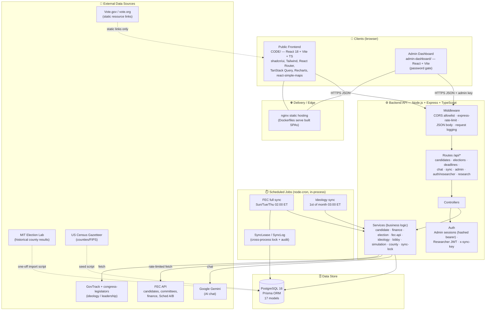
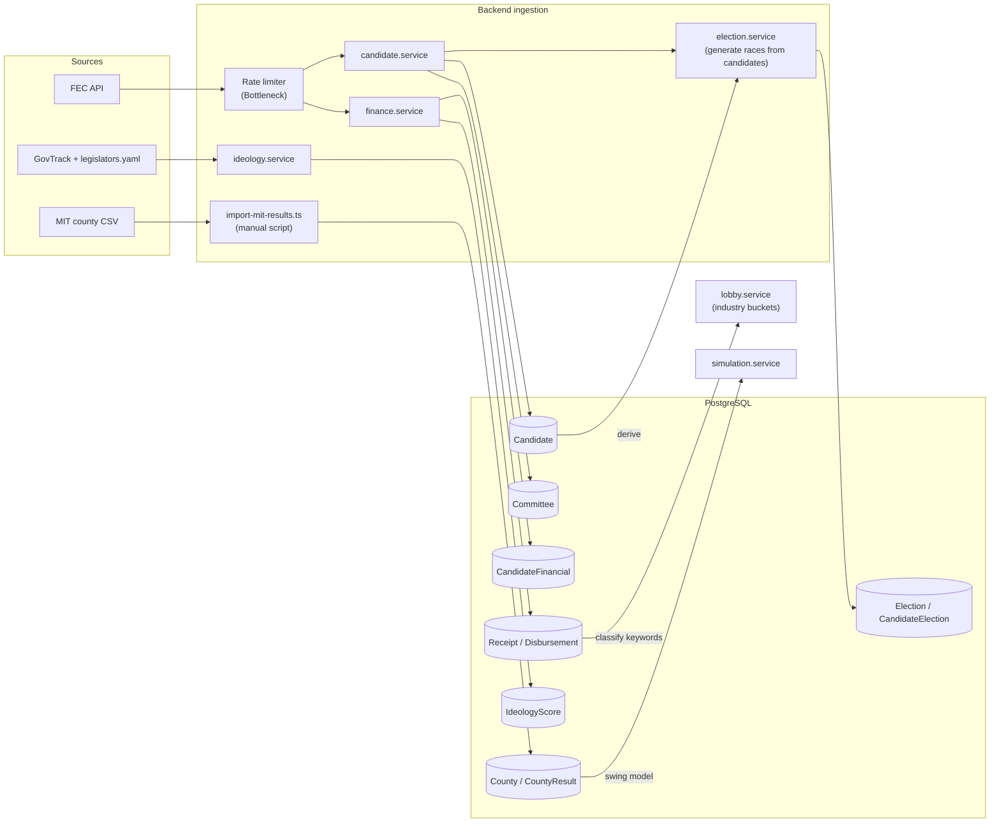
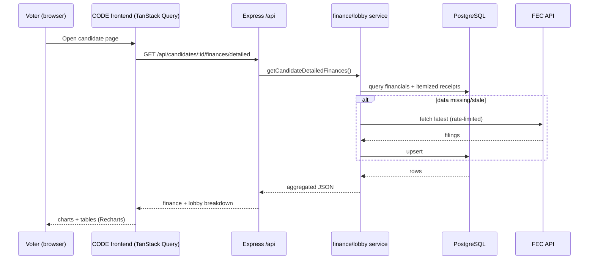
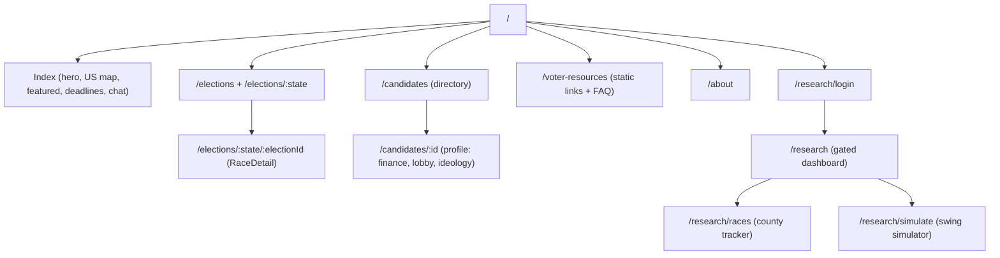
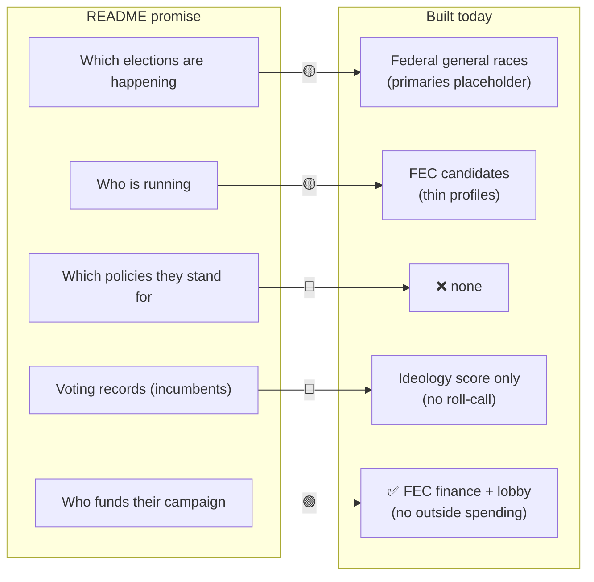
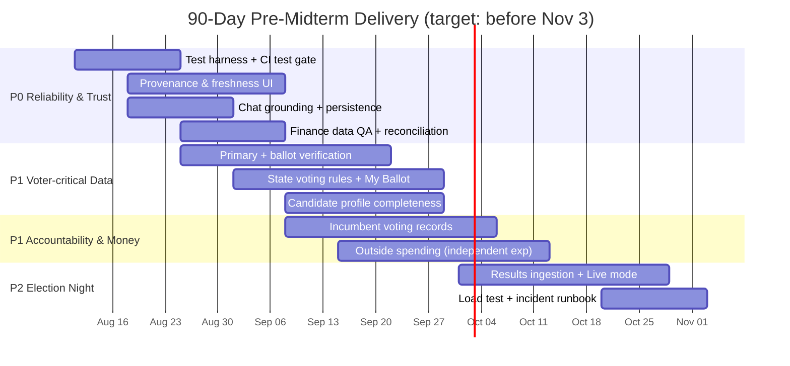
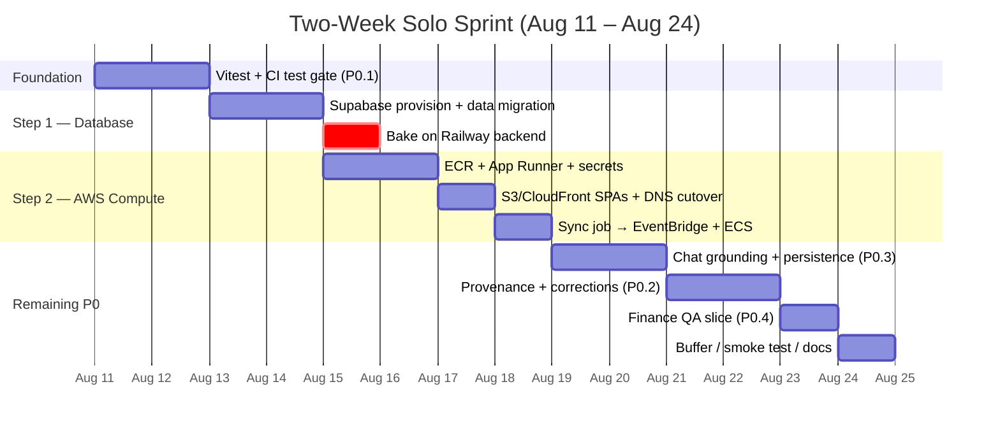
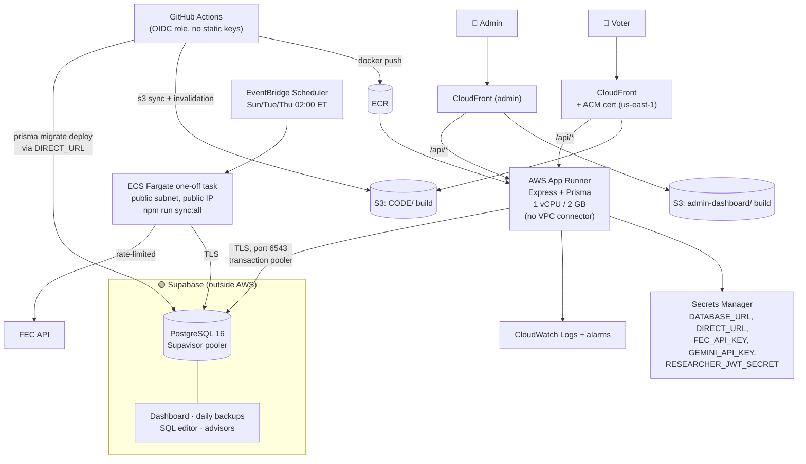

# VoteInformed / 2026 Midterms — Codebase Analysis & 90‑Day Pre‑Midterm Plan

**Author:** Automated codebase analysis
**Date:** August 11, 2026
**Scope reviewed:** Entire monorepo (`backend/`, `CODE/` public frontend, `admin-dashboard/`, `.github/` CI/CD, Prisma schema, jobs/services, existing planning docs)
**Deadline framing:** The general midterm election is ~**November 3, 2026**. This document treats the "90 days" window as the run‑up to Election Day and prioritizes accordingly.

> This is an independent analysis of what actually exists in the code today versus the product's stated promise. It complements the existing, much longer [`feature_roadmap.md`](./feature_roadmap.md) (a multi‑release, multi‑month plan) by compressing everything into a **deadline‑driven triage**: what must ship before voters go to the polls, what can wait, and what is at risk.

---

## 1. Executive Summary

**What the product promises** (from the repository `README.md`):

> "This website will educate voters in each state which federal and state elections are happening and the details on who is running and it will help them learn which policies each candidate stands for along with their voting records if incumbent and who funds their campaign."

**What actually exists today** is a solid **campaign‑finance + candidate directory** platform with a historical‑results research portal. The "who funds their campaign" pillar is the most mature. Two of the four core promises — **"which policies each candidate stands for"** and **"their voting records if incumbent"** — are **essentially not implemented** as first‑class, sourced data. **"State elections"** are also not modeled (only federal House/Senate).

**Headline findings:**

| Product Pillar (from README) | Status | Notes |
|---|---|---|
| Which federal elections are happening | 🟡 Partial | General races generated from FEC filings; **primaries are a "Coming Soon" placeholder**; ballot status largely `UNCONFIRMED` |
| Which **state** elections are happening | 🔴 Missing | Only `HOUSE`/`SENATE` federal offices modeled — no Governor / state legislature |
| Who is running (candidate details) | 🟡 Partial | FEC candidates synced; profile fields (bio, website, socials) exist in schema but have **no ingestion source** so they render empty |
| **Which policies each candidate stands for** | 🔴 Missing | **No `Issue` / `CandidatePosition` models at all** |
| **Voting records (if incumbent)** | 🔴 Missing | Only aggregate `IdeologyScore` + bill counts; **no roll‑call / per‑bill voting record model** |
| Who funds their campaign | 🟢 Strong | FEC summaries, itemized receipts/disbursements, lobby/industry breakdown |

**Biggest risks for a pre‑election launch:**

1. **Zero automated tests** anywhere in the repo. CI only type‑checks, lints, and builds. For a civic‑information product shipping under election‑day load, this is the #1 reliability risk.
2. **AI chat is not grounded in platform data** — it's a generic Gemini chatbot with in‑memory history (lost on restart, no cleanup / memory‑leak risk). For an election product, ungrounded answers are a **misinformation liability**.
3. **No data provenance / freshness / corrections surface** beyond "last synced" timestamps. Users can't see where a claim came from.
4. **Primaries + ballot verification incomplete** — the platform can't yet tell a voter who is actually confirmed on their ballot.

---

## 2. Repository Map

```
2026midterms/
├── backend/                 # Node.js + Express + TypeScript + Prisma API
│   ├── prisma/schema.prisma  # 17 models (candidates, finance, elections, counties, ...)
│   ├── src/
│   │   ├── config/           # env (Zod), Prisma client, FEC clients (std + "fast")
│   │   ├── controllers/      # admin, candidate, chat, deadline, election, researcher-auth
│   │   ├── services/         # candidate, finance, election, fec-api, ideology, lobby,
│   │   │                     #   simulation, county, sync-lock
│   │   ├── routes/           # candidates, sync, elections, admin, deadlines, chat,
│   │   │                     #   research, researcher-auth
│   │   ├── jobs/             # scheduler (node-cron), sync-all-data (+ "fast")
│   │   ├── scripts/          # create-admin, seed-counties, import-mit-results, sync-ideology, ...
│   │   └── server.ts
├── CODE/                    # Public frontend (Vite + React 18 + TS + shadcn/ui + Tailwind)
│   └── src/{pages,components,hooks,lib,types}
├── admin-dashboard/         # Internal admin app (Vite + React + Tailwind)
├── docker-compose.yml       # db (Postgres 16) + backend + frontend + admin
├── .github/workflows/       # CI, deploy (backend/frontend/admin), FEC sync cron,
│                            #   db-migrate, security-audit, codeql, stale
├── feature_roadmap.md       # Existing long-form roadmap (13 features, 6 releases)
├── CICD_PIPELINE_PLAN.md, PHASE5_PLAN.md, Product_requirment_document.docx
```

**Data stores & external integrations detected in code:**

- **PostgreSQL 16** via Prisma (17 models).
- **FEC API** (`api.open.fec.gov`) — candidates, committees, financial summaries, itemized Schedule A/B. Rate‑limited (Bottleneck) with a "fast" client variant.
- **GovTrack** sponsorship‑analysis files + **unitedstates/congress‑legislators** YAML crosswalk → incumbent ideology scores.
- **MIT Election Lab** county results (imported via script) → historical `CountyResult`.
- **US Census gazetteer** → `County` seeding.
- **Google Gemini** (`gemini-1.5-flash`) → AI chat.
- **Static** voter‑resource links (Vote.gov, vote.org) on the Voter Resources page.

---

## 3. Tech Stack Visual — Front End → Back End → Data Collection

### 3.1 End‑to‑end architecture



### 3.2 Data‑collection / ingestion pipeline



### 3.3 Request lifecycle (candidate finance example)



### 3.4 Frontend route → capability map



---

## 4. Feature Inventory — What Is Actually Built

### 4.1 Implemented and working (🟢)

- **Candidate directory & profiles** — filter by state/office/party/cycle, pagination; profile page shows finance, lobby breakdown, ideology.
- **Campaign finance (the strongest area)** — `CandidateFinancial` totals, itemized `Receipt`/`Disbursement` (Schedule A/B) with backfill cursors and amendment/`memoedSubtotal` handling, detailed finance endpoint, and a **lobby/industry classification** engine (`lobby.service.ts`) that buckets donations (AI/Big Tech, Oil & Gas, Pharma, Defense, Crypto, Labor, Pro‑Israel, etc.) with explicit coverage caveats.
- **Elections** — races generated from FEC candidate data; state map with per‑state race counts; race detail with candidate list.
- **Incumbent ideology scores** — GovTrack‑derived 0–100 ideology + leadership, monthly refresh, FEC↔GovTrack crosswalk.
- **Voter resources page** — static, sourced links to registration / polling place / absentee (Vote.gov, vote.org).
- **Deadlines** — admin‑managed registration/election deadlines, public endpoint, home‑page "upcoming deadlines".
- **Researcher portal (auth‑gated)** — JWT login; historical **county‑level results tracker**; **uniform‑swing simulator** (`simulation.service.ts`) with per‑race/statewide swings and flipped‑seat rollups.
- **Admin dashboard** — durable hashed‑token sessions, stats, sync trigger + status, election generation, deadline CRUD; login rate‑limited.
- **Data pipeline** — `node-cron` scheduler with a **DB‑backed cross‑process lease** (`SyncLease`) and `SyncLog` audit trail, bounded itemized backfill, rate limiting, skip‑if‑recently‑synced.
- **CI/CD** — GitHub Actions for type‑check/lint/build across all three apps, deploy workflows, scheduled FEC sync, DB migrate, CodeQL, dependency security audit, stale‑issue bot. Dockerized services + `docker-compose`.

### 4.2 Partially implemented (🟡)

- **AI chat** — works via Gemini, but **not connected to any platform data** (no retrieval of candidates/finance/elections), and history is **in‑memory only** (code comments flag: lost on restart, no cleanup, potential memory leak).
- **Primary elections** — filter tab exists but UI shows **"Primary Elections Coming Soon"**; ballot status defaults to `UNCONFIRMED`.
- **Candidate profile depth** — schema has `biography`, `campaignWebsite`, `socialMedia`, `currentOfficeHeld`, but **no ingestion source populates them** → fields render empty.
- **Saved simulations** — `SavedSimulation` + `ResearcherUser` models exist, but **no CRUD endpoints/UI** wire them up (research routes expose races/simulate only).

### 4.3 Not implemented / missing (🔴)

| # | Missing capability | Evidence in code | Impact |
|---|---|---|---|
| 1 | **Issue/policy positions** | No `Issue`/`CandidatePosition`/`PositionEvidence` models in `schema.prisma` | Core README promise unmet |
| 2 | **Voting records (roll‑call)** | Only `IdeologyScore` (aggregate) — no per‑bill/vote model | Core README promise unmet |
| 3 | **State (non‑federal) elections** | `office` limited to `HOUSE`/`SENATE` | "state elections" promise unmet |
| 4 | **Outside / independent expenditures (Super PACs)** | FEC sync covers candidate committees only; no IE endpoints/models | Incomplete "who funds them" |
| 5 | **Live election‑night results** | `CountyResult` is historical (MIT) only | No results mode for Nov 3 |
| 6 | **Polling data** | `RaceDetail.tsx` shows "Polling Data Coming Soon" placeholder | Empty section |
| 7 | **State voting rules + "My Ballot" by address/ZIP** | VoterResources is generic static links; no `StateVotingRule`, no district resolver | Personalization promise unmet |
| 8 | **Data provenance / freshness / corrections** | Only `lastUpdated`/`lastSynced` timestamps; no `SourceRecord`, no "report a problem" | Trust gap |
| 9 | **Automated tests** | No `test` script / no jest/vitest in any `package.json`; CI has no test job | Reliability risk |
| 10 | **Voter accounts, watchlists, alerts, i18n, offline, public API/embeds** | None present | Post‑election scope |
| 11 | **Chat grounding + persistence, Redis cache, full‑text search, OpenAPI docs** | None present | Quality/scale gaps |

---

## 5. Gap Analysis Against the Product Promise

The README makes four concrete promises. Mapping them to reality:



**Conclusion:** the platform is ~60% of the way to its own stated promise. The finance pillar is genuinely strong. The two "accountability" pillars (policy positions + voting records) are absent, and election/ballot completeness is the highest‑value near‑term fix for actual voters.

---

## 6. The 90‑Day Pre‑Midterm Plan

**Guiding principle:** with Election Day ~12 weeks out, **do not start anything that can't ship, be sourced, and be verified in time.** Favor (a) reliability, (b) data completeness that directly helps a voter cast an informed ballot, and (c) the "who funds them / how did they vote" accountability content the product promises. Explicitly **defer** large net‑new subsystems (accounts, alerts, campaign portal, public API, i18n, offline) to **after** the election.

### Priority definitions

- **P0 — Must ship before Election Day.** Reliability, trust, and voter‑critical correctness. Nothing else should start until these are underway.
- **P1 — High value, ship if P0 is on track.** Accountability content and money transparency.
- **P2 — Stretch / election‑night.** Valuable but riskier or dependent on external providers.
- **Deferred — After Nov 3.** Retention/scale features from the long roadmap.



---

### P0 — Reliability & Trust Foundation (Weeks 1–4)

These are prerequisites for shipping anything else safely before an election.

#### P0.1 — Automated test harness + CI test gate
- **Why:** There are currently **zero tests**. Pure calculation/normalization logic (finance aggregation, lobby classification, swing simulation, calendar‑date handling) is exactly what breaks silently and misleads voters.
- **Do:**
  - Add **Vitest** to `backend/` and `CODE/`; add a `test` script and a **CI `test` job** gating merges.
  - Unit‑test the highest‑risk pure functions first: `simulation.service` (`simulateFromRows`), `lobby.service` matching/aggregation, finance aggregation, `utils/calendar-date.ts`, `utils/pagination.ts`.
  - Add API integration tests against an ephemeral Postgres (the CI already spins Node; add a service container) for `/candidates`, `/elections`, `/deadlines`.
  - Add **contract fixtures** for the FEC client so ingestion logic is testable offline.
- **Effort:** Medium. **Risk if skipped:** High — regressions ship undetected under election load.

#### P0.2 — Data provenance & freshness surface
- **Why:** For a civic product, "where did this come from and how fresh is it?" is table stakes; today only `lastUpdated` exists.
- **Do:**
  - Add a lightweight `meta` envelope (`generatedAt`, `source`, `freshness`) to public finance/election/candidate responses (no schema migration required to start — derive from existing `lastUpdated`/`SyncLog`).
  - Frontend: reusable `SourceLink` + `FreshnessBadge` components placed **next to** finance totals, deadlines, and ideology scores.
  - Add a minimal **"Report a problem"** endpoint (`POST /api/corrections`) with rate limiting + spam controls, and an admin triage list. (Full `SourceRecord` provenance model is deferred; this is the pragmatic pre‑election slice.)
- **Effort:** Medium.

#### P0.3 — Ground the AI chat in platform data + persist sessions
- **Why:** An ungrounded election chatbot is a **misinformation risk**; in‑memory history is a stability/memory‑leak risk (flagged in the code).
- **Do:**
  - Add retrieval: before calling Gemini, fetch relevant candidate/election/finance/deadline rows and pass them as grounded context; instruct the model to answer **only** from provided data and to say "I don't have verified information on that" otherwise.
  - Persist conversations in Postgres (or Redis with TTL) instead of the module‑level `conversations` object; add session cleanup.
  - Add a visible disclaimer + link to sources in chat responses.
- **Effort:** Medium.

#### P0.4 — Finance data QA & amendment reconciliation checks
- **Why:** Finance is the flagship feature; amended FEC filings can double‑count if reconciliation is wrong.
- **Do:** Add reconciliation tests/fixtures for amended filings, a data‑coverage report (per candidate: itemized backfill complete?), and admin alerts for large unexpected record‑count deltas after a sync.
- **Effort:** Small–Medium (builds on existing backfill cursors).

---

### P1 — Voter‑Critical Data Completeness (Weeks 3–9)

#### P1.1 — Primary + ballot verification (remove "Coming Soon")
- **Why:** Many state primaries fall inside this window; the platform currently can't tell a voter who is **confirmed on the ballot**.
- **Do:**
  - Extend `Election` with primary metadata (primary type, party, runoff link, official source URL, verification status).
  - Move ballot status from FEC‑derived guessing to an **admin verification queue** that promotes `UNCONFIRMED → CONFIRMED` against official state sources; visually separate "filed with FEC" from "confirmed on ballot".
  - Remove the "Primary Elections Coming Soon" UI only once a state has verified data.
- **Effort:** Medium–High. Depends on P0.2 for source labeling.

#### P1.2 — State voting rules + "My Ballot" (address/ZIP → your races)
- **Why:** The single highest‑value voter feature: "what's on *my* ballot and how do I vote?"
- **Do (pragmatic slice):**
  - Add `StateVotingRule` (registration deadline, ID, early/absentee, ballot return) with **official source + last‑verified date** per state.
  - Add `POST /api/ballot/resolve` (ZIP or address → state + congressional district) behind a `DistrictResolver` interface; **do not persist raw addresses** (transient resolution → store district only).
  - `/my-ballot` page: your federal races + key dates + registration/voting options + printable checklist. Anonymous local‑storage persistence (no accounts required).
- **Effort:** High. **De‑risk:** start with ZIP‑only + a curated pilot set of states, expand coverage weekly.

#### P1.3 — Candidate profile completeness
- **Why:** Profiles have empty bio/website/social fields today.
- **Do:** Populate `biography`, `campaignWebsite`, `socialMedia`, `currentOfficeHeld` from an authoritative source (e.g., congress‑legislators for incumbents; admin entry for challengers), with source attribution. Add coverage reporting so gaps are visible.
- **Effort:** Medium.

---

### P1 — Accountability & Money (Weeks 5–11)

#### P1.4 — Incumbent voting records (fulfills a core promise)
- **Why:** "Voting records if incumbent" is promised and absent. The GovTrack/congress‑legislators integration already exists, so the path is short.
- **Do:**
  - Add a `LegislativeAction` model (bill/vote ID, action type, date, chamber, title, result, official source URL).
  - Ingest recent key votes + sponsorship/cosponsorship for sitting members via existing Congress data sources.
  - Add a **Voting Record tab** on incumbent profiles with links to official roll‑call pages; label clearly as "selected key votes, not a complete record."
- **Effort:** Medium–High. **Note:** full editorial *issue positions* (P3 in the long roadmap) require staffing and should stay **deferred**; shipping factual legislative actions is achievable and non‑editorial.

#### P1.5 — Outside / independent expenditures
- **Why:** "Who funds their campaign" is incomplete without Super‑PAC independent expenditures supporting/opposing candidates.
- **Do:** Extend the FEC client to independent‑expenditure endpoints; add `IndependentExpenditure` + `OutsideSpendingAggregate` with the same amendment/idempotency approach as receipts; add support/oppose totals (never netted) to candidate/race pages with FEC filing links and a clear "not coordinated with the campaign" disclaimer.
- **Effort:** Medium–High (reuses existing finance ingestion patterns).

---

### P2 — Election‑Night Readiness (Weeks 8–12, stretch)

#### P2.1 — Live results mode
- **Why:** Highest engagement moment of the cycle — but the riskiest to build.
- **Do (conservative):** Choose a licensed/official results provider; add `ElectionResultSnapshot`/`CandidateResultSnapshot`; **display official/provider status only — do not call races**; add stale‑feed + correction banners and a low‑bandwidth accessible table view. Publish via Server‑Sent Events.
- **Effort:** High + external dependency. **Only start if P0/P1 are on track; otherwise ship "official results links" and defer live mode.**

#### P2.2 — Load test + incident runbook
- **Why:** Election night is a traffic spike event.
- **Do:** Load‑test candidate/race/finance endpoints and (if built) results endpoints at projected peak; add caching/CDN for read‑heavy summaries; write an incident/correction runbook and freeze non‑essential changes in the final week.
- **Effort:** Medium.

---

### Explicitly Deferred to After Election Day

These are valuable (and detailed in [`feature_roadmap.md`](./feature_roadmap.md)) but are **not** worth starting in the 90‑day window because they add scope/risk without directly helping a voter cast a ballot in time:

- Voter accounts, watchlists & alerts, "What Changed This Week?" feed.
- Verified campaign‑response portal.
- Research Lab 2.0 (advanced models, saved‑scenario CRUD beyond the existing scaffold).
- Publisher/civic API, dataset exports, embeds.
- Multilingual (i18n) + offline/PWA.
- Full editorial issue‑position taxonomy (requires editorial staffing + review workflow).
- Redis caching layer, full‑text search, OpenAPI docs (nice‑to‑have; not blocking).

---

## 7. Prioritized Backlog (at a glance)

| ID | Item | Priority | Effort | Fulfills promise / risk addressed |
|---|---|---|---|---|
| P0.1 | Test harness + CI gate | P0 | M | Reliability |
| P0.2 | Provenance & freshness UI + corrections | P0 | M | Trust |
| P0.3 | Chat grounding + persistence | P0 | M | Misinformation risk |
| P0.4 | Finance QA / amendment reconciliation | P0 | S–M | "Who funds them" integrity |
| P1.1 | Primary + ballot verification | P1 | M–H | "Which elections / who's on ballot" |
| P1.2 | State voting rules + My Ballot | P1 | H | Voter action |
| P1.3 | Candidate profile completeness | P1 | M | "Who is running" |
| P1.4 | Incumbent voting records | P1 | M–H | "Voting records if incumbent" |
| P1.5 | Outside / independent expenditures | P1 | M–H | "Who funds them" |
| P2.1 | Live results mode | P2 | H + vendor | Election night |
| P2.2 | Load test + incident runbook | P2 | M | Election-day stability |

---

## 8. Cross‑Cutting Recommendations

- **Add a `test` job to `.github/workflows/ci.yml`** as the very first change — it protects everything else.
- **Adopt the response `meta` envelope** (`generatedAt`/`source`/`freshness`) as a convention now, so provenance can be added incrementally per endpoint rather than retrofitted.
- **Keep the nonpartisan bar explicit:** every accountability feature (votes, money, positions) must apply identical rules to all candidates and show "not verified / not available" instead of inferring.
- **Address privacy up front** for My Ballot: transient address resolution, store district only, redact from logs/analytics — validated by a test.
- **Freeze window:** lock non‑essential production changes in the final 1–2 weeks before Nov 3.

---

## 9. Two‑Week Feasibility Assessment (Aug 11 – Aug 24, 2026)

**Question asked:** can the entire Section 6 plan be implemented in the two weeks before the fall semester starts?

**Answer: No — and it is not close.** Attempting it would produce a half‑finished version of every workstream, which for an election product is worse than a smaller, finished one.

### 9.1 The arithmetic

The Gantt in §6 schedules 11 workstreams totalling ~**238 workstream‑days**, overlapped across 12 calendar weeks. That overlap only works with **2–3 people running in parallel**. Compressing 238 workstream‑days into 14 solo calendar days is a ~17× compression. Even at an aggressive 10 productive hours/day, two weeks is ~140 hours — roughly **15–20 workstream‑days of real capacity**, before the AWS migration is counted.

### 9.2 Per‑item verdict

| ID | Item | Two‑week verdict | Why |
|---|---|---|---|
| P0.1 | Test harness + CI gate | ✅ **Yes** (scoped) | Vitest + CI job is hours. Unit tests for the pure functions (`simulateFromRows`, `lobby.service` matching, `calendar-date.ts`, `pagination.ts`) are 1–2 days. Full API integration suite against ephemeral Postgres → trim to a smoke subset. |
| P0.2 | Provenance & freshness + corrections | ✅ **Yes** (slice) | `meta` envelope derives from existing `lastUpdated`/`SyncLog` — no migration. `CorrectionReport` model + admin list is one small migration. |
| P0.3 | Chat grounding + persistence | ✅ **Yes** | `chat.controller.ts` is self‑contained; swap the module‑level `conversations` object for two Prisma models and inject retrieved rows into the prompt. ~2 days. |
| P0.4 | Finance QA / amendment reconciliation | 🟡 **Partial** | Reconciliation unit tests + reusing `analyze-data-coverage.ts` as a report: yes. Admin delta alerting: cut. |
| P1.1 | Primary + ballot verification | ❌ **No** | The schema work is small; the **actual cost is 50 states of manual verification against official SoS sources**. That is data‑entry labor, not engineering, and it cannot be compressed. |
| P1.2 | State voting rules + My Ballot | ❌ **No** | Needs a geocoding/district‑resolver provider (selection + account + cost), a privacy review, plus 50 states of curated `StateVotingRule` rows. Highest‑value feature in the plan and the one most damaged by rushing. |
| P1.3 | Candidate profile completeness | 🟡 **Stretch** | The *incumbent* half is genuinely small — `legislators-current.yaml` is already fetched by `ideology.service.ts` and carries bio/website/social fields. Challengers have no source and need admin entry. Ship incumbents only, if time remains. |
| P1.4 | Incumbent voting records | ❌ **No** | New `LegislativeAction` model + a new ingestion source + a new profile tab. This is a genuine 3–4 week item. |
| P1.5 | Outside / independent expenditures | ❌ **No** | Reuses finance patterns, but Schedule E ingestion, amendment idempotency, and support/oppose UI is 3+ weeks. |
| P2.1 | Live results mode | ❌ **No** | Blocked on a **vendor contract** (AP / Decision Desk). Procurement alone outlasts the window. |
| P2.2 | Load test + incident runbook | 🟡 **Partial** | A basic k6 run against the AWS deployment is half a day and worth doing as part of the migration. Full runbook: defer. |

**Realistic two‑week yield: all of P0 (≈4 of 11 items, ~35–40% of the plan) plus the AWS migration.** That is a good outcome — P0 is explicitly the set §6 says must be underway before anything else starts, and the plan's own guiding principle is *"do not start anything that can't ship, be sourced, and be verified in time."* Two weeks is enough to finish the foundation; it is not enough to also build the accountability content on top of it.

### 9.3 Why this is still the right two weeks

P0 + AWS is the correct thing to spend the window on precisely *because* the remaining items must be built during the semester on nights and weekends. Part‑time work on an untested codebase with no deploy pipeline is where projects die. Finishing the test gate, the provenance convention, and a real deploy target first means every P1 item afterward lands on rails.

**Post‑window sequencing (semester, ~10 hrs/week):** P1.3 incumbents → P1.4 voting records → P1.1 primaries/ballot → P1.5 outside spending → P1.2 My Ballot. That ordering front‑loads items with an existing data source and defers the ones needing procurement or bulk curation. At 10 hrs/week from Aug 25 to Nov 3 (~10 weeks, ~100 hours) you should expect to land **two, maybe three** of those five. Plan the pre‑election scope accordingly, and decide now which two matter most.

---

## 10. The Two‑Week Plan (Aug 11 – Aug 24, 2026)

**Sequencing logic:** tests first (a safety net costs 2 days and protects every subsequent change), then the **database move to Supabase**, then compute to AWS, then the remaining P0 work shipped through the new pipeline.

**Why the database moves first, on its own:** migrating Postgres and migrating compute are two independent failure domains, and doing them in one step means any breakage is ambiguous — you won't know whether it's a connection‑pooling problem or an App Runner problem. Point the **still‑running Railway backend** at Supabase first and let it bake for a day. Railway stays as a working rollback the entire time, and by the time you stand up App Runner the only new variable is the compute layer.

This ordering also *removes* work from the AWS side: with Postgres living outside AWS behind a public TLS endpoint, you no longer need a VPC, private subnets, a VPC connector, or (critically) a **NAT gateway — that alone is ~$32/mo you now don't pay**.



| Days | Work | Done when |
|---|---|---|
| 1–2 | **P0.1.** Vitest in `backend/` + `CODE/`, `test` script, `test` job in `ci.yml` gating merges. Unit tests for `simulation.service`, `lobby.service`, finance aggregation, `calendar-date.ts`, `pagination.ts`. FEC client fixtures. | CI fails on a deliberately broken assertion. |
| 3–4 | **Supabase (Step 1).** Provision project, `pg_dump`/`pg_restore` from Railway, add `directUrl` to `schema.prisma`, wire Supavisor pooler URLs, lock down PostgREST exposure, row‑count reconciliation. **Repoint the existing Railway backend at Supabase.** | `SELECT count(*)` on `Receipt`/`Disbursement` matches Railway, and the Railway‑hosted API serves live traffic off Supabase. |
| 5–6 | **AWS compute (Step 2).** Account + budget alarm, GitHub OIDC role, ECR repo, App Runner service, Secrets Manager wiring, `/api/health/live` split. No VPC needed. | App Runner URL serves `/api/candidates` with real data. |
| 7 | **AWS frontends.** Build `CODE/` and `admin-dashboard/` with the new `VITE_API_URL`, push to S3, CloudFront + ACM cert + SPA error mapping, update `FRONTEND_URL`/`ADMIN_URL`, DNS cutover. | Both SPAs load over HTTPS on the real domain, no CORS errors. |
| 8 | **Sync job.** Disable in‑process `node-cron` in production; EventBridge Scheduler → ECS Fargate task running `npm run sync:all`. Retire or repoint `sync-fec-data.yml`. | A manually triggered task completes and writes a `SyncLog` row. |
| 9–10 | **P0.3.** Persist chat to Postgres, retrieval grounding over candidate/election/finance/deadline rows, refusal instruction, disclaimer + source links in the UI. | Restarting the service preserves history; an off‑topic question gets the refusal. |
| 11–12 | **P0.2.** `meta` envelope on public endpoints, `FreshnessBadge`/`SourceLink` components, `POST /api/corrections` + admin triage list. | Finance totals and deadlines render a visible freshness badge. |
| 13 | **P0.4.** Amendment‑reconciliation unit tests with fixtures; promote `analyze-data-coverage.ts` to a per‑candidate itemized‑coverage report. | Coverage report runs against production data. |
| 14 | **Buffer.** k6 smoke load test, README/runbook update, cost check. Do not start anything new. | — |

**Cut list if you fall behind** (drop in this order): day‑13 finance QA → the corrections endpoint (keep the `meta` envelope, it's the convention other work depends on) → frontend Vitest (keep backend). **Never cut days 3–8** — a half‑migrated deploy is the one failure mode with no good recovery during a semester. If you must stop mid‑migration, **stop after day 4**: Supabase + Railway is a perfectly stable resting state you can sit on for weeks. Supabase + half‑configured App Runner is not.

---

## 11. Migration Guide — Supabase (Database) → AWS (Backend + Frontend)

Two moves, done in order, with a stable resting state in between:

1. **Step 1 — Database:** Railway Postgres → **Supabase**, while the backend keeps running on Railway.
2. **Step 2 — Compute:** Railway backend → **AWS App Runner**, Vercel SPAs → **S3 + CloudFront**.

### 11.1 Where you are today vs. target

| Component | Today | Target | Step |
|---|---|---|---|
| Postgres | Railway Postgres | **Supabase Postgres** (Supavisor pooler) | 1 |
| Migrations | `db-migrate.yml` → `prisma migrate deploy` from a GH runner | **Unchanged** — keeps working, now against Supabase's `DIRECT_URL` | 1 |
| Backend API | Railway (`backend-deploy.yml`, `railway up`) | **AWS App Runner** (container from ECR) | 2 |
| Public frontend | Vercel (`frontend-deploy.yml`) | **S3 + CloudFront** | 2 |
| Admin dashboard | Vercel (`admin-deploy.yml`) | **S3 + CloudFront** (separate distribution) | 2 |
| Scheduled sync | In‑process `node-cron` (`jobs/scheduler.ts`) **and** `sync-fec-data.yml` curl | **EventBridge Scheduler → ECS Fargate task** | 2 |
| Secrets | Railway/Vercel/GitHub env vars | **AWS Secrets Manager** | 2 |

**What this ordering buys you:** because Postgres ends up *outside* AWS behind a public TLS endpoint, the AWS side needs **no VPC, no private subnets, no VPC connector, and no NAT gateway**. That is both a large chunk of setup you skip and ~$32/mo of NAT charges you never pay. It also means `db-migrate.yml` keeps working exactly as written — a GitHub runner can reach Supabase directly, which it could never do with an RDS instance in a private subnet.

### 11.2 Target architecture



---

### 11.3 Step 1 — Database to Supabase (days 3–4)

#### 11.3.1 Provision

- Create the project in a region physically near your chosen AWS region (`us-east-1` ↔ Supabase `us-east-1`) — every query crosses the public internet now, so cross‑region latency is real and additive.
- **Choose the Pro plan ($25/mo) for production.** The free tier caps at 500 MB and **pauses the project after 7 days of inactivity**, which is disqualifying for a live site. Check your dump size first (`Receipt` and `Disbursement` are by far your largest tables) — if it's near 500 MB you have no choice anyway. Keep a *separate* free‑tier project as a staging/dev database; that's the right use for the free tier.

#### 11.3.2 Move the data

```bash
# From Railway → local dump (public schema only; Supabase owns its own schemas)
pg_dump --no-owner --no-acl -n public -Fc "$RAILWAY_DATABASE_URL" -f midterms.dump

# → Supabase, via the SESSION pooler (port 5432), not the transaction pooler
pg_restore --no-owner --no-acl --no-comments \
  -d "postgresql://postgres.<project-ref>:<password>@aws-0-<region>.pooler.supabase.com:5432/postgres" \
  midterms.dump
```

Use a `pg_dump` binary at version 16+ to match. Restore through the **session** pooler or a direct connection — the transaction pooler on 6543 will choke on a restore.

**Verify before proceeding.** Compare `count(*)` on `Candidate`, `Receipt`, `Disbursement`, `CountyResult`, `CandidateFinancial` between Railway and Supabase. `Receipt`/`Disbursement` matter most: they carry the itemized backfill cursors, and a partial restore means re‑running a bounded backfill against a rate‑limited FEC API. Also confirm `_prisma_migrations` came across, or `prisma migrate deploy` will try to replay every migration from the baseline.

#### 11.3.3 Wire Prisma to the pooler

Supabase gives you three connection strings. Prisma needs two of them, and picking wrong is the most common way this migration goes sideways:

| Purpose | Port | Host | Use for |
|---|---|---|---|
| Transaction pooler | **6543** | `aws-0-<region>.pooler.supabase.com` | `DATABASE_URL` — normal app queries |
| Session pooler | **5432** | `aws-0-<region>.pooler.supabase.com` | `DIRECT_URL` — migrations, restores |
| Direct | 5432 | `db.<ref>.supabase.co` | Avoid — **IPv6‑only** without the paid IPv4 add‑on, and App Runner / Fargate / GitHub runners are IPv4 |

Update `backend/prisma/schema.prisma`:

```prisma
datasource db {
  provider  = "postgresql"
  url       = env("DATABASE_URL")   // transaction pooler, 6543
  directUrl = env("DIRECT_URL")     // session pooler, 5432
}
```

`DATABASE_URL` must carry `?pgbouncer=true&connection_limit=1` — without `pgbouncer=true`, Prisma's prepared statements break against a transaction‑mode pooler with errors that look like random query failures under concurrency. `DIRECT_URL` is what `prisma migrate deploy` uses; the transaction pooler cannot run migrations (no advisory locks, no prepared statements).

**`DIRECT_URL` now has to exist everywhere `DATABASE_URL` does**, because Prisma reads it straight from the environment when it loads the datasource — a missing value fails at generate/validate time, not just at migrate time. Three places to update besides your secret stores:

- `docker-compose.yml` (line 28) — set `DIRECT_URL` to the same local Postgres URL.
- `.github/workflows/docker-build.yml` (line 63) — add a dummy `DIRECT_URL` next to the existing dummy `DATABASE_URL`.
- `backend/src/scripts/test-fec-pagination.ts` (line 5) — mirror the existing `DATABASE_URL ??=` default.

Add `DIRECT_URL: z.string()` to the Zod schema in `backend/src/config/env.ts` so a missing value fails loudly at boot rather than mysteriously at first query.

#### 11.3.4 Lock down PostgREST — do not skip this

**Supabase automatically exposes every table in the `public` schema through its REST API, readable with the `anon` key — and the `anon` key is public by design.** Your Prisma‑created tables have no row‑level security, so the moment the restore finishes, your entire database is world‑readable to anyone who finds the project URL. This is the single biggest difference from Railway or RDS, and it is easy to miss because nothing warns you.

Prisma connects as the `postgres` role, which bypasses RLS, so locking things down costs you nothing functionally:

```sql
-- 1. Revoke the PostgREST roles outright
revoke all on all tables    in schema public from anon, authenticated;
revoke all on all sequences in schema public from anon, authenticated;
revoke all on all functions in schema public from anon, authenticated;
alter default privileges in schema public revoke all on tables    from anon, authenticated;
alter default privileges in schema public revoke all on sequences from anon, authenticated;

-- 2. Belt and braces: RLS on with zero policies = deny-all for anon/authenticated.
--    Run the generated output; Prisma's `postgres` role is unaffected.
select format('alter table public.%I enable row level security;', tablename)
from pg_tables where schemaname = 'public';
```

Then open **Database → Advisors** in the Supabase dashboard and confirm there are no "RLS disabled in public" errors left. Re‑run this SQL after any future migration that adds a table — the `alter default privileges` line covers new tables for grants, but RLS must be enabled per table.

#### 11.3.5 Bake on Railway (day 5, before touching AWS)

Set `DATABASE_URL` and `DIRECT_URL` on the **existing Railway backend** to the Supabase pooler URLs and redeploy. Exercise the real paths: load candidate profiles, hit `/api/candidates/:id/finances/detailed`, run an admin sync, log into the researcher portal. Watch for pooler connection errors under the sync job specifically — that's your highest‑concurrency workload.

Leave the Railway database intact and take a final dump before you delete anything. This is your rollback: one environment‑variable change reverts the entire step.

---

### 11.4 Step 2 — Compute to AWS (days 5–8)

#### 11.4.1 Why App Runner

| Option | Setup effort | ~Cost/mo | Verdict |
|---|---|---|---|
| **App Runner** | Low — point it at ECR; it handles TLS, scaling, deploys | **$15–25** | ✅ **Recommended.** Closest thing to the Railway experience you already have, and you keep `backend/Dockerfile` essentially unchanged. With Postgres on Supabase you don't even need the VPC connector. |
| ECS Fargate + ALB | High — task defs, target groups, ALB, autoscaling | $35–55 (ALB alone ~$18) | Only if you outgrow App Runner's knobs. You're already adding ECS for the sync task, so this stays an easy later move. |
| Elastic Beanstalk | Medium | $20–30 | Legacy‑feeling; no reason to pick it for a container you already build. |
| Lightsail Containers | Lowest | $10–15 | Cheapest, and Supabase‑over‑public‑TLS removes its usual VPC drawback. Viable if cost is the deciding factor, but weaker CI/CD integration. |
| Lambda + API Gateway | High rewrite | $1–5 | Prisma cold starts and the long‑running sync job make this a bad fit. Don't. |

#### 11.4.2 Steps

**A. Account and guardrails (½ day)**
- One region, never mixed. `us-east-1` is simplest — CloudFront's ACM certificate *must* live there regardless.
- MFA on root; create an admin IAM user; stop using root.
- **AWS Budgets alert at $50/mo.** Do this first. It is the most important step on a student account.
- GitHub OIDC provider + a deploy role scoped to ECR push, S3 write, CloudFront invalidation, and `ecs:RunTask`. **No long‑lived AWS access keys in GitHub secrets.**

**B. Secrets (1 hour)**
`backend/src/config/env.ts` hard‑fails at boot without `DATABASE_URL`, `FEC_API_KEY`, and `GEMINI_API_KEY`, and additionally throws in production unless `RESEARCHER_JWT_SECRET` is ≥32 characters. Create all of those plus `DIRECT_URL` in Secrets Manager, and generate a real JWT secret (`openssl rand -base64 48`) rather than carrying the dev default forward.

**C. Container + App Runner (1 day)**
- ECR repo; build and push using the existing `backend/Dockerfile`.
- App Runner service: port 3001, **no VPC connector** (default public egress reaches both Supabase and the FEC API), secrets injected from Secrets Manager, health check path **`/api/health/live`** (see gotcha 1), auto‑deploy on ECR push.
- Replace `backend-deploy.yml`'s `railway up` step with build → push to ECR.

**D. Frontends (½ day)**
- Two S3 buckets (private, no website hosting) + two CloudFront distributions with Origin Access Control.
- **CloudFront custom error responses: 403 → `/index.html` (200) and 404 → `/index.html` (200)** — React Router deep links 404 without this.
- `VITE_API_URL` is **baked in at build time**, so App Runner must exist before you build. Rewrite `frontend-deploy.yml` / `admin-deploy.yml` to `npm run build` → `aws s3 sync --delete` → `aws cloudfront create-invalidation`.
- Update `FRONTEND_URL` and `ADMIN_URL` on App Runner to the final origins — `server.ts` does **exact‑string** origin matching with no wildcards, so a trailing slash or an `http`/`https` mismatch is an instant CORS failure.

**E. Scheduled sync (½ day)**
EventBridge Scheduler → `ecs:RunTask` on Fargate, same image, command override `npm run sync:all`. Run the task in a **public subnet with a public IP** — it only needs to reach Supabase and the FEC API, both public, so you avoid a NAT gateway entirely. See gotcha 2 for why the current setup can't just be lifted over.

**F. Cutover (½ day)**
Run App Runner and Railway in parallel for 24–48 hours against the same Supabase database. Point DNS at CloudFront (Route 53 alias records), watch CloudWatch logs and the `SyncLog` table through one full sync cycle, **then** tear down Railway and Vercel.

### 11.5 Cost

| Line item | ~Monthly |
|---|---|
| Supabase Pro | $25 |
| App Runner (2 GB provisioned ≈ $13 + active vCPU) | $15–25 |
| S3 + CloudFront | $1–3 |
| Secrets Manager (5 secrets × $0.40) | $2 |
| ECR + EventBridge + Fargate sync task | ~$1 |
| Route 53 hosted zone | $0.50 |
| **Total** | **≈ $45–55/mo** |

Worth being straight with yourself: this is **more** than self‑hosting Postgres on RDS `db.t4g.micro` (~$15/mo, free for 12 months on a new account). You're paying roughly $10–25/mo extra for Supabase's managed backups, dashboard, SQL editor, pooler, and advisors — and for not operating a VPC. For a solo developer heading into a semester, that trade is defensible; just make it deliberately rather than discovering the bill later. AWS free tier covers CloudFront's first 1 TB/mo of egress for 12 months; **App Runner has no free tier.**

### 11.6 Gotchas specific to this codebase

1. **`/api/health` returns 503 when Postgres is unreachable** (`backend/src/routes/index.ts`). Point App Runner's health check at it and a transient Supabase blip will kill and recycle healthy instances in a loop. **Split it:** add `/api/health/live` returning 200 unconditionally for the App Runner health check, and keep `/api/health` as the readiness/monitoring endpoint. ~10 lines, and the highest‑value fix in this section. This matters *more* with Supabase than it would with RDS, because the database is now across the public internet.

2. **The FEC sync will not survive App Runner's request timeout.** `sync-fec-data.yml` POSTs `/api/sync/all` with `--max-time 600`, but App Runner caps request timeouts at 120s by default (max 300s). A 50‑state sync runs far longer. It also runs *again* in‑process via `node-cron` in `jobs/scheduler.ts`. Fix both: gate `initializeScheduler()` behind a `DISABLE_SCHEDULER` env var in production, and move the work to the EventBridge → Fargate task. The `SyncLease` model already gives you cross‑process safety, so an overlap won't corrupt data — but you'd be burning duplicate calls against a rate‑limited API.

3. **Pooler connection limits during sync.** Supabase Pro's transaction pooler allows far fewer connections than you'd assume, and the sync job is your most concurrent workload. Keep `connection_limit=1` in `DATABASE_URL` for App Runner (Prisma multiplexes fine through the pooler) and set a low explicit limit on the Fargate sync task too. Symptom if you get this wrong: sync failures that only appear at scale and look like random FEC errors.

4. **`db-migrate.yml` keeps working — but must use `DIRECT_URL`.** Set the repo's `PRODUCTION_DATABASE_URL` secret to the **session pooler** string (port 5432), not the transaction pooler. Keep the existing `environment: production` manual approval gate. (Had the database gone to RDS in a private subnet, this workflow would have needed a full rewrite to an ECS task — the Supabase route avoids that entirely.)

5. **App Runner can run multiple instances.** The chat controller's module‑level `conversations` object is per‑instance, so histories will appear to vanish as requests land on different instances. P0.3 (days 9–10) fixes this — but if you deploy before P0.3, **pin App Runner to max 1 instance** in the interim.

6. **`npx prisma generate` on every container start** (the current `CMD` in `backend/Dockerfile`) adds seconds to cold starts and requires network access at boot. Move `prisma generate` fully into the build stage — `npm run build` already runs it — and simplify the runtime `CMD` to `node dist/server.js`.

7. **CloudFront caches your API if you let it.** If you route `/api/*` through CloudFront, attach the `CachingDisabled` policy to that behavior and forward `Origin`, `Authorization`, and `x-sync-key`. Silent caching of admin or finance responses is a nasty, hard‑to‑diagnose bug.

8. **Don't adopt Supabase Auth.** You already have working admin sessions (hashed bearer tokens) and researcher JWTs. Swapping auth systems is a multi‑day project with real security risk and zero voter‑facing value in this window. Use Supabase as plain managed Postgres.

9. **`docker-compose.yml` stays** as the local dev environment — local Postgres, not Supabase. Just add the `DIRECT_URL` variable so Prisma loads.

### 11.7 Definition of done

**Step 1 — Supabase**
- [ ] Row counts on `Candidate` / `Receipt` / `Disbursement` / `CountyResult` / `CandidateFinancial` match Railway.
- [ ] `_prisma_migrations` restored; `prisma migrate deploy` is a no‑op.
- [ ] `directUrl` in `schema.prisma`; `DIRECT_URL` set in compose, `docker-build.yml`, and `env.ts`.
- [ ] PostgREST locked down; **Supabase Advisors shows zero "RLS disabled in public" errors.**
- [ ] Railway backend serving live traffic off Supabase for 24h with no pooler errors.
- [ ] Final Railway dump archived.

**Step 2 — AWS**
- [ ] Budget alarm active; root MFA on; no static AWS keys in GitHub.
- [ ] App Runner health check on `/api/health/live`, not `/api/health`.
- [ ] Both SPAs load over HTTPS on the production domain with zero CORS errors, and a hard refresh on a deep link (`/candidates/:id`) returns 200.
- [ ] `db-migrate.yml` runs green against the Supabase session pooler.
- [ ] One full `sync:all` completes via EventBridge and writes a `SyncLog` row.
- [ ] CloudWatch alarms on App Runner 5xx rate; Supabase disk‑usage alert configured.
- [ ] Railway and Vercel projects deleted.

---

## 12. Appendix — Prisma Models Present Today

`Candidate`, `CandidateFinancial`, `Committee`, `Election`, `CandidateElection`, `FinancialSummary`, `Receipt`, `Disbursement`, `IdeologyScore`, `SyncLog`, `SyncLease`, `AdminUser`, `AdminSession`, `County`, `CountyResult`, `ResearcherUser`, `SavedSimulation`, `Deadline`.

**Notably absent** (would be added by the plan above): `Issue`/`CandidatePosition`/`PositionEvidence`, `LegislativeAction`, `StateVotingRule`, `IndependentExpenditure`/`OutsideSpendingAggregate`, `ElectionResultSnapshot`, `SourceRecord`/`CorrectionReport`, `VoterUser`/`Watch`/`DomainEvent`.
