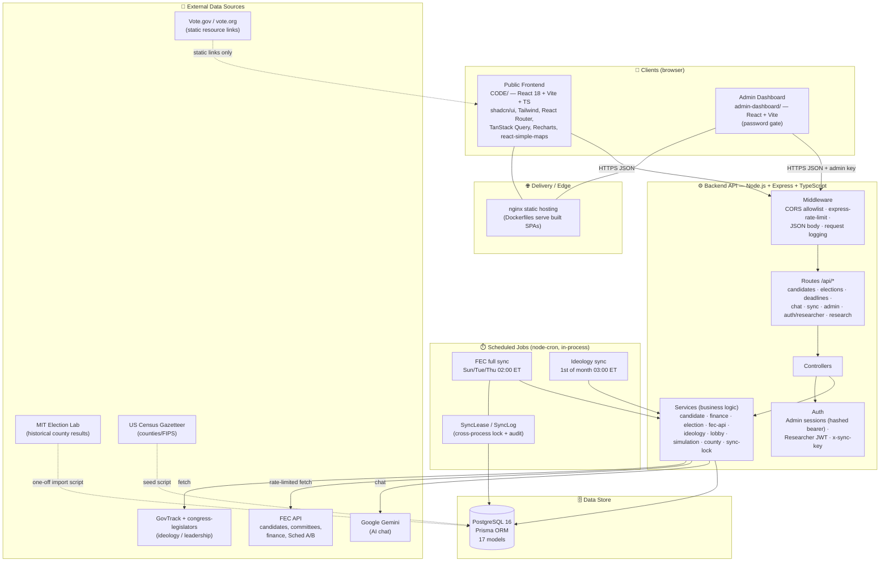
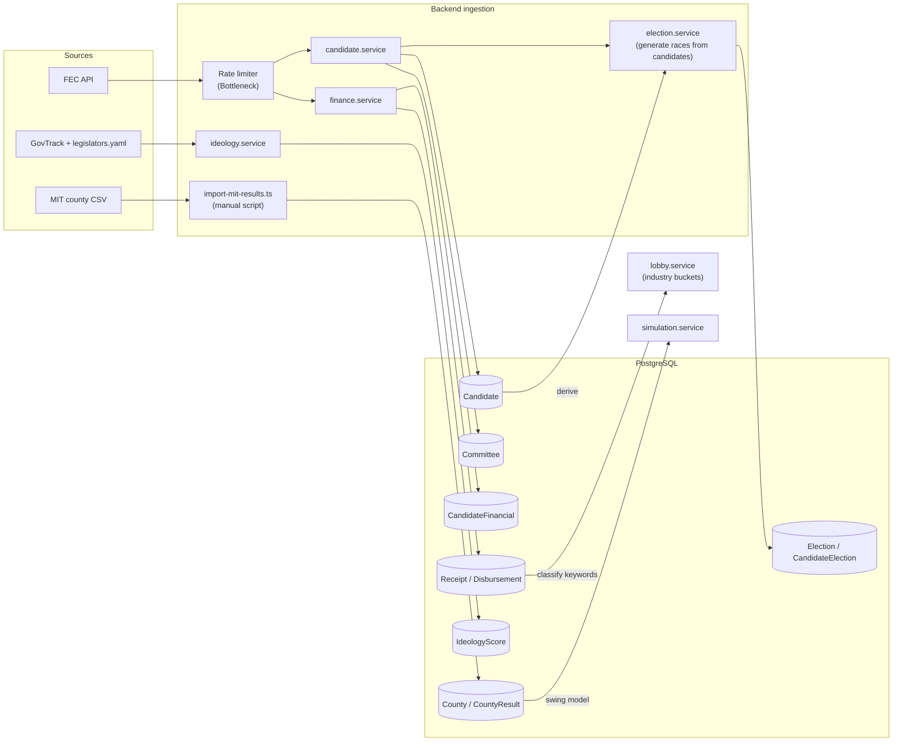
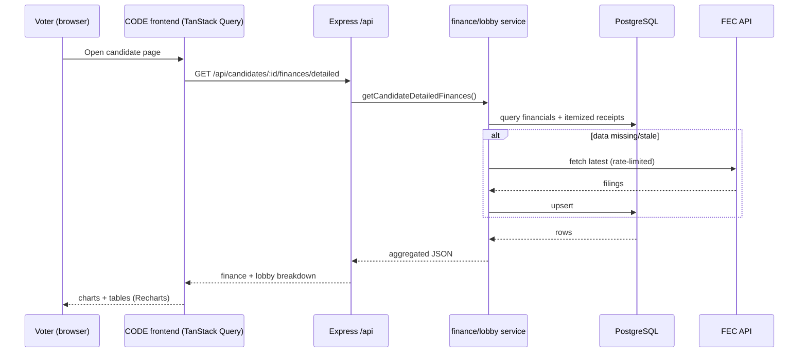
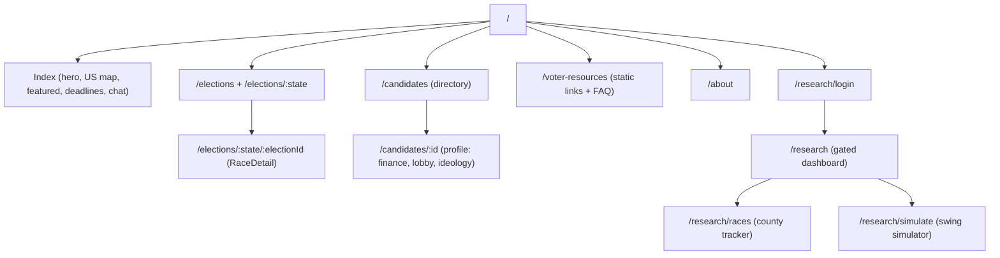
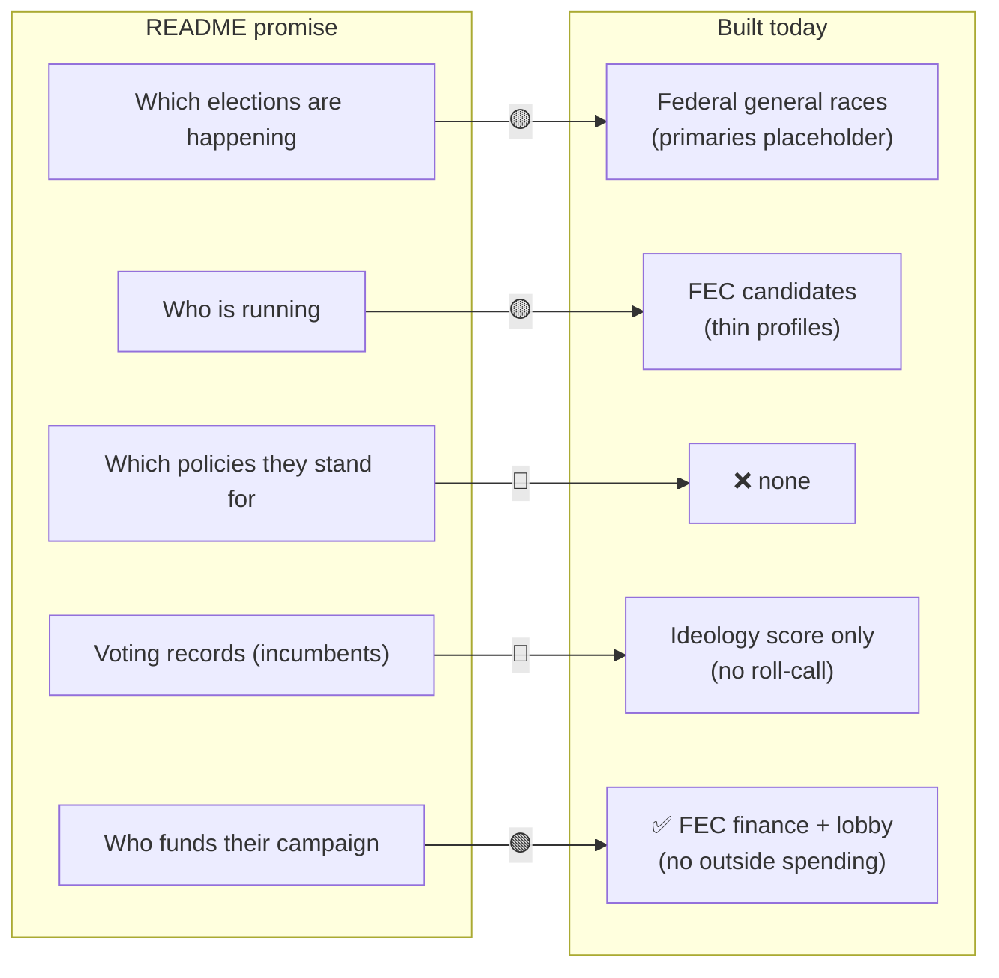

# VoteInformed / 2026 Midterms — Codebase Analysis & 90‑Day Pre‑Midterm Plan

**Author:** Automated codebase analysis
**Date:** August 11, 2026
**Scope reviewed:** Entire monorepo (`backend/`, `CODE/` public frontend, `admin-dashboard/`, `.github/` CI/CD, Prisma schema, jobs/services, existing planning docs)
**Deadline framing:** The general midterm election is ~**November 3, 2026**. This document treats the "90 days" window as the run‑up to Election Day and prioritizes accordingly.

> This is an independent analysis of what actually exists in the code today versus the product's stated promise. It complements the existing, much longer [`feature_roadmap.md`](./feature_roadmap.md) (a multi‑release, multi‑month plan) by compressing everything into a **deadline‑driven triage**: what must ship before voters go to the polls, what can wait, and what is at risk.

---

## 1. Executive Summary

**What the product promises** (from the repository `README.md`):

> "This website will educate voters in each state which federal and state elections are happening and the details on who is running and it will help them learn which policies each candidate stands for along with their voting records if incumbent and who funds their campaign."

**What actually exists today** is a solid **campaign‑finance + candidate directory** platform with a historical‑results research portal. The "who funds their campaign" pillar is the most mature. Two of the four core promises — **"which policies each candidate stands for"** and **"their voting records if incumbent"** — are **essentially not implemented** as first‑class, sourced data. **"State elections"** are also not modeled (only federal House/Senate).

**Headline findings:**

| Product Pillar (from README) | Status | Notes |
|---|---|---|
| Which federal elections are happening | 🟡 Partial | General races generated from FEC filings; **primaries are a "Coming Soon" placeholder**; ballot status largely `UNCONFIRMED` |
| Which **state** elections are happening | 🔴 Missing | Only `HOUSE`/`SENATE` federal offices modeled — no Governor / state legislature |
| Who is running (candidate details) | 🟡 Partial | FEC candidates synced; profile fields (bio, website, socials) exist in schema but have **no ingestion source** so they render empty |
| **Which policies each candidate stands for** | 🔴 Missing | **No `Issue` / `CandidatePosition` models at all** |
| **Voting records (if incumbent)** | 🔴 Missing | Only aggregate `IdeologyScore` + bill counts; **no roll‑call / per‑bill voting record model** |
| Who funds their campaign | 🟢 Strong | FEC summaries, itemized receipts/disbursements, lobby/industry breakdown |

**Biggest risks for a pre‑election launch:**

1. **Zero automated tests** anywhere in the repo. CI only type‑checks, lints, and builds. For a civic‑information product shipping under election‑day load, this is the #1 reliability risk.
2. **AI chat is not grounded in platform data** — it's a generic Gemini chatbot with in‑memory history (lost on restart, no cleanup / memory‑leak risk). For an election product, ungrounded answers are a **misinformation liability**.
3. **No data provenance / freshness / corrections surface** beyond "last synced" timestamps. Users can't see where a claim came from.
4. **Primaries + ballot verification incomplete** — the platform can't yet tell a voter who is actually confirmed on their ballot.

---

## 2. Repository Map

```
2026midterms/
├── backend/                 # Node.js + Express + TypeScript + Prisma API
│   ├── prisma/schema.prisma  # 17 models (candidates, finance, elections, counties, ...)
│   ├── src/
│   │   ├── config/           # env (Zod), Prisma client, FEC clients (std + "fast")
│   │   ├── controllers/      # admin, candidate, chat, deadline, election, researcher-auth
│   │   ├── services/         # candidate, finance, election, fec-api, ideology, lobby,
│   │   │                     #   simulation, county, sync-lock
│   │   ├── routes/           # candidates, sync, elections, admin, deadlines, chat,
│   │   │                     #   research, researcher-auth
│   │   ├── jobs/             # scheduler (node-cron), sync-all-data (+ "fast")
│   │   ├── scripts/          # create-admin, seed-counties, import-mit-results, sync-ideology, ...
│   │   └── server.ts
├── CODE/                    # Public frontend (Vite + React 18 + TS + shadcn/ui + Tailwind)
│   └── src/{pages,components,hooks,lib,types}
├── admin-dashboard/         # Internal admin app (Vite + React + Tailwind)
├── docker-compose.yml       # db (Postgres 16) + backend + frontend + admin
├── .github/workflows/       # CI, deploy (backend/frontend/admin), FEC sync cron,
│                            #   db-migrate, security-audit, codeql, stale
├── feature_roadmap.md       # Existing long-form roadmap (13 features, 6 releases)
├── CICD_PIPELINE_PLAN.md, PHASE5_PLAN.md, Product_requirment_document.docx
```

**Data stores & external integrations detected in code:**

- **PostgreSQL 16** via Prisma (17 models).
- **FEC API** (`api.open.fec.gov`) — candidates, committees, financial summaries, itemized Schedule A/B. Rate‑limited (Bottleneck) with a "fast" client variant.
- **GovTrack** sponsorship‑analysis files + **unitedstates/congress‑legislators** YAML crosswalk → incumbent ideology scores.
- **MIT Election Lab** county results (imported via script) → historical `CountyResult`.
- **US Census gazetteer** → `County` seeding.
- **Google Gemini** (`gemini-1.5-flash`) → AI chat.
- **Static** voter‑resource links (Vote.gov, vote.org) on the Voter Resources page.

---

## 3. Tech Stack Visual — Front End → Back End → Data Collection

### 3.1 End‑to‑end architecture



### 3.2 Data‑collection / ingestion pipeline



### 3.3 Request lifecycle (candidate finance example)



### 3.4 Frontend route → capability map



---

## 4. Feature Inventory — What Is Actually Built

### 4.1 Implemented and working (🟢)

- **Candidate directory & profiles** — filter by state/office/party/cycle, pagination; profile page shows finance, lobby breakdown, ideology.
- **Campaign finance (the strongest area)** — `CandidateFinancial` totals, itemized `Receipt`/`Disbursement` (Schedule A/B) with backfill cursors and amendment/`memoedSubtotal` handling, detailed finance endpoint, and a **lobby/industry classification** engine (`lobby.service.ts`) that buckets donations (AI/Big Tech, Oil & Gas, Pharma, Defense, Crypto, Labor, Pro‑Israel, etc.) with explicit coverage caveats.
- **Elections** — races generated from FEC candidate data; state map with per‑state race counts; race detail with candidate list.
- **Incumbent ideology scores** — GovTrack‑derived 0–100 ideology + leadership, monthly refresh, FEC↔GovTrack crosswalk.
- **Voter resources page** — static, sourced links to registration / polling place / absentee (Vote.gov, vote.org).
- **Deadlines** — admin‑managed registration/election deadlines, public endpoint, home‑page "upcoming deadlines".
- **Researcher portal (auth‑gated)** — JWT login; historical **county‑level results tracker**; **uniform‑swing simulator** (`simulation.service.ts`) with per‑race/statewide swings and flipped‑seat rollups.
- **Admin dashboard** — durable hashed‑token sessions, stats, sync trigger + status, election generation, deadline CRUD; login rate‑limited.
- **Data pipeline** — `node-cron` scheduler with a **DB‑backed cross‑process lease** (`SyncLease`) and `SyncLog` audit trail, bounded itemized backfill, rate limiting, skip‑if‑recently‑synced.
- **CI/CD** — GitHub Actions for type‑check/lint/build across all three apps, deploy workflows, scheduled FEC sync, DB migrate, CodeQL, dependency security audit, stale‑issue bot. Dockerized services + `docker-compose`.

### 4.2 Partially implemented (🟡)

- **AI chat** — works via Gemini, but **not connected to any platform data** (no retrieval of candidates/finance/elections), and history is **in‑memory only** (code comments flag: lost on restart, no cleanup, potential memory leak).
- **Primary elections** — filter tab exists but UI shows **"Primary Elections Coming Soon"**; ballot status defaults to `UNCONFIRMED`.
- **Candidate profile depth** — schema has `biography`, `campaignWebsite`, `socialMedia`, `currentOfficeHeld`, but **no ingestion source populates them** → fields render empty.
- **Saved simulations** — `SavedSimulation` + `ResearcherUser` models exist, but **no CRUD endpoints/UI** wire them up (research routes expose races/simulate only).

### 4.3 Not implemented / missing (🔴)

| # | Missing capability | Evidence in code | Impact |
|---|---|---|---|
| 1 | **Issue/policy positions** | No `Issue`/`CandidatePosition`/`PositionEvidence` models in `schema.prisma` | Core README promise unmet |
| 2 | **Voting records (roll‑call)** | Only `IdeologyScore` (aggregate) — no per‑bill/vote model | Core README promise unmet |
| 3 | **State (non‑federal) elections** | `office` limited to `HOUSE`/`SENATE` | "state elections" promise unmet |
| 4 | **Outside / independent expenditures (Super PACs)** | FEC sync covers candidate committees only; no IE endpoints/models | Incomplete "who funds them" |
| 5 | **Live election‑night results** | `CountyResult` is historical (MIT) only | No results mode for Nov 3 |
| 6 | **Polling data** | `RaceDetail.tsx` shows "Polling Data Coming Soon" placeholder | Empty section |
| 7 | **State voting rules + "My Ballot" by address/ZIP** | VoterResources is generic static links; no `StateVotingRule`, no district resolver | Personalization promise unmet |
| 8 | **Data provenance / freshness / corrections** | Only `lastUpdated`/`lastSynced` timestamps; no `SourceRecord`, no "report a problem" | Trust gap |
| 9 | **Automated tests** | No `test` script / no jest/vitest in any `package.json`; CI has no test job | Reliability risk |
| 10 | **Voter accounts, watchlists, alerts, i18n, offline, public API/embeds** | None present | Post‑election scope |
| 11 | **Chat grounding + persistence, Redis cache, full‑text search, OpenAPI docs** | None present | Quality/scale gaps |

---

## 5. Gap Analysis Against the Product Promise

The README makes four concrete promises. Mapping them to reality:



**Conclusion:** the platform is ~60% of the way to its own stated promise. The finance pillar is genuinely strong. The two "accountability" pillars (policy positions + voting records) are absent, and election/ballot completeness is the highest‑value near‑term fix for actual voters.

---

## 6. The 90‑Day Pre‑Midterm Plan

**Guiding principle:** with Election Day ~12 weeks out, **do not start anything that can't ship, be sourced, and be verified in time.** Favor (a) reliability, (b) data completeness that directly helps a voter cast an informed ballot, and (c) the "who funds them / how did they vote" accountability content the product promises. Explicitly **defer** large net‑new subsystems (accounts, alerts, campaign portal, public API, i18n, offline) to **after** the election.

### Priority definitions

- **P0 — Must ship before Election Day.** Reliability, trust, and voter‑critical correctness. Nothing else should start until these are underway.
- **P1 — High value, ship if P0 is on track.** Accountability content and money transparency.
- **P2 — Stretch / election‑night.** Valuable but riskier or dependent on external providers.
- **Deferred — After Nov 3.** Retention/scale features from the long roadmap.


---

### P0 — Reliability & Trust Foundation (Weeks 1–4)

These are prerequisites for shipping anything else safely before an election.

#### P0.1 — Automated test harness + CI test gate
- **Why:** There are currently **zero tests**. Pure calculation/normalization logic (finance aggregation, lobby classification, swing simulation, calendar‑date handling) is exactly what breaks silently and misleads voters.
- **Do:**
  - Add **Vitest** to `backend/` and `CODE/`; add a `test` script and a **CI `test` job** gating merges.
  - Unit‑test the highest‑risk pure functions first: `simulation.service` (`simulateFromRows`), `lobby.service` matching/aggregation, finance aggregation, `utils/calendar-date.ts`, `utils/pagination.ts`.
  - Add API integration tests against an ephemeral Postgres (the CI already spins Node; add a service container) for `/candidates`, `/elections`, `/deadlines`.
  - Add **contract fixtures** for the FEC client so ingestion logic is testable offline.
- **Effort:** Medium. **Risk if skipped:** High — regressions ship undetected under election load.

#### P0.2 — Data provenance & freshness surface
- **Why:** For a civic product, "where did this come from and how fresh is it?" is table stakes; today only `lastUpdated` exists.
- **Do:**
  - Add a lightweight `meta` envelope (`generatedAt`, `source`, `freshness`) to public finance/election/candidate responses (no schema migration required to start — derive from existing `lastUpdated`/`SyncLog`).
  - Frontend: reusable `SourceLink` + `FreshnessBadge` components placed **next to** finance totals, deadlines, and ideology scores.
  - Add a minimal **"Report a problem"** endpoint (`POST /api/corrections`) with rate limiting + spam controls, and an admin triage list. (Full `SourceRecord` provenance model is deferred; this is the pragmatic pre‑election slice.)
- **Effort:** Medium.

#### P0.3 — Ground the AI chat in platform data + persist sessions
- **Why:** An ungrounded election chatbot is a **misinformation risk**; in‑memory history is a stability/memory‑leak risk (flagged in the code).
- **Do:**
  - Add retrieval: before calling Gemini, fetch relevant candidate/election/finance/deadline rows and pass them as grounded context; instruct the model to answer **only** from provided data and to say "I don't have verified information on that" otherwise.
  - Persist conversations in Postgres (or Redis with TTL) instead of the module‑level `conversations` object; add session cleanup.
  - Add a visible disclaimer + link to sources in chat responses.
- **Effort:** Medium.

#### P0.4 — Finance data QA & amendment reconciliation checks
- **Why:** Finance is the flagship feature; amended FEC filings can double‑count if reconciliation is wrong.
- **Do:** Add reconciliation tests/fixtures for amended filings, a data‑coverage report (per candidate: itemized backfill complete?), and admin alerts for large unexpected record‑count deltas after a sync.
- **Effort:** Small–Medium (builds on existing backfill cursors).

---

### P1 — Voter‑Critical Data Completeness (Weeks 3–9)

#### P1.1 — Primary + ballot verification (remove "Coming Soon")
- **Why:** Many state primaries fall inside this window; the platform currently can't tell a voter who is **confirmed on the ballot**.
- **Do:**
  - Extend `Election` with primary metadata (primary type, party, runoff link, official source URL, verification status).
  - Move ballot status from FEC‑derived guessing to an **admin verification queue** that promotes `UNCONFIRMED → CONFIRMED` against official state sources; visually separate "filed with FEC" from "confirmed on ballot".
  - Remove the "Primary Elections Coming Soon" UI only once a state has verified data.
- **Effort:** Medium–High. Depends on P0.2 for source labeling.

#### P1.2 — State voting rules + "My Ballot" (address/ZIP → your races)
- **Why:** The single highest‑value voter feature: "what's on *my* ballot and how do I vote?"
- **Do (pragmatic slice):**
  - Add `StateVotingRule` (registration deadline, ID, early/absentee, ballot return) with **official source + last‑verified date** per state.
  - Add `POST /api/ballot/resolve` (ZIP or address → state + congressional district) behind a `DistrictResolver` interface; **do not persist raw addresses** (transient resolution → store district only).
  - `/my-ballot` page: your federal races + key dates + registration/voting options + printable checklist. Anonymous local‑storage persistence (no accounts required).
- **Effort:** High. **De‑risk:** start with ZIP‑only + a curated pilot set of states, expand coverage weekly.

#### P1.3 — Candidate profile completeness
- **Why:** Profiles have empty bio/website/social fields today.
- **Do:** Populate `biography`, `campaignWebsite`, `socialMedia`, `currentOfficeHeld` from an authoritative source (e.g., congress‑legislators for incumbents; admin entry for challengers), with source attribution. Add coverage reporting so gaps are visible.
- **Effort:** Medium.

---

### P1 — Accountability & Money (Weeks 5–11)

#### P1.4 — Incumbent voting records (fulfills a core promise)
- **Why:** "Voting records if incumbent" is promised and absent. The GovTrack/congress‑legislators integration already exists, so the path is short.
- **Do:**
  - Add a `LegislativeAction` model (bill/vote ID, action type, date, chamber, title, result, official source URL).
  - Ingest recent key votes + sponsorship/cosponsorship for sitting members via existing Congress data sources.
  - Add a **Voting Record tab** on incumbent profiles with links to official roll‑call pages; label clearly as "selected key votes, not a complete record."
- **Effort:** Medium–High. **Note:** full editorial *issue positions* (P3 in the long roadmap) require staffing and should stay **deferred**; shipping factual legislative actions is achievable and non‑editorial.

#### P1.5 — Outside / independent expenditures
- **Why:** "Who funds their campaign" is incomplete without Super‑PAC independent expenditures supporting/opposing candidates.
- **Do:** Extend the FEC client to independent‑expenditure endpoints; add `IndependentExpenditure` + `OutsideSpendingAggregate` with the same amendment/idempotency approach as receipts; add support/oppose totals (never netted) to candidate/race pages with FEC filing links and a clear "not coordinated with the campaign" disclaimer.
- **Effort:** Medium–High (reuses existing finance ingestion patterns).

---

### P2 — Election‑Night Readiness (Weeks 8–12, stretch)

#### P2.1 — Live results mode
- **Why:** Highest engagement moment of the cycle — but the riskiest to build.
- **Do (conservative):** Choose a licensed/official results provider; add `ElectionResultSnapshot`/`CandidateResultSnapshot`; **display official/provider status only — do not call races**; add stale‑feed + correction banners and a low‑bandwidth accessible table view. Publish via Server‑Sent Events.
- **Effort:** High + external dependency. **Only start if P0/P1 are on track; otherwise ship "official results links" and defer live mode.**

#### P2.2 — Load test + incident runbook
- **Why:** Election night is a traffic spike event.
- **Do:** Load‑test candidate/race/finance endpoints and (if built) results endpoints at projected peak; add caching/CDN for read‑heavy summaries; write an incident/correction runbook and freeze non‑essential changes in the final week.
- **Effort:** Medium.

---

### Explicitly Deferred to After Election Day

These are valuable (and detailed in [`feature_roadmap.md`](./feature_roadmap.md)) but are **not** worth starting in the 90‑day window because they add scope/risk without directly helping a voter cast a ballot in time:

- Voter accounts, watchlists & alerts, "What Changed This Week?" feed.
- Verified campaign‑response portal.
- Research Lab 2.0 (advanced models, saved‑scenario CRUD beyond the existing scaffold).
- Publisher/civic API, dataset exports, embeds.
- Multilingual (i18n) + offline/PWA.
- Full editorial issue‑position taxonomy (requires editorial staffing + review workflow).
- Redis caching layer, full‑text search, OpenAPI docs (nice‑to‑have; not blocking).

---

## 7. Prioritized Backlog (at a glance)

| ID | Item | Priority | Effort | Fulfills promise / risk addressed |
|---|---|---|---|---|
| P0.1 | Test harness + CI gate | P0 | M | Reliability |
| P0.2 | Provenance & freshness UI + corrections | P0 | M | Trust |
| P0.3 | Chat grounding + persistence | P0 | M | Misinformation risk |
| P0.4 | Finance QA / amendment reconciliation | P0 | S–M | "Who funds them" integrity |
| P1.1 | Primary + ballot verification | P1 | M–H | "Which elections / who's on ballot" |
| P1.2 | State voting rules + My Ballot | P1 | H | Voter action |
| P1.3 | Candidate profile completeness | P1 | M | "Who is running" |
| P1.4 | Incumbent voting records | P1 | M–H | "Voting records if incumbent" |
| P1.5 | Outside / independent expenditures | P1 | M–H | "Who funds them" |
| P2.1 | Live results mode | P2 | H + vendor | Election night |
| P2.2 | Load test + incident runbook | P2 | M | Election-day stability |

---

## 8. Cross‑Cutting Recommendations

- **Add a `test` job to `.github/workflows/ci.yml`** as the very first change — it protects everything else.
- **Adopt the response `meta` envelope** (`generatedAt`/`source`/`freshness`) as a convention now, so provenance can be added incrementally per endpoint rather than retrofitted.
- **Keep the nonpartisan bar explicit:** every accountability feature (votes, money, positions) must apply identical rules to all candidates and show "not verified / not available" instead of inferring.
- **Address privacy up front** for My Ballot: transient address resolution, store district only, redact from logs/analytics — validated by a test.
- **Freeze window:** lock non‑essential production changes in the final 1–2 weeks before Nov 3.

---

## 9. Appendix — Prisma Models Present Today

`Candidate`, `CandidateFinancial`, `Committee`, `Election`, `CandidateElection`, `FinancialSummary`, `Receipt`, `Disbursement`, `IdeologyScore`, `SyncLog`, `SyncLease`, `AdminUser`, `AdminSession`, `County`, `CountyResult`, `ResearcherUser`, `SavedSimulation`, `Deadline`.

**Notably absent** (would be added by the plan above): `Issue`/`CandidatePosition`/`PositionEvidence`, `LegislativeAction`, `StateVotingRule`, `IndependentExpenditure`/`OutsideSpendingAggregate`, `ElectionResultSnapshot`, `SourceRecord`/`CorrectionReport`, `VoterUser`/`Watch`/`DomainEvent`.
