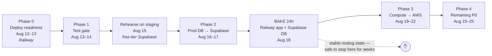
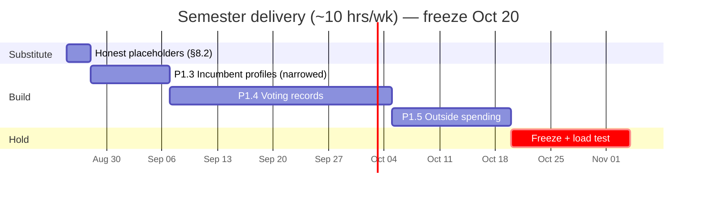

# Production Implementation Plan

**Date:** August 12, 2026
**Input:** [`CODEBASE_ANALYSIS_AND_90DAY_PLAN.md`](./CODEBASE_ANALYSIS_AND_90DAY_PLAN.md) (Aug 11)
**Scope:** How the items in that analysis actually get into production — sequencing, PR-by-PR, with gates, rollbacks, and a scope decision.
**Anchors:** Fall semester starts ~Aug 25. Election Day is Nov 3. Today is Aug 12 — **the two-week window in §10 of the analysis has already lost a day.**

---

## 1. What this document is

The Aug 11 analysis is a good *diagnosis*. It says what's missing and roughly when to build it. It stops short of saying **how any of it reaches production**, which on this repo is the harder half: there is no test gate, no staging environment, and three deploy workflows that fire automatically on push to `main`.

This plan covers the delivery mechanics. Where I disagree with the analysis, §3 says so explicitly. Where I agree, I don't re-argue it.

**I verified the analysis against the code before planning against it.** Every 🔴/🟡 claim in its §4 holds:

| Claim | Verified |
|---|---|
| Zero tests, CI has no test job | ✅ No `test` script in any `package.json`; `ci.yml` runs type-check/lint/build only |
| Chat is ungrounded, history in-memory | ✅ `chat.controller.ts:33` — module-level `const conversations` |
| No policy/voting-record/state-election models | ✅ 18 models in `schema.prisma`; `office` is a free `String` used as `HOUSE`/`SENATE` |
| `biography`/`campaignWebsite`/`socialMedia` have no ingestion source | ✅ Present in `Candidate` (`schema.prisma:29-33`), written by nothing |
| "Coming Soon" placeholders | ✅ `Elections.tsx:248`, `RaceDetail.tsx:242` |
| `/api/health` 503s on DB loss | ✅ `routes/index.ts:28-47` |
| Dockerfile runs `prisma generate` at container start | ✅ `backend/Dockerfile:31` |
| CORS is exact-string matching | ✅ `server.ts:25` — `allowedOrigins.includes(origin)` |
| `SavedSimulation` has no CRUD | ✅ `research.routes.ts` exposes races/counties/simulate only |

---

## 2. Two corrections to the analysis

### 2.1 The duplicate sync is worse than described — and the fix is free

**Gotcha 2 in §11.6 understates the duplicate-sync problem.** It says the FEC sync "runs *again* in-process via `node-cron`," implying the two paths overlap on the same days and that `SyncLease` makes this harmless.

They do not overlap. They alternate:

- `jobs/scheduler.ts` — `0 2 * * 0,2,4` → **Sun / Tue / Thu**
- `.github/workflows/sync-fec-data.yml` — `0 2 * * 1,3,5` UTC → **Mon / Wed / Fri**

So production is running a 50-state sync **six days a week against a rate-limited API**, not three. `SyncLease` prevents corruption, but it does nothing here because the two paths never collide — they just both run. This is burning roughly double the FEC quota the analysis assumes, and quota pressure is precisely what makes itemized backfill (`ITEMIZED_COMMITTEES_PER_RUN=10`, `ITEMIZED_MAX_PAGES=5`) crawl.

**Consequence for the plan:** gating the in-process scheduler behind `DISABLE_SCHEDULER` is not just AWS-migration prep, as the analysis frames it. It is a **quota fix that should ship this week, on Railway, before anything else** — and it makes the itemized backfill measurably faster for free. It moves from "step 2 gotcha" to Phase 0.

### 2.2 P1.3 is not as cheap as §9.2 claims — `legislators-current.yaml` does not have the fields

§9.2 rates P1.3 a "stretch" that could land inside the two-week window, on this reasoning:

> "The *incumbent* half is genuinely small — `legislators-current.yaml` is already fetched by `ideology.service.ts` and carries bio/website/social fields."

The first clause is true; the second is wrong on all three counts. I checked both the code and the live upstream file.

`ideology.service.ts:36` declares `LegislatorEntry` as an explicit **subset** — it reads `id.govtrack`, `id.fec`, `id.bioguide` and nothing else. It is a crosswalk parser, not a profile parser. And the upstream file doesn't contain what P1.3 needs anyway:

| `Candidate` field | What the analysis assumed | What `legislators-current.yaml` actually has |
|---|---|---|
| `biography` | a bio | `bio:` is **`birthday` and `gender` only** — no narrative text |
| `campaignWebsite` | a website | `terms[].url` is the **official government site** (`cantwell.senate.gov`), not a campaign site |
| `socialMedia` | social handles | **Not in this file at all** — it's a separate `legislators-social-media.yaml` |
| `currentOfficeHeld` | — | ✅ genuinely derivable from `terms[]` (`type`, `state`, `district`, `party`) |

So one of four fields is a freebie. The rest need scoping decisions:

- **`socialMedia`** requires fetching a second file — small, but that file's own header states its policy is to list **only official taxpayer-funded accounts, explicitly not campaign or personal accounts**. Showing a member's official House account labeled as their campaign presence would be inaccurate. Ingest it, but label it "official account" and leave `campaignWebsite` alone.
- **`campaignWebsite`** has no authoritative bulk source. FEC filings carry a committee URL of inconsistent quality. This is admin entry or nothing.
- **`biography`** has no non-editorial source at all. Writing biographies is editorial work — the same category the analysis correctly defers for issue positions.

**Consequence for the plan:** P1.3 is not a two-week stretch item, and it isn't a single ingestion job either. It splits into a cheap part and an expensive part, and only the cheap part should be scheduled. §8.2 scopes it accordingly: ship `currentOfficeHeld` + official social + official website, drop `biography` and `campaignWebsite` to `coverage: 'unavailable'` with an honest label. That is roughly a week rather than three, which is what makes room for P1.5 in §8.2's sequence.

---

## 3. Where I depart from the analysis

Four changes. Each one is a decision, not a preference.

### 3.1 Deploy-readiness code ships *before* the infra move, not during it

The analysis scatters four small code fixes across §11.6 as "gotchas" to handle while standing up App Runner: the health-check split, the scheduler gate, the Dockerfile `CMD`, and `DIRECT_URL` plumbing.

Doing them *during* the cutover is backwards. Each one is a behavior change to the container. If you introduce them at the same moment you change where the container runs, a failure is ambiguous — exactly the reasoning the analysis itself uses to justify splitting the database move from the compute move. Apply that reasoning one level further down.

**All four ship as one PR to Railway first** (Phase 0), bake for a day, and then the AWS cutover changes exactly one variable: where the already-proven container runs.

### 3.2 `DIRECT_URL` must be optional in the Zod schema, not required

The analysis says to add `DIRECT_URL: z.string()` to `backend/src/config/env.ts`. Taken literally, that is a hard-fail-at-boot for a required variable — and it will break, in order: local `npm run dev`, `docker-compose`, the `docker-build.yml` smoke run, and the test harness from Phase 1, all of which have a single local Postgres and no separate direct URL. The analysis notices three of those four call sites and proposes patching each with a dummy value.

Patching four call sites to satisfy a validator is the wrong direction. Make the variable optional with a fallback, and require it only where it actually matters:

```ts
// backend/src/config/env.ts
DIRECT_URL: z.string().optional(),
```

```ts
// alongside the existing NODE_ENV === 'production' guard
if (parsed.data.NODE_ENV === 'production' && !parsed.data.DIRECT_URL) {
  throw new Error('DIRECT_URL (session pooler, port 5432) is required in production');
}

export const env = {
  ...parsed.data,
  DIRECT_URL: parsed.data.DIRECT_URL ?? parsed.data.DATABASE_URL,
  // ...
};
```

Local dev and CI keep working untouched — one URL, no dummies. Production still fails loudly if the session-pooler URL is missing. `docker-compose.yml`, `docker-build.yml`, and `test-fec-pagination.ts` need **no changes at all**, which removes three of the analysis's checklist items.

> Note: Prisma resolves `directUrl` from the process environment, so it must be *set* for `prisma migrate`/`generate` to validate. The fallback above sets it in `env`, but Prisma reads `process.env` directly — so Phase 0 also adds `process.env.DIRECT_URL ??= process.env.DATABASE_URL` at the top of `env.ts`, before `config()`'s values are consumed. One line, and every existing call site stays as-is.

### 3.3 The response `meta` envelope is an added field, never a wrapper

§P0.2 says "add a lightweight `meta` envelope to public responses." There are two ways to read that, and one of them is a breaking change.

`CODE/src/lib/api.ts` types every endpoint through a generic `fetchAPI<T>`, with concrete response types in `CODE/src/types/candidate.ts` (`CandidatesResponse`, `DetailedFinanceResponse`, `LobbyBreakdownResponse`, …). Re-wrapping responses as `{ data: T, meta: M }` means touching every type, every hook, and every consuming component in one PR — an all-or-nothing change during a migration window.

**Decision: `meta` is an optional sibling key added to the existing response objects.** `{ ...existingShape, meta?: ResponseMeta }`. Old clients ignore it, the frontend types get one optional field, and it can land **one endpoint per PR** without coordination. This is what makes the analysis's own advice — "adopt the convention now so provenance can be added incrementally" — actually achievable.

### 3.4 The semester scope decision, made

§9.3 of the analysis ends with "decide now which two matter most" among the five P1 items, and estimates two or three will land in ~100 hours of semester time. It doesn't make the call. Making it:

| Item | Blocked on | Call |
|---|---|---|
| P1.3 Candidate profiles (incumbents) | Nothing, **once narrowed** — see §2.2. Ship the fields that have an authoritative source; drop `biography`/`campaignWebsite`, which don't | ✅ **Build (narrowed)** |
| P1.4 Incumbent voting records | Nothing — same data sources, already wired | ✅ **Build** |
| P1.5 Outside/independent expenditures | Nothing — Schedule E reuses the existing Schedule A/B ingestion patterns | ✅ **Build** |
| P1.1 Primary + ballot verification | **50 states of manual verification** against SoS sources. Data-entry labor, not engineering | ❌ **Substitute** (§8.2) |
| P1.2 State voting rules + My Ballot | **Vendor selection + account + cost**, a privacy review, and 50 states of curated rows | ❌ **Substitute** (§8.2) |

The analysis's own sequencing puts P1.1 third, ahead of P1.5. I'd invert that. P1.1 and P1.2 are the only two items on the list whose cost is **not engineering time** — they are procurement and bulk curation, the two things a solo developer on ~10 hrs/week cannot compress at all. Everything else on the list is code against a data source that is already authenticated and already flowing.

So: build the three engineering-only items, and replace the two curation-bound ones with an honest, one-day substitute that removes the misleading placeholders without pretending to data we don't have. Details in §8.2.

**This fulfills two of the four README promises outright** ("who is running" via real profiles, "voting records if incumbent") and completes the third ("who funds them" via outside spending) — which is a better pre-election story than a half-verified ballot checker.

---

## 4. The production delivery model

This is the part the analysis doesn't cover, and it applies to every phase below.

### 4.1 Environments

Today there are two: a developer's laptop, and production. That is not enough to run a migration through.

| Environment | Database | Backend | Purpose |
|---|---|---|---|
| Local | `docker-compose` Postgres | `npm run dev` | Development |
| **Staging** (new) | **Supabase free-tier project** | Railway (existing service, second instance) or App Runner staging | Migration rehearsal, PR verification |
| Production | Railway PG → Supabase Pro | Railway → App Runner | Live |

The analysis already suggests a free-tier Supabase project "as a staging/dev database." Take that further: **staging is where the Supabase cutover is rehearsed end-to-end before production touches it.** The 7-day inactivity pause that disqualifies free-tier for production is irrelevant for staging during an active two-week sprint.

### 4.2 Branch and PR discipline

- One workstream per PR. No PR mixes an infra change with a feature change.
- All work branches off `main`; `main` is always deployable.
- **CI test gate (Phase 1) merges first and blocks every subsequent PR.** This is the analysis's §8 first recommendation and it's correct.
- Squash-merge, so `main` history reads as one commit per workstream and a revert is one commit.

### 4.3 Deploy safety during the migration window

`backend-deploy.yml`, `frontend-deploy.yml`, and `admin-deploy.yml` all trigger on `push: branches: [main]` with path filters. During a cutover, an unrelated merge to `main` can redeploy a service mid-migration.

**Before Phase 2 starts:** add `workflow_dispatch` to all three and comment out the `push` trigger for the duration. Deploys become deliberate. Restore automatic deploys after Phase 3 cutover completes. `db-migrate.yml` already has an `environment: production` manual approval gate — keep it, and never remove it.

### 4.4 Migration discipline

Every schema change from here to Nov 3 is **additive**. No dropped columns, no renamed columns, no narrowed types.

Expand/contract, always:
1. Add the new nullable column/table. Deploy.
2. Backfill. Deploy.
3. Start reading it. Deploy.
4. (After Nov 3, if ever) drop the old one.

Rationale: with `db-migrate.yml` running `prisma migrate deploy` from a GitHub runner behind a manual gate, a destructive migration that needs rolling back has no automated path — you'd be restoring from a Supabase backup under time pressure. Additive migrations are always forward-compatible with the previously deployed container, which means **a bad app deploy can be reverted without touching the database**. That property is worth more than schema tidiness for the next twelve weeks.

### 4.5 Feature flags for partial data

Several items ship state-by-state or candidate-by-candidate. A voter must never see an empty section that implies missing data is *absent* data.

The mechanism is deliberately boring — no flag service. A `data_coverage` concept, computed server-side and returned in the `meta` field from §3.3:

```ts
meta: {
  generatedAt: string;
  source: { name: string; url: string };   // e.g. FEC, GovTrack
  freshness: { lastSynced: string; stale: boolean };
  coverage: 'complete' | 'partial' | 'unavailable';
}
```

The frontend renders on `coverage`: `partial` gets a caveat badge, `unavailable` renders "we don't have verified data for this yet" with a link to the official source — **never an empty div, never a "Coming Soon."** This single field is what lets P1.3, P1.4, and P1.5 ship incrementally without a flag system, and it is why §3.3's incremental `meta` rollout is a prerequisite rather than a nicety.

### 4.6 Freeze

**Oct 20 – Nov 4: production freeze.** Only fixes for incorrect voter-facing data, security issues, or outages. No new features, no dependency bumps, no refactors. Every merge in the freeze needs a one-line written justification in the PR body. The analysis calls for a 1–2 week freeze; two weeks, starting Oct 20, is the version I'd hold to.

---

## 5. Phase 0 — Deploy readiness (Aug 12–13, ~1 day)

**Ships to Railway. Nothing else starts until this is deployed and baking.**

One PR, five changes, all small, all independently revertible:

| # | Change | File | Why now |
|---|---|---|---|
| 1 | Gate `initializeScheduler()` behind `DISABLE_SCHEDULER` | `server.ts:120`, `jobs/scheduler.ts` | **Halves FEC quota burn today** (§2). Prerequisite for multi-instance compute. |
| 2 | Add `/api/health/live` (unconditional 200); keep `/api/health` as readiness | `routes/index.ts` | Without it, App Runner recycles healthy instances on any transient DB blip. ~10 lines. |
| 3 | `DIRECT_URL` optional-with-fallback + `process.env` default | `config/env.ts` | §3.2. Unblocks Phase 2 without breaking local/CI. |
| 4 | Move `prisma generate` into the build stage; `CMD ["node", "dist/server.js"]` | `backend/Dockerfile:31` | Removes network dependency and seconds of latency from every cold start. `npm run build` already runs it. |
| 5 | Pin Railway to a single instance | Railway config | The in-memory `conversations` object is per-instance until P0.3 lands. |

**Verification:** `/api/health/live` returns 200 with the database intentionally unreachable; `/api/health` returns 503 in the same state; container starts without network access to the Prisma CDN; one Sun/Tue/Thu cycle passes with **no** `SyncLog` row from the in-process scheduler and a normal row from the GH Actions path.

**Rollback:** revert the commit; Railway redeploys the prior image.

---

## 6. Phase 1 — Test gate (Aug 13–14, 2 days)

**PR 1 — harness + CI gate (half a day).**
Vitest in `backend/` and `CODE/`, a `test` script in both, and a `test` job in `ci.yml` that runs before `build` and blocks merges. Land this with a single trivial passing test so the gate exists before there is anything to gate.

**PR 2 — unit tests for the pure logic (1 day).** Real targets, verified to exist:

| Target | File | Why it's first |
|---|---|---|
| `simulateFromRows` | `services/simulation.service.ts:108` | Pure `(rows, swings) → response`. Zero mocking. Highest logic density in the repo. |
| `LobbyService` matching/aggregation | `services/lobby.service.ts:98` | Keyword classification that silently mislabels donations if wrong. |
| `parseCalendarDate` | `utils/calendar-date.ts:2` | Date handling drives **deadlines** — the single most consequential thing to get wrong for a voter. |
| `createPaginationResult`, `getPaginationParams` | `utils/pagination.ts:18,39` | Off-by-one here hides candidates from the directory. |

**PR 3 — FEC contract fixtures (half a day).** Record real Schedule A/B payloads into `backend/src/__fixtures__/`, so ingestion logic is testable offline and the **amendment-reconciliation tests of P0.4 have something to run against**. This PR is what makes Phase 6's finance QA cheap.

**Deliberately deferred:** API integration tests against an ephemeral Postgres service container. The analysis lists them under P0.1; I'd cut them to a smoke subset (`/api/health/live`, `/api/candidates?state=CA`, `/api/deadlines`) added *after* the migration, against staging. Standing up a CI Postgres service in the same week as moving the production database is two database problems at once.

**Gate:** break an assertion on purpose, confirm CI goes red, revert. Until that is observed, the gate is not proven.

---

## 7. Phase 2 & 3 — Infrastructure (Aug 15–22)

The analysis's §11 migration guide is technically sound and I'm not rewriting it. What follows is the delivery wrapper around it.



### 7.1 Phase 2 — Database to Supabase (Aug 16–17, + 24h bake)

Follow §11.3 of the analysis as written. Three additions:

1. **Rehearse on staging first (Aug 15).** Full `pg_dump`/`pg_restore` into the free-tier project, run the PostgREST lockdown SQL, point a staging backend at it, exercise `/api/candidates/:id/finances/detailed`. The rehearsal is where you discover the `pg_dump` version mismatch or the pooler flag problem — for free, on a Saturday, with nothing live at stake.
2. **The PostgREST lockdown (§11.3.4) is a release blocker, not a checklist item.** Between `pg_restore` finishing and that SQL running, the entire database is world-readable to anyone with the project URL. Run the lockdown in the *same session* as the restore, before the connection strings go anywhere near a deploy config. Confirm zero "RLS disabled in public" entries in Supabase Advisors before proceeding.
3. **Bake for a full 24 hours** with the Railway backend pointed at Supabase, and specifically **span one scheduled sync**. Sync is the highest-concurrency workload and pooler exhaustion won't show up in browsing traffic. With Phase 0's scheduler gate in place, that means the Mon/Wed/Fri GH Actions run.

**Rollback:** one environment variable on Railway. The Railway database stays intact and un-deleted through Phase 3.

### 7.2 Phase 3 — Compute to AWS (Aug 19–22)

Follow §11.4. Four notes on delivery:

1. **Budget alarm at $50/mo before the first `docker push`.** Not after. It's the only irreversible-cost control on the list.
2. **Order is forced by `VITE_API_URL`.** It's baked in at build time, so App Runner must exist and have a stable URL before the SPAs are built. Backend → frontends, never parallel.
3. **Parallel-run for 24–48h.** App Runner and Railway both against Supabase, before DNS moves. Compare `/api/candidates` responses between the two hosts.
4. **Delete nothing until Phase 4 is done.** Railway and Vercel projects stay alive (idle) through Aug 25. The final Railway dump gets archived off-platform before either is torn down.

**If Phase 3 slips past Aug 22, stop and take the resting state.** Supabase + Railway is stable indefinitely; Supabase + half-configured App Runner is the one failure mode with no good recovery during a semester. The analysis is right about this and it deserves repeating as a hard rule, not advice.

---

## 8. Phase 4 — Remaining P0 (Aug 23–25) and the semester

### 8.1 Remaining P0, in dependency order

**P0.3 — Chat grounding + persistence (2 days, Aug 23–24).** Highest priority of the three: it's the only remaining item that is a **liability**, not a gap. An ungrounded election chatbot that confidently invents a candidate's finance numbers is worse than no chatbot.

Two Prisma models (`ChatSession`, `ChatMessage`), replacing `conversations` at `chat.controller.ts:33`. Retrieval before the Gemini call — candidate/election/finance/deadline rows relevant to the question, injected as context, with an explicit instruction to answer **only** from provided data and to say "I don't have verified information on that" otherwise. Session TTL cleanup. Visible disclaimer plus source links in the UI.

Ship-gate: restart the service and confirm history survives; ask "who will win Ohio?" and confirm a refusal rather than a guess. **Until this ships, the compute layer stays pinned to one instance** (Phase 0, item 5).

**P0.2 — Provenance `meta` + corrections (2 days, Aug 24–25).** Per §3.3, additive and incremental. Establish `ResponseMeta`, apply it to the three endpoints where a wrong number does the most damage — finance totals, deadlines, ideology scores — and ship `FreshnessBadge` / `SourceLink` components next to them. `POST /api/corrections` (`CorrectionReport` model, rate-limited, plus an admin triage list) is the second PR and the first thing on the cut list.

**P0.4 — Finance QA (1 day, or first weekend of the semester).** Amendment-reconciliation tests against the Phase 1 fixtures; promote `scripts/analyze-data-coverage.ts` to a per-candidate itemized-coverage report that feeds the `coverage` field from §4.5. Cut admin delta alerting — it's a nice-to-have that needs a notification path we don't have.

**Cut list, in order, if Aug 25 arrives first:** P0.4 → the corrections endpoint (keep the `meta` field; three later workstreams depend on it) → frontend Vitest (keep backend). **Never cut Phases 0–3.**

### 8.2 The semester, ~10 hrs/week, Aug 25 → Oct 20 (freeze)

Per the §3.4 decision — three engineering-only builds, sequenced by dependency:



**First, the substitute for P1.1/P1.2 (3 days, not 8 weeks).** The two "Coming Soon" placeholders at `Elections.tsx:248` and `RaceDetail.tsx:242` are the actual problem — they promise data that isn't coming. Replace them with what's true and useful:

- Primaries tab → per-state deep links to the official Secretary of State candidate-filing page, with a plain statement: *"We show candidates who have filed with the FEC. We do not independently verify ballot status — check your Secretary of State for the official ballot."*
- Polling section → removed entirely, rather than a placeholder for data we have no source for.
- Voter Resources → the existing static links, plus per-state SoS links and the `meta.freshness` treatment from §4.5.

This is three days of work that makes the site *more* trustworthy than a rushed 50-state verification pass would, because it stops implying a verification we aren't performing. It is not a lesser version of P1.1/P1.2 — it's the honest version of what we can actually stand behind.

**P1.3 — Incumbent profiles, narrowed (~1.5 weeks).** Per §2.2, this is a smaller job than the analysis assumed, and a different one. `ideology.service.ts` already fetches `legislators-current.yaml` and holds a working FEC↔GovTrack crosswalk; widening its `LegislatorEntry` interface past the ID subset costs nothing.

Ship what has an authoritative source:

- `currentOfficeHeld` — derived from the current entry in `terms[]` (type, state, district, party). Free.
- **Official** website — `terms[].url`, labeled "official government website," stored distinctly from `campaignWebsite`. Requires one additive column rather than reusing `campaignWebsite`, which would misrepresent it.
- **Official** social accounts — second fetch of `legislators-social-media.yaml`, joined on `bioguide`, labeled "official account, not campaign." Twitter/Facebook/Instagram/YouTube coverage runs ~80-95% of members.

Do not ship: `biography` (no non-editorial source) and `campaignWebsite` (no authoritative bulk source). Both render `coverage: 'unavailable'` per §4.5 — "we don't have a verified biography for this candidate" — which is accurate and costs nothing. Challengers get the same treatment across every field.

This is honest, sourced, and about a week of work. Chasing the other two fields is where the original three-week estimate came from, and they're the two with no source to chase.

**P1.4 — Voting records (~4 weeks).** New `LegislativeAction` model (bill/vote ID, type, date, chamber, title, result, official source URL), ingesting key votes and sponsorships for sitting members from the sources already wired in P1.3. A Voting Record tab on incumbent profiles, every row linking to the official roll-call page, labeled **"selected key votes, not a complete record."** Fulfills the README's fourth promise. Editorial issue-position taxonomy stays deferred — it needs staffing and a review workflow, and the analysis is right to keep it out.

**P1.5 — Outside spending (~2 weeks, if the calendar holds).** Schedule E via the existing FEC client, `IndependentExpenditure` with the same amendment-idempotency approach as `Receipt`. Support and oppose totals shown **separately, never netted**, with a clear "not coordinated with the campaign" disclaimer. Completes "who funds them."

**Realistic expectation:** the substitute, P1.3, and P1.4 land with margin. Narrowing P1.3 from three weeks to one (§2.2) is what buys P1.5 a real chance rather than a nominal slot on a chart — but P1.5 remains the designated drop if the semester bites. Decided now, not in October.

**Explicitly not starting before Nov 3:** live results (§P2.1 — blocked on an AP/Decision Desk contract; procurement alone outlasts the window), voter accounts, alerts, campaign portal, public API, i18n, Redis, full-text search, OpenAPI docs.

---

## 9. PR ledger

| # | PR | Phase | Depends on | Revert cost |
|---|---|---|---|---|
| 1 | Deploy readiness (scheduler gate, health split, `DIRECT_URL`, Dockerfile, single instance) | 0 | — | 1 commit |
| 2 | Vitest + `test` job in `ci.yml` | 1 | — | 1 commit |
| 3 | Unit tests: simulation, lobby, calendar-date, pagination | 1 | 2 | 1 commit |
| 4 | FEC contract fixtures | 1 | 2 | 1 commit |
| 5 | `workflow_dispatch` on deploy workflows; disable `push` triggers | 2 | 1 | 1 commit |
| 6 | `schema.prisma` `directUrl` + Supabase connection strings | 2 | 1 | env var |
| 7 | ECR + App Runner + Secrets Manager; replace `railway up` in `backend-deploy.yml` | 3 | 6 | DNS stays on Railway |
| 8 | S3 + CloudFront; rewrite `frontend-deploy.yml` / `admin-deploy.yml` | 3 | 7 | DNS revert |
| 9 | EventBridge + Fargate sync; retire `sync-fec-data.yml` | 3 | 7 | re-enable workflow |
| 10 | Chat persistence + grounding | 4 | 1 | 1 commit + additive migration |
| 11 | `ResponseMeta` on finance/deadlines/ideology + UI badges | 4 | — | 1 commit (additive field) |
| 12 | `POST /api/corrections` + admin triage | 4 | 11 | 1 commit |
| 13 | Amendment-reconciliation tests + coverage report | 4 | 4 | 1 commit |
| 14 | Restore `push` deploy triggers | 4 | 9 | 1 commit |
| 15 | Honest placeholders + per-state SoS links | Semester | 11 | 1 commit |
| 16 | P1.3 incumbent profiles (office, official site, official social) | Semester | 15 | additive migration |
| 17 | P1.4 `LegislativeAction` + Voting Record tab | Semester | 16 | additive migration |
| 18 | P1.5 Schedule E + outside spending UI | Semester | 4 | additive migration |

---

## 10. Risk register

| Risk | Likelihood | Impact | Mitigation |
|---|---|---|---|
| Supabase restore is incomplete; itemized backfill cursors lost | Medium | High — re-backfilling against a rate-limited API takes weeks | Row-count reconciliation on `Receipt`/`Disbursement` **before** cutover; rehearse on staging first; Railway DB retained |
| PostgREST left open after restore | Medium | **Critical** — entire DB world-readable | Lockdown SQL in the same session as the restore; Advisors check is a release blocker (§7.1) |
| App Runner recycles instances on transient DB blips | High if unmitigated | High | `/api/health/live` ships in Phase 0, a week before App Runner exists |
| Pooler connection exhaustion during sync | Medium | Medium | `connection_limit=1`; 24h bake spanning a full sync cycle |
| Migration slips past Aug 25 into the semester | **High** | High | Hard stop rule: resting state after Phase 2 (§7.2) |
| Chat hallucinates election facts | High while ungrounded | **Critical** — misinformation liability | P0.3 prioritized first in Phase 4; refusal instruction is a ship-gate |
| CORS misconfiguration at cutover | Medium | High — total frontend outage | `server.ts:25` is exact-string; verify `FRONTEND_URL`/`ADMIN_URL` for trailing slash and scheme before DNS moves |
| Semester capacity < estimate | Medium | Medium | P1.5 is the designated drop; decided now, not in October |

---

## 11. Definition of done

**Pre-semester (by Aug 25)**
- [ ] In-process scheduler disabled in production; exactly one sync path runs (§2)
- [ ] `test` job in `ci.yml` blocks merges; a deliberately broken assertion turns CI red
- [ ] Production runs on Supabase; row counts reconciled; **Advisors shows zero "RLS disabled in public"**
- [ ] App Runner health check on `/api/health/live`; both SPAs load over HTTPS with zero CORS errors; deep-link hard refresh returns 200
- [ ] One full `sync:all` completes via EventBridge and writes a `SyncLog` row
- [ ] Chat history survives a restart; an unanswerable question returns a refusal
- [ ] Finance totals and deadlines render a visible freshness badge
- [ ] Budget alarm active; no static AWS keys in GitHub; final Railway dump archived
- [ ] Automatic deploy triggers restored

**Pre-election (by Oct 20 freeze)**
- [ ] No "Coming Soon" text anywhere in the frontend
- [ ] Every incumbent profile shows current office held plus official website and social accounts, each labeled "official"; `biography` and `campaignWebsite` render an explicit "not available" rather than an empty field
- [ ] Voting Record tab live on incumbent profiles, every row linking to an official roll-call source
- [ ] Every voter-facing data section shows source, freshness, and coverage — or an explicit "not available," never an empty section
- [ ] k6 smoke load test run against production; results recorded
- [ ] Freeze in effect Oct 20 – Nov 4

---

## 12. Summary

The Aug 11 analysis diagnoses the product correctly and its migration guide is sound. Two of its claims don't survive contact with the code (§2), and this plan adds the delivery mechanics it left out. Five calls:

1. **Deploy-readiness code ships to Railway first** (Phase 0), so the AWS cutover changes one variable instead of five. It also fixes a live quota bug the analysis missed: two sync paths on alternating days are syncing six days a week, not three — and disabling one is free.
2. **`DIRECT_URL` is optional-with-fallback**, which removes three checklist items and stops the change from breaking local dev and CI.
3. **`meta` is an added field, not a wrapper**, which is what makes incremental provenance rollout actually possible rather than an all-or-nothing frontend change.
4. **P1.3 is narrowed to the fields that have a source.** `legislators-current.yaml` does not contain biographies, campaign websites, or social handles — the analysis assumed all three. Shipping the two fields that are genuinely free, and labeling the rest "not available," takes it from three weeks to one.
5. **The semester scope is decided: P1.3, P1.4, P1.5** — the three items blocked on nothing but engineering time — with a three-day honest substitute replacing the two items blocked on procurement and 50-state curation.

The through-line: for a civic product, **showing less with a source beats showing more with a placeholder.** Every scope cut above is chosen to preserve that.
