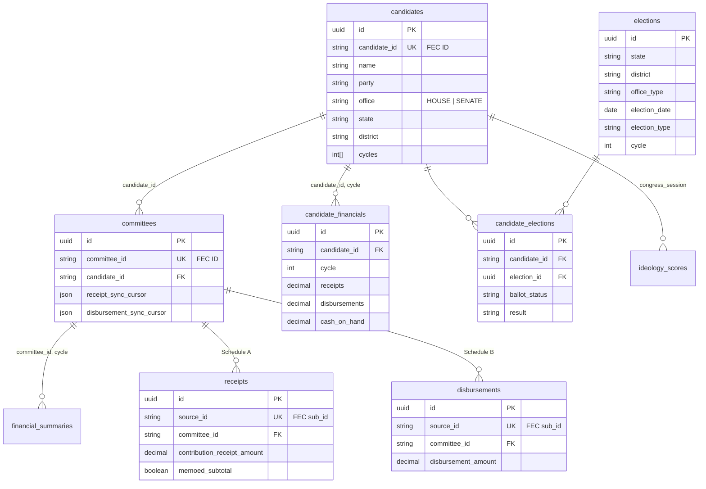
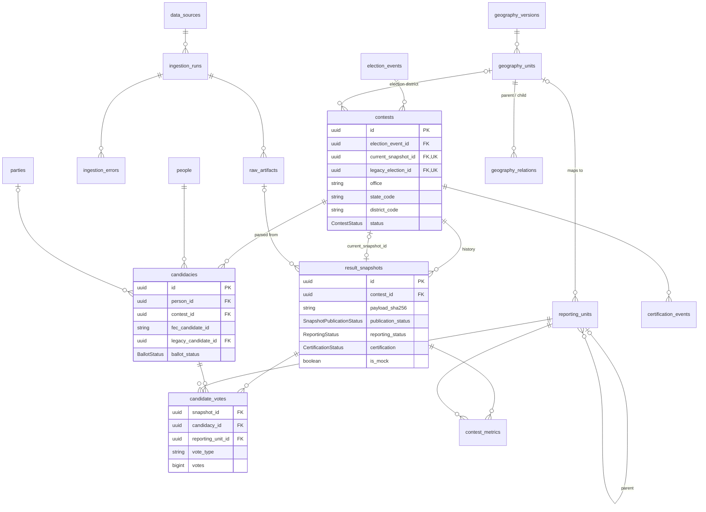
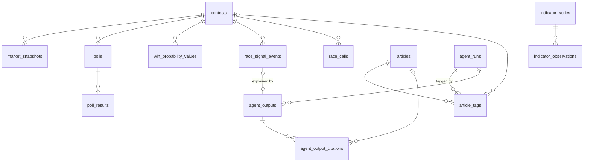

# Database schema design

**Status:** describes the schema as implemented in `backend/prisma/schema.prisma` after migration `20260921120000_day0_election_results_foundation`.  
**Engine:** PostgreSQL 16 via Prisma 6. 35 models, 16 enums, 6 migrations.  
**Intel v2:** batch 1 is migrated (`20261001220824_intel_v2_batch1`). Later batches are proposed in [their own section](#intel-v2-proposed-schema).

This is the reference for how our data is organized. The rationale for the results tables is in [ADR 0001](adr/0001-provider-neutral-results-foundation.md), and the publication rules are in [DAY_0_DATABASE_NOTES.md](DAY_0_DATABASE_NOTES.md). Section 6 of the [implementation plan](ELECTION_DASHBOARD_RAILWAY_IMPLEMENTATION_PLAN.md#6-postgresql-design) has the original target design.

## Principles

1. **PostgreSQL is the system of record.** Redis (when added) is only a cache, lock, and queue. Raw source payloads and map assets live in object storage and are referenced by content hash.
2. **Changes are additive.** New domains sit next to the legacy tables and are linked by optional bridge keys. Nothing has been renamed or dropped.
3. **Provenance is tracked for every row that came from an external source.** Each such row records which `DataSource` it came from, the `IngestionRun` that loaded it, and the `RawArtifact` it was parsed from.
4. **Results are append-only.** A correction creates a new `ResultSnapshot`. Publishing means moving `Contest.currentSnapshotId`.
5. **Money uses exact types.** Money is `DECIMAL(15,2)`, vote counts are `BIGINT`, and percentages are derived from totals. Source-reported percentages are kept only as audit values.
6. **Conventions:** UUID primary keys (`@default(uuid())`), `snake_case` table and column names through `@map`, and `created_at`/`updated_at` on every mutable table.

## Domain map

| # | Domain | Tables | Fed by |
|---|---|---|---|
| 1 | Candidates & legacy elections | `candidates`, `elections`, `candidate_elections`, `ideology_scores` | FEC API, ideology sync |
| 2 | Campaign finance | `committees`, `candidate_financials`, `financial_summaries`, `receipts`, `disbursements` | FEC API (totals, Schedule A/B) |
| 3 | Historical geography & results | `counties`, `county_results` | Census gazetteer, MIT Election Lab |
| 4 | Normalized elections & identity | `election_events`, `contests`, `people`, `parties`, `candidacies` | Results providers, legacy bridge |
| 5 | Versioned geography | `geography_versions`, `geography_units`, `geography_relations`, `reporting_units` | Census TIGER builds, providers |
| 6 | Source provenance & ingestion | `data_sources`, `ingestion_runs`, `raw_artifacts`, `ingestion_errors` | Ingestion workers |
| 7 | Live results | `result_snapshots`, `candidate_votes`, `contest_metrics`, `certification_events` | Ingestion workers |
| 8 | Operations | `sync_logs`, `sync_leases` | Scheduler / sync jobs |
| 9 | Auth & users | `admin_users`, `admin_sessions`, `researcher_users`, `saved_simulations` | Admin and research apps |
| 10 | Content | `deadlines` | Admin dashboard |

## 1–2. Candidates, legacy elections, and finance

These tables are keyed on **FEC natural IDs** (`candidates.candidate_id`, `committees.committee_id`). Foreign keys point at those columns, not at the UUID `id`.



| Table | Grain | Unique key | Notes |
|---|---|---|---|
| `candidates` | One FEC candidate | `candidate_id` | Profile fields (`biography`, `social_media` JSON) live here |
| `candidate_financials` | Candidate × cycle | `(candidate_id, cycle)` | Mirrors FEC `/candidate/totals`, about 40 money columns |
| `committees` | One FEC committee | `committee_id` | Also holds the itemized-sync cursor and backfill state |
| `financial_summaries` | Committee × cycle | `(committee_id, cycle)` | Committee-level totals |
| `receipts` | One Schedule A line | `source_id` | `memoed_subtotal` rows must be excluded from sums |
| `disbursements` | One Schedule B line | `source_id` | Same memo rule |
| `elections` | One legacy race | none | Serves as the contest read model until the legacy tables are retired |
| `candidate_elections` | Candidate × race | `(candidate_id, election_id)` | `ballot_status` is a string here and an enum in `candidacies` |
| `ideology_scores` | Candidate × Congress | `(candidate_id, congress_session)` | |

## 3. Historical county results

| Table | Grain | Unique key |
|---|---|---|
| `counties` | One county (5-digit FIPS PK) | `fips_code` |
| `county_results` | County × cycle × office × district × candidate | `(county_fips, cycle, office_type, district, candidate_name)` |

`county_results.district` is `''` for Senate, which makes the unique key work. These are historical rows only. Election-night results never go into this table.

## 4–7. Provider-neutral elections and results



### Identity

| Table | Grain | Unique key | Notes |
|---|---|---|---|
| `election_events` | One election day per jurisdiction and type | `(source_id, source_election_id)` | `type`: GENERAL, PRIMARY, RUNOFF, SPECIAL, OTHER |
| `contests` | One race on one ballot | `(source_id, source_contest_id)` | `office` is a free string so it isn't tied to one provider's vocabulary |
| `people` | One human, stable across contests | none | `normalized_name` is indexed for match review |
| `parties` | Party per source code | `(name, source_code)` | |
| `candidacies` | Person × contest | `(contest_id, person_id)` | `FEC_FILED` is distinct from `BALLOT_CONFIRMED` |

### Geography

| Table | Purpose |
|---|---|
| `geography_versions` | A reproducible boundary build: vintage, Congress, source URL, and SHA-256 |
| `geography_units` | State, district, county, or precinct inside a version. Unique on `(version_id, type, geoid)` |
| `geography_relations` | `CONTAINS` / `INTERSECTS` / `EQUIVALENT_TO` edges with an optional `overlap_percentage`. Counties that cross district lines are modeled here instead of being duplicated |
| `reporting_units` | A provider's own unit IDs (with a self-referencing hierarchy), mapped to a `geography_unit` |

Geometry is not stored in Postgres. Boundaries ship as versioned GeoJSON/PMTiles assets. PostGIS is deferred until server-side spatial queries become a requirement.

### Provenance and ingestion

| Table | Purpose |
|---|---|
| `data_sources` | Registry of upstream sources: attribution, license, expected cadence, health, `is_enabled` (default false), `is_mock` |
| `ingestion_runs` | One fetch-and-parse run: parser version, counts, and status |
| `raw_artifacts` | Immutable fetched bytes, stored by `storage_key` and identified by `content_sha256` (unique per source) |
| `ingestion_errors` | Record-level warnings and errors, optionally tied to an artifact or contest |

### Results

| Table | Grain | Unique key |
|---|---|---|
| `result_snapshots` | One version of one contest's result | `(contest_id, source_id, payload_sha256)`, which makes replays idempotent |
| `candidate_votes` | Snapshot × candidacy × reporting unit × vote type | the same four columns |
| `contest_metrics` | Snapshot × reporting unit (ballots cast, units reporting) | `(snapshot_id, reporting_unit_id)` |
| `certification_events` | Canvass, certification, recount, or correction history per contest | none (time series) |

`ReportingStatus` (how much has been counted) and `CertificationStatus` (how official it is) are separate fields on purpose. A contest can be 100% reported and still unofficial.

### Publication flow

```
fetch → raw_artifacts (hash) → ingestion_runs
      → result_snapshots (STAGED) + candidate_votes + contest_metrics
      → validate → snapshot PUBLISHED, old one SUPERSEDED
      → contests.current_snapshot_id = new snapshot   (one serializable transaction)
```

The publication service enforces the invariants listed in [DAY_0_DATABASE_NOTES.md](DAY_0_DATABASE_NOTES.md#important-invariants). The most important ones: only a validated `PUBLISHED` snapshot from the same contest can become current, an empty or failed payload never replaces the current snapshot, and parent and child reporting units are never summed together.

## 8–10. Operations, auth, and content

| Table | Purpose |
|---|---|
| `sync_logs` | History of FEC sync jobs (type, status, counts, duration) |
| `sync_leases` | Cross-process lock (`name` PK, `token`, `expires_at`) that stops sync jobs from overlapping |
| `admin_users` / `admin_sessions` | Admin login. Sessions store only a SHA-256 of the bearer token and are deleted along with their user |
| `researcher_users` / `saved_simulations` | Separate researcher role and saved what-if scenarios (`params` JSON) |
| `deadlines` | Registration and election deadlines per state (`states` text array, `["ALL"]` for nationwide) |

## Enums

| Enum | Values |
|---|---|
| `ElectionEventType` | GENERAL, PRIMARY, RUNOFF, SPECIAL, OTHER |
| `ElectionEventStatus` | SCHEDULED, ACTIVE, COMPLETED, POSTPONED, CANCELLED |
| `ContestStatus` | SCHEDULED, OPEN, UNCONTESTED, REPORTING, COMPLETE, CANCELLED |
| `BallotStatus` | UNCONFIRMED, FEC_FILED, BALLOT_CONFIRMED, WITHDRAWN, DISQUALIFIED, WRITE_IN |
| `DataSourceType` | OFFICIAL_FEDERAL, OFFICIAL_STATE, OFFICIAL_LOCAL, LICENSED_PROVIDER, MOCK_FIXTURE, OTHER |
| `SourceHealthStatus` | CURRENT, STALE, DEGRADED, UNAVAILABLE, NOT_CONFIGURED |
| `IngestionRunStatus` | QUEUED, RUNNING, SUCCEEDED, PARTIAL, FAILED, CANCELLED |
| `IngestionErrorSeverity` | WARNING, ERROR, FATAL |
| `RawArtifactStatus` | FETCHED, VALIDATED, REJECTED |
| `GeographyUnitType` | NATION, STATE, CONGRESSIONAL_DISTRICT, COUNTY, PRECINCT, SPLIT_PRECINCT, MUNICIPALITY, OTHER |
| `GeographyRelationshipType` | CONTAINS, INTERSECTS, EQUIVALENT_TO |
| `ReportingUnitType` | NATION, STATE, DISTRICT, COUNTY, PRECINCT, SPLIT_PRECINCT, BALLOT_BATCH, OTHER |
| `SnapshotPublicationStatus` | STAGED, PUBLISHED, SUPERSEDED, REJECTED |
| `ReportingStatus` | NOT_STARTED, PARTIAL, COMPLETE, DELAYED, SUSPENDED, UNAVAILABLE |
| `CertificationStatus` | UNOFFICIAL, CANVASSING, CERTIFIED, RECOUNT, CONTESTED |
| `CertificationEventType` | UNOFFICIAL_RESULTS_PUBLISHED, CANVASS_STARTED, AUDIT_STARTED, CERTIFIED, RECOUNT_STARTED, RECOUNT_COMPLETED, CONTESTED, CORRECTED |

## Legacy → normalized bridge

| Legacy | Normalized | Bridge column |
|---|---|---|
| `elections.id` | `contests` | `contests.legacy_election_id` (unique) |
| `candidates.id` | `candidacies` | `candidacies.legacy_candidate_id` |
| `candidate_elections.id` | `candidacies` | `candidacies.legacy_candidate_election_id` (unique) |
| `candidates.candidate_id` | `candidacies` | `candidacies.fec_candidate_id` (indexed, no FK) |

The backfill runs on a staging copy first and requires a reviewed mapping file. Ambiguous matches are never guessed. See the bridge plan in [DAY_1_IMPLEMENTATION_REPORT.md](DAY_1_IMPLEMENTATION_REPORT.md#reviewed-legacy-bridge-plan).

## Planned but not yet built

| Item | Purpose | From |
|---|---|---|
| `officeholder_terms` | `person_id`, office, state, district, dates, `bioguide_id`, for incumbency and Congress.gov linkage | Plan §6.2 |
| `map_assets` | `version_id`, layer, object key, etag, zoom range, pointing the map at versioned tiles | Plan §6.1 |
| Read models / materialized views | Map summary and candidate page queries over the current snapshot | Plan §6.4 |
| Partitioning of `candidate_votes`, `receipts`, `disbursements` by cycle | Only once measured costs justify it | Plan §6.3 |

## Known gaps to decide on

These are differences between the plan and the implemented schema, or places where Postgres semantics can be surprising. None of them have been changed yet.

1. **Nullable composite unique keys.** `(source_id, source_contest_id)`, `(source_id, source_election_id)`, and `(source_id, source_candidate_id, contest_id)` don't prevent duplicates when `source_id` is NULL, because Postgres treats NULLs as distinct. Either make `source_id` required for provider rows or add `NULLS NOT DISTINCT` in a raw-SQL migration.
2. **The contest natural key isn't unique.** The plan calls for `UNIQUE(election_event_id, office, district_code)`. The schema only has a non-unique index, and `district_code` is nullable for Senate races, so the same nullable-key problem applies.
3. **Mixed legacy key targets.** Every legacy FK references `candidates.candidate_id` (the FEC ID) except `candidacies.legacy_candidate_id`, which references `candidates.id` (the UUID). Keep this in mind when writing joins.
4. **One current snapshot per contest.** The schema guarantees that a snapshot is current for at most one contest. It doesn't guarantee the snapshot belongs to that contest or is `PUBLISHED`; the publication transaction enforces both. A deferred check trigger would move that guarantee into the database.
5. **Duplicate indexes.** `@@index([candidateId])` on `candidates` and `@@index([committeeId])` on `committees` repeat the existing unique indexes and can be dropped.
6. **String-typed status columns** in legacy tables (`office`, `election_type`, `candidate_elections.ballot_status`, `sync_logs.status`) can be converted to enums when the legacy tables are retired after the election.

## Intel v2: proposed schema

**Status:** batch 1 (`market_snapshots`, `indicator_series`, `indicator_observations`, `district_profiles`, `agent_runs`) is migrated in `20261001220824_intel_v2_batch1`. Batches 2–4 are proposed and not migrated. This section covers the data that [INTEL_V2_PLAN.md](product/INTEL_V2_PLAN.md) needs. It follows the same conventions as the rest of the schema and is fully additive.

### Design decisions

1. **Reuse `data_sources` for provenance.** Kalshi, Polymarket, FRED, the ACS API, each news feed, and each poll source get a `data_sources` row. Every new fact table carries `source_id`. This replaces the separate `SourceRecord` model proposed in `feature_roadmap.md` §4.3.
2. **Hang everything off `contests`.** Race pages, odds, polls, signals, and AI output all reference `contests.id`, with `state_code`/`district_code` denormalized for contests that haven't been created yet. This makes the legacy bridge backfill (above) a prerequisite for race pages.
3. **Keep numbers and AI text in separate tables.** Market prices, polls, indicators, and index values come from APIs or formulas. Agent output lives only in `agent_outputs`, and every claim must cite a stored source (rule 4.3.1 in the plan).
4. **Store each agent run.** `agent_runs` stores the model, prompt version, input hash, and raw output so any AI text can be traced and reproduced (rule 4.3.4).
5. **Store probabilities as fractions.** Prices and probabilities are `DECIMAL(5,4)` in `[0, 1]`, labeled by `price_type`. The UI formats them as percentages.



### Markets (plan §3.2)

**`market_snapshots`**: one row per provider market outcome per hour.

| Column | Type | Notes |
|---|---|---|
| `provider` | enum `MarketProvider` | KALSHI, POLYMARKET |
| `scope` | enum `MarketScope` | NATIONAL_HOUSE, NATIONAL_SENATE, STATE_SENATE, HOUSE_DISTRICT (same values as `prediction-markets.service.ts`) |
| `source_event_id` | text | Kalshi event ticker or Polymarket slug |
| `source_market_id` | text | Kalshi market ticker or Polymarket market ID |
| `outcome` | text | Label as shown by the provider |
| `contest_id` | uuid FK, nullable | Null for national control markets |
| `state_code`, `district_code` | text, nullable | |
| `price_type` | enum `MarketPriceType` | MIDPOINT, LAST_TRADE, OUTCOME_PRICE |
| `price`, `yes_bid`, `yes_ask` | decimal(5,4) | |
| `volume`, `liquidity` | decimal(18,2), nullable | |
| `captured_hour` | timestamptz | Truncated to the hour |
| `fetched_at` | timestamptz | |

- Unique: `(provider, source_market_id, captured_hour)`, so a re-run within the same hour updates instead of inserting.
- Indexes: `(contest_id, captured_hour)` and `(scope, state_code, district_code, captured_hour)`.
- Expected size: about 2–3M rows through November. No partitioning is needed.

### Polls and fundamentals (plan §3.1, §3.3)

| Table | Grain | Key columns | Unique key |
|---|---|---|---|
| `polls` | One published poll | `contest_id` (null for the generic ballot), `pollster`, `sponsor`, `field_start`, `field_end`, `sample_size`, `population` (LV/RV/A), `mode`, `source_url`, `source_id` | `(source_id, source_poll_id)` |
| `poll_results` | Poll × choice | `poll_id`, `candidacy_id` (nullable), `party`, `choice_label`, `pct decimal(5,2)` | `(poll_id, choice_label)` |
| `district_profiles` | District × ACS vintage | `state_code`, `district_code`, `geography_unit_id` (nullable until the geography vintage is chosen), `acs_year`, `pres_2024_margin decimal(6,4)`, `partisan_lean decimal(6,4)`, `population`, `median_household_income`, `demographics jsonb`, `source_id` | `(state_code, district_code, acs_year)` |

Poll averages are computed when queried, or cached in `win_probability_values.inputs`. They aren't stored as poll rows.

### Win probability index (plan §3.3, §3.7)

**`win_probability_values`**: one row per contest × candidacy × computation.

Columns: `contest_id`, `candidacy_id`, `methodology_version`, `computed_at`, `probability decimal(5,4)`, `market_component`, `poll_component`, `fundamentals_component` (each `decimal(5,4)`, nullable), and `inputs jsonb`. `inputs` holds the snapshot IDs and values used, so a published number can always be recomputed.

- Unique: `(contest_id, candidacy_id, methodology_version, computed_at)`.
- Tipping-point results go in a sibling table, **`control_simulations`** (`chamber`, `methodology_version`, `run_count`, `computed_at`, `results jsonb` with per-contest tipping-point frequency).

### Economic indicators (plan §3.4)

| Table | Key columns | Unique key |
|---|---|---|
| `indicator_series` | `key` (e.g. FRED `DGS10`, `T10Y2Y`, `VIXCLS`), `name`, `unit`, `frequency`, `source_id` | `key` |
| `indicator_observations` | `series_id`, `observed_at`, `value decimal(18,6)`, `fetched_at` | `(series_id, observed_at)` |

### Signals and movers (plan §3.5, agents 3–4)

**`race_signal_events`**: deterministic triggers that feed the movers feed and the "why it moved" agent.

| Column | Notes |
|---|---|
| `contest_id` | FK |
| `type` | enum `SignalType`: ODDS_MOVE, NEW_POLL, FEC_FILING, OUTSIDE_SPENDING, SIGNAL_DIVERGENCE |
| `detected_at`, `window_hours` | |
| `magnitude` | decimal; points for odds and polls, dollars for money |
| `before_value`, `after_value` | decimal, nullable |
| `evidence` | jsonb: IDs of the market snapshots, poll, or filing that triggered it |
| `status` | enum `SignalStatus`: OPEN, EXPLAINED, NO_CLEAR_CAUSE, DISMISSED |
| `explanation_output_id` | FK to `agent_outputs`, nullable |

Index `(detected_at DESC)` serves the movers feed, and `(contest_id, detected_at)` serves race pages. A unique key on `(contest_id, type, evidence hash)` keeps one move from firing twice.

### News and AI agents (plan §4)

| Table | Grain | Key columns | Unique key |
|---|---|---|---|
| `articles` | One canonical article | `url`, `url_sha256`, `publisher`, `title`, `published_at`, `fetched_at`, `excerpt`, `content_sha256`, `source_id` (the feed) | `url_sha256` |
| `article_tags` | Article × race/person/issue | `article_id`, `contest_id` (nullable), `person_id` (nullable), `issue`, `event_type` (enum `NewsEventType`: POLL, AD, SCANDAL, ENDORSEMENT, DEBATE, FUNDRAISING, OTHER), `relevance decimal(3,2)`, `agent_run_id` | none. Re-tagging creates a new `agent_run`, and readers use the latest run per article |
| `agent_runs` | One LLM job | `agent` (enum `AgentKind`, the 9 agents in §4.2), `model`, `prompt_version`, `schema_version`, `status` (reuse `IngestionRunStatus`), `trigger_signal_id` (nullable), `input_sha256`, `input jsonb`, `raw_output jsonb`, `error`, `input_tokens`, `output_tokens`, `started_at`, `completed_at` | `(agent, prompt_version, input_sha256)` for idempotent retries |
| `agent_outputs` | One displayable AI artifact | `agent_run_id`, `kind`, `contest_id`/`person_id` (nullable), `title`, `body text`, `payload jsonb` (Zod-validated), `review_status` (enum `ReviewStatus`: AUTO_PUBLISHED, PENDING_REVIEW, APPROVED, REJECTED, RETRACTED), `reviewed_by` (FK `admin_users`), `reviewed_at`, `published_at` | none |
| `agent_output_citations` | Claim × source | `output_id`, `claim_index`, `article_id` (nullable), `url`, `quote` | `(output_id, claim_index, url)` |

Rules enforced in the schema or in the publishing service:

- An output with zero citations can't be published unless its payload is an explicit "not found" or "no clear cause" result.
- Outputs about a named person (`person_id` set, or kind CANDIDATE_POSITION) are created as PENDING_REVIEW. Tags and briefs may be AUTO_PUBLISHED.
- Public reads filter to `review_status IN (AUTO_PUBLISHED, APPROVED)` and `published_at IS NOT NULL`.

### Election night and early vote (plan §3.6, §3.8)

| Table | Key columns | Unique key |
|---|---|---|
| `race_calls` | `contest_id`, `candidacy_id`, `source_id` (the calling desk), `called_at`, `retracted_at`, `source_url` | `(contest_id, source_id, called_at)` |
| `early_vote_reports` | `state_code`, `county_fips` (nullable), `report_date`, `party_registration`, `ballots_requested`, `ballots_returned` (bigint), `source_id` | `(state_code, county_fips, report_date, party_registration)` |

A race call is kept separate from `certification_events`. A call is a media projection, and certification is an official act. Results still come from `result_snapshots`.

Outside spending (FEC Schedule E) is tracked separately in [mihir-patel-05/2026midterms#31](https://github.com/mihir-patel-05/2026midterms/issues/31).

### Proposed migration order

Order follows the plan's timeline:

1. **Oct 1–7 (done):** `market_snapshots`, `indicator_series`/`indicator_observations`, `district_profiles`, `agent_runs`. `agent_runs.trigger_signal_id` is deferred to batch 2, when `race_signal_events` exists.
2. **Oct 8–14:** `articles`, `article_tags`, `agent_outputs`, `agent_output_citations`, `race_signal_events`, `win_probability_values`
3. **Oct 15–24:** `polls`, `poll_results`, `early_vote_reports`, `control_simulations`
4. **Oct 25–Nov 3:** `race_calls`. The schema freeze applies after this.

## Making schema changes

1. Edit `backend/prisma/schema.prisma`.
2. From `backend/`, run `npm run prisma:migrate -- --name <change>` against a disposable database and review the generated SQL. Migrations must stay additive until after election operations finish.
3. Commit the schema and the migration folder together.
4. Deploy with `npm run prisma:deploy`, which runs once from the API pre-deploy step and never concurrently from multiple replicas.
