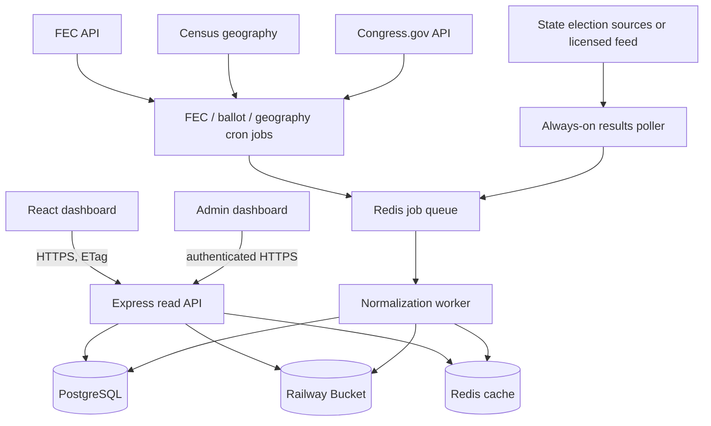

# 2026 Midterms Election Dashboard — WorldMonitor-Inspired Implementation Plan

**Prepared:** September 21, 2026  
**Target election:** November 3, 2026 ([FEC 2026 congressional election dates](https://www.fec.gov/documents/5910/2026pdates.pdf))  
**Repositories reviewed:**

- `2026Midterms` at commit [`9845d584`](https://github.com/mihir-patel-05/2026Midterms/tree/9845d58492112ef36eea7651c0a4e0db024ff54d)
- `mihir-patel-05/worldmonitor` at commit [`e586b8b4`](https://github.com/mihir-patel-05/worldmonitor/tree/e586b8b4b80f595aa7ece295eec10d76f2921240)

## 1. Executive decision

Build the election dashboard as an evolution of the existing `2026Midterms` application, not as a port of WorldMonitor.

The current repository already has the right product foundation: a React/Vite public application, an Express/TypeScript API, Prisma/PostgreSQL, FEC candidate and finance ingestion, election and candidate pages, a state map, county history, admin tooling, and Railway configuration. Replacing it with WorldMonitor's much larger vanilla-TypeScript/Vercel/Railway architecture would discard working domain code and create unnecessary delivery risk.

Adopt these WorldMonitor patterns instead:

1. A registry-driven map in which every layer declares its data source, freshness expectations, rendering support, and limitations.
2. A map-plus-panels interface in which a selection on the map drives race, result, and finance panels.
3. Precomputed read models published by background jobs, rather than querying upstream providers during a user request.
4. A small bootstrap response for first paint, followed by lazy loading of state, district, county, and candidate detail.
5. Explicit source health, stale-data handling, attribution, and “last updated” timestamps.
6. Redis-backed cache invalidation and work coordination, while PostgreSQL remains the source of truth.

Those patterns are visible in WorldMonitor's [architecture](https://github.com/mihir-patel-05/worldmonitor/blob/e586b8b4b80f595aa7ece295eec10d76f2921240/ARCHITECTURE.md), [map layer registry](https://github.com/mihir-patel-05/worldmonitor/blob/e586b8b4b80f595aa7ece295eec10d76f2921240/src/config/map-layer-definitions.ts), and [Redis cache implementation](https://github.com/mihir-patel-05/worldmonitor/blob/e586b8b4b80f595aa7ece295eec10d76f2921240/server/_shared/redis.ts).

The first release should cover federal U.S. House and U.S. Senate contests only. It should present sourced candidates, campaign finance, official or clearly labeled unofficial results, and historical comparisons. It should not publish candidate scores, candidate rankings, endorsements, race forecasts, victory probabilities, or AI-generated policy positions.

## 2. What already exists

The current codebase is materially closer to the proposed product than the README suggests.

| Area | Existing implementation | Keep / change |
|---|---|---|
| Public frontend | React 18, Vite, TypeScript, TanStack Query, Recharts, shadcn/ui | Keep |
| Map | `react-simple-maps` state-level SVG map using a remote `us-atlas` file | Replace with a versioned, locally controlled map stack that supports districts and counties |
| API | Express + TypeScript | Keep; introduce versioned read endpoints and response metadata |
| Database | PostgreSQL + Prisma | Keep as the system of record; extend schema rather than replacing it |
| Elections | `Election` and `CandidateElection` for House/Senate | Keep, but distinguish an election event from an individual contest and separate FEC filing status from ballot status |
| Finance | Candidates, committees, totals, Schedule A receipts, Schedule B disbursements | Keep and harden amendment/provenance handling; add outside spending |
| County data | `County` and historical `CountyResult` | Keep historical data; create separate live-result snapshot tables |
| Jobs | In-process `node-cron`, sync leases, sync logs, Railway notes | Move scheduled work to dedicated Railway cron services; use an always-on worker for election-night polling |
| Admin | Separate React admin dashboard | Keep; add source health, result feed controls, correction/replay tools |
| Provenance | Timestamps and sync logs | Expand to a first-class source and ingestion registry |

Relevant current files include the [Prisma schema](https://github.com/mihir-patel-05/2026Midterms/blob/9845d58492112ef36eea7651c0a4e0db024ff54d/backend/prisma/schema.prisma), [state map](https://github.com/mihir-patel-05/2026Midterms/blob/9845d58492112ef36eea7651c0a4e0db024ff54d/CODE/src/components/home/USMap.tsx), [election service](https://github.com/mihir-patel-05/2026Midterms/blob/9845d58492112ef36eea7651c0a4e0db024ff54d/backend/src/services/election.service.ts), and [FEC integration](https://github.com/mihir-patel-05/2026Midterms/blob/9845d58492112ef36eea7651c0a4e0db024ff54d/backend/src/services/fec-api.service.ts).

## 3. Product shape

### 3.1 User journey

1. The national dashboard opens with the U.S. map, filters, a search box, update status, and compact nationwide totals.
2. Selecting a state zooms to that state and loads its Senate contest, House districts, county boundaries, election dates, and result-feed status.
3. Selecting a congressional district opens the contest drawer and outlines the district. The drawer shows candidates in official ballot order when the source provides it; otherwise it uses alphabetical order and says so.
4. Selecting a county displays county-level results for statewide contests and district-specific county reporting only where the source supports that breakdown.
5. Selecting a candidate opens a profile with official ballot status, committee information, receipts, spending, cash on hand, debt, contributor geography, employer/occupation aggregates, and outside spending that supports or opposes the candidate.
6. Every result and finance section shows source, reporting status, coverage period, and update time.

### 3.2 Modes

- **Pre-election:** ballot-qualified candidates, election dates, voter links, finance, and prior results.
- **Election night:** unofficial results, reporting progress as supplied by the source, source health, and change history.
- **Post-election:** canvass/certification status and final certified results without overwriting the earlier unofficial snapshots.

The distinction matters because local jurisdictions transmit preliminary results to states, states publish unofficial totals, and final certified results can arrive days or weeks later. “100% precincts reporting” does not itself make a result certified. See the [U.S. Election Assistance Commission's results guidance](https://www.eac.gov/where-do-i-find-election-results) and [canvass/certification overview](https://www.eac.gov/election-officials/election-results-canvass-and-certification).

### 3.3 Initial scope

**Required for the first public release**

- All federal House and Senate contests with sourced ballot status.
- State, congressional-district, and county navigation.
- Statewide and contest totals; county results where the official or licensed source provides them.
- Candidate finance pages backed by FEC records.
- Source attribution, freshness, data status, and visible limitations.
- Mobile, keyboard, screen-reader, and color-accessible behavior.
- Admin visibility into ingestion, validation, and source failures.

**Deferred until the core dashboard is reliable**

- State legislative, governor, and local contests.
- Address-based ballot lookup.
- Poll aggregation, race ratings, forecasts, victory probabilities, or candidate scoring.
- Editorial candidate-position summaries generated without primary-source citations.
- A generalized news or social-media intelligence feed.

## 4. Target architecture



### 4.1 Request path

User requests must never trigger a 50-state scrape or a full FEC synchronization. The public API reads only normalized PostgreSQL records and cached read models. Background processes own acquisition, parsing, validation, and publication.

For election results, use snapshot publication:

1. Fetch the source into immutable raw storage.
2. Record the HTTP metadata, source timestamp, hash, and parser version.
3. Parse into a staging snapshot.
4. Validate contest identity, candidate identity, vote types, reporting-unit identity, totals, and status.
5. In one database transaction, insert the snapshot and move the contest's `currentSnapshotId` pointer.
6. Invalidate Redis keys and publish a small “snapshot changed” event.
7. The browser refetches the changed contest payload using its ETag.

This is safer than mutating one live row repeatedly: corrections remain auditable and rollback is a pointer change.

## 5. Data-source plan

### 5.1 Candidate and campaign finance data

Use the [OpenFEC API](https://api.open.fec.gov/developers/) and FEC bulk files as the authoritative federal campaign-finance source. The API exposes candidates, committees, filings, reports, Schedule A receipts, Schedule B disbursements, and independent expenditures; the FEC states that processed API data is updated nightly.

Important rule: an FEC filing is not proof that a person is on a state's ballot. Preserve `FEC_FILED` separately from `BALLOT_CONFIRMED`, with the latter linked to a state election-office source.

Add these finance capabilities:

- Candidate and authorized-committee totals.
- Coverage dates and report type beside every aggregate.
- Itemized receipts and disbursements with amendment-aware deduplication.
- Independent expenditures with `SUPPORT` and `OPPOSE` shown separately, never netted together.
- Employer, occupation, geography, and committee aggregates with a published methodology.
- Raw filing/image links where available.
- Aggregated public views that avoid exposing unnecessary personal-address information.

### 5.2 Ballot and contest data

The authoritative source is each state election office. The EAC maintains a [state-by-state directory](https://www.eac.gov/voters/register-and-vote-in-your-state) and cautions users to verify dates and procedures with the linked state/local source.

Create one source adapter per provider format. Each adapter emits the same internal contract:

```ts
type NormalizedContest = {
  sourceContestId: string;
  electionDate: string;
  state: string;
  office: 'US_HOUSE' | 'US_SENATE';
  district?: string;
  electionType: 'PRIMARY' | 'GENERAL' | 'RUNOFF' | 'SPECIAL';
  candidates: Array<{
    sourceCandidateId?: string;
    name: string;
    party?: string;
    ballotOrder?: number;
    ballotStatus: 'CONFIRMED' | 'WITHDRAWN' | 'DISQUALIFIED';
  }>;
};
```

Matching a state ballot candidate to an FEC entity must be reviewable. Auto-match only on strong identifiers; send ambiguous name/office/state matches to the admin queue.

### 5.3 Election results

There is no single federal official election-night results API. The EAC directs users to state and local election sites, and election administration/reporting varies by state and jurisdiction. Therefore nationwide live coverage requires one of these choices:

**Option A — licensed national results provider**

- Best when complete nationwide election-night coverage is non-negotiable.
- Lower adapter and operations burden.
- Requires budget, redistribution rights, service-level terms, archive rights, and a contract completed before integration.

**Option B — official state and local sources**

- Primary-source attribution and no national feed dependency.
- Requires many adapters, ongoing monitoring, manual fallbacks, and explicit coverage gaps.
- Nationwide completeness by November 3 is high risk unless adapter work is already underway.

**Decision gate:** choose by September 24. If there is no licensed feed, publish a state coverage matrix and expand based on machine-readable source readiness—not perceived political importance. Never display a state or county as live when its adapter has not passed replay and source-health tests.

Where a source implements the [NIST Election Results Reporting Common Data Format](https://pages.nist.gov/ElectionResultsReporting/), map it directly. NIST's format supports pre-election and post-election data, reporting units, precinct/split-precinct detail, ballot type, and explicit result status. Other XML, JSON, CSV, and HTML sources need isolated parsers behind the same normalized contract.

### 5.4 Geography

Use Census geography, not an unversioned CDN asset. TIGERweb currently exposes 120th Congressional District layers, while the Census also provides state/county boundaries and relationship files. See [TIGERweb legislative layers](https://tigerweb.geo.census.gov/tigerwebmain/TIGERweb_state_based_files.html) and the [TIGER/Line download interface](https://www.census.gov/cgi-bin/geo/shapefiles/index.php).

Build a reproducible geography pipeline:

1. Download and checksum the selected Census vintage.
2. Reproject to WGS84.
3. Validate FIPS/GEOID fields and district counts.
4. Simplify into zoom-specific assets.
5. Produce versioned GeoJSON for initial development, then PMTiles/vector tiles for production.
6. Publish a manifest containing vintage, Congress, build hash, bounds, attribution, and asset URLs.

A county is not always wholly contained within one congressional district. Model county–district intersections explicitly. For House results, never copy an entire county total into every district that intersects it; use district-specific county/precinct reporting from the source or mark the breakdown unavailable.

### 5.5 Incumbent legislative record

Use the [Congress.gov API](https://api.congress.gov/) for machine-readable member and legislative data. The Library of Congress documents JSON/XML responses and endpoint coverage in its [official API repository](https://github.com/LibraryOfCongress/api.congress.gov). Show individual sourced roll calls, bills, and sponsorships rather than computing a candidate ideology or suitability score.

## 6. PostgreSQL design

PostgreSQL is the durable source of truth. Redis is only a cache, queue, lock, and notification layer. Raw external artifacts and large map assets belong in object storage.

### 6.1 Geography

| Table | Key fields | Purpose |
|---|---|---|
| `GeographyVersion` | `id`, `vintage`, `congress`, `sourceUrl`, `sha256`, `publishedAt` | Makes boundaries reproducible |
| `GeographyUnit` | `id`, `versionId`, `type`, `geoid`, `stateCode`, `districtCode`, `name` | State, district, county, precinct/reporting-unit metadata |
| `GeographyRelation` | `parentId`, `childId`, `relationshipType`, optional overlap metadata | Handles county/district and precinct/district relationships |
| `MapAsset` | `versionId`, `layer`, `objectKey`, `etag`, `minZoom`, `maxZoom` | Points the map to versioned files/tiles |

Store heavy boundary geometry in versioned tile/GeoJSON assets, not in every API response. Add PostGIS later only if server-side spatial queries or address-to-district resolution become requirements.

### 6.2 Elections and ballot identity

| Table | Key fields | Purpose |
|---|---|---|
| `ElectionEvent` | `id`, `date`, `type`, `stateCode`, `status` | A general, primary, runoff, or special election |
| `Contest` | `id`, `electionEventId`, `office`, `districtCode`, `sourceContestId` | One House or Senate race |
| `Person` | `id`, normalized name | Stable human identity |
| `Candidacy` | `id`, `personId`, `contestId`, `fecCandidateId`, `partyId`, `ballotStatus`, `ballotOrder` | A person's participation in one contest |
| `Party` | `id`, `name`, `abbreviation` | Source-normalized party metadata |
| `OfficeholderTerm` | `personId`, `office`, `state`, `district`, dates, `bioguideId` | Incumbency and Congress.gov linkage |

For the deadline, do not destructively rename the existing `Election` table. Add `ElectionEvent`, add the required source/status fields to `Election`, and treat `Election` as the contest read model. Perform a clean rename only after election operations are complete.

### 6.3 Results and provenance

| Table | Key fields | Purpose |
|---|---|---|
| `DataSource` | `id`, `name`, `authority`, `url`, `license`, `expectedCadenceSec` | Registry of upstream sources |
| `IngestionRun` | `id`, `sourceId`, `startedAt`, `completedAt`, `status`, counts, parserVersion, error | Operational audit record |
| `RawArtifact` | `id`, `ingestionRunId`, `objectKey`, `sha256`, HTTP metadata | Immutable fetched input |
| `ResultSnapshot` | `id`, `contestId`, `sourceId`, `sourceTimestamp`, `publishedAt`, `status`, `isCurrent` | Auditable version of one contest result |
| `ReportingUnit` | `id`, `sourceId`, `geographyUnitId`, `sourceUnitId`, `unitType` | County, precinct, split precinct, state, or district |
| `CandidateVote` | `snapshotId`, `candidacyId`, `reportingUnitId`, `voteType`, `votes` | Candidate totals by reporting unit and vote type |
| `ContestMetric` | `snapshotId`, ballots cast, units reporting/total when supplied | Source-provided contest progress |
| `CertificationEvent` | `contestId`, `status`, `effectiveAt`, `sourceUrl` | Tracks canvass/certification changes |

Use `BIGINT` for vote counts and integer cents/Prisma `Decimal` for money. Derive percentages from totals rather than treating binary floating-point percentages as canonical.

Recommended indexes:

- `Contest(electionEventId, office, districtCode)` unique.
- `Candidacy(contestId, fecCandidateId)` plus normalized-name review indexes.
- `ResultSnapshot(contestId, publishedAt desc)` and one current snapshot per contest.
- `CandidateVote(snapshotId, reportingUnitId)` and `(candidacyId, snapshotId)`.
- `ReportingUnit(sourceId, sourceUnitId)` unique.
- Existing receipt/disbursement indexes retained; add filing/amendment lookup indexes based on the FEC natural keys.

Partition `CandidateVote`, `Receipt`, and `Disbursement` by cycle only when measured query or maintenance costs justify it. Premature partitioning will slow delivery.

### 6.4 Migration from the existing schema

1. Preserve current candidate, committee, finance, receipt, and disbursement tables.
2. Add provenance fields and source identifiers without breaking existing API responses.
3. Create `ElectionEvent` and result snapshot tables alongside `Election`/`CandidateElection`.
4. Backfill 2026 contest keys from state + office + district + election date/type.
5. Keep `CountyResult` as historical data; do not write election-night snapshots into it.
6. Add read-model queries or materialized views for the map and candidate pages.
7. Migrate public endpoints one at a time, then retire legacy response shapes after the election.

## 7. Redis and object storage

### Redis

Use Railway Redis for:

- Cached bootstrap, map summary, contest, and finance payloads.
- ETags/current snapshot IDs.
- Distributed ingestion locks and idempotency keys.
- BullMQ jobs, retry policy, and a dead-letter queue.
- Small pub/sub notifications indicating that a contest changed.
- API rate limits.

Do not store the only copy of a result in Redis.

### Railway Bucket

Use a Railway Bucket for:

- Raw source responses and checksums.
- Parser fixtures and replay artifacts.
- Geography source files and generated PMTiles/GeoJSON.
- Portable logical database dumps.

Railway Buckets are private and S3-compatible; clients access objects through presigned URLs or an API proxy. They do not currently provide object versioning or object locks, so immutability must be enforced through unique content-addressed keys and application policy. See [Railway Storage Buckets](https://docs.railway.com/storage-buckets).

## 8. Map and frontend implementation

### 8.1 Map engine

Replace `react-simple-maps` with MapLibre GL JS plus deck.gl's React integration. This mirrors WorldMonitor's successful flat-map approach while staying inside React.

Create a small election layer registry:

```ts
type ElectionLayerDefinition = {
  id: 'states' | 'districts' | 'counties' | 'results';
  source: string;
  geographyVersion: string;
  minZoom: number;
  maxZoom: number;
  selectable: boolean;
  freshness: 'static' | 'scheduled' | 'live';
  limitations: string[];
};
```

Layer behavior:

- National zoom: states and factual contest/result summaries.
- State zoom: congressional districts and the statewide Senate contest.
- District zoom: selected district, counties/intersections, contest drawer.
- County selection: source-supported county results and source status.
- Results styling: categorical winner/leader shading only when backed by a published snapshot; neutral “no data/stale” styling otherwise.

Map selection and filters belong in the URL so views are shareable:

`/map?cycle=2026&state=MI&office=HOUSE&district=07&layer=results`

### 8.2 Dashboard panels

- **Contest list:** state, office, district, election type, result status, update time.
- **Contest detail:** candidates, vote totals, source-supplied reporting progress, result status.
- **County detail:** county totals and historical comparison only where data semantics are valid.
- **Candidate finance:** totals, trends, receipts, spending, outside spending, source coverage.
- **Data status:** upstream status, last successful ingestion, next expected update, known gaps.

On mobile, use a bottom sheet over the map. On desktop, use a resizable side panel. Lazy-load county geometry and itemized finance; they must not block first paint.

### 8.3 Public API

Suggested read endpoints:

```text
GET /api/v1/bootstrap?cycle=2026
GET /api/v1/map/manifest?geographyVersion=2026-120
GET /api/v1/states/:state/contests?cycle=2026
GET /api/v1/contests/:id
GET /api/v1/contests/:id/results/current
GET /api/v1/contests/:id/results/history
GET /api/v1/contests/:id/counties
GET /api/v1/candidates/:id
GET /api/v1/candidates/:id/finance?cycle=2026
GET /api/v1/sources/status
```

Every response should carry a common envelope:

```json
{
  "data": {},
  "meta": {
    "generatedAt": "2026-11-04T02:14:00Z",
    "source": { "name": "State election office", "url": "https://..." },
    "sourceUpdatedAt": "2026-11-04T02:13:12Z",
    "status": "UNOFFICIAL",
    "freshness": "CURRENT",
    "warnings": []
  }
}
```

Use `Cache-Control`, ETags, compression, and request coalescing. For election night, simple conditional polling is the reliable default. An optional Server-Sent Events endpoint may announce changed contest IDs, but clients must still refetch the canonical payload.

## 9. Railway deployment topology

| Railway resource | Process | Public? | Scaling notes |
|---|---|---:|---|
| `web` | Build `CODE/`; serve static assets | Yes | Stateless; cache static assets immutably |
| `api` | Express read/admin API | Yes | Stateless after moving schedules out; scale horizontally behind health checks |
| `admin-web` | Build/serve admin dashboard | Restricted domain | May remain a separate service |
| `ingestion-worker` | BullMQ normalization/retry worker | No | Private network only |
| `results-poller` | Poll enabled election result feeds | No | Always-on during the live window; hard timeouts and per-source pacing |
| `cron-fec` | Candidate, committee, finance synchronization | No | Railway cron; exits cleanly |
| `cron-ballots` | Ballot/contest refresh | No | Railway cron; exits cleanly |
| `cron-geography` | Infrequent geography validation/build | No | Manual or scheduled; exits cleanly |
| PostgreSQL | Durable relational data | No public URL for app traffic | Private `DATABASE_URL`, backups, PITR |
| Redis | Cache, queue, locks, notifications | No | Private network |
| Bucket | Raw artifacts, map assets, dumps | Presigned/proxied | Content-addressed object keys |

Railway supports persistent services, scheduled jobs, private networking, Redis-backed queues, and separate start commands from one repository. Its cron jobs have a five-minute minimum interval, run in UTC, and skip a scheduled run if the previous invocation is still active. That makes cron appropriate for FEC and ballot refreshes but not for election-night result polling. See [Railway's worker/cron/queue guide](https://docs.railway.com/guides/cron-workers-queues) and [cron documentation](https://docs.railway.com/cron-jobs).

Deployment rules:

1. Only the API service runs `prisma migrate deploy`, preferably as a pre-deploy command.
2. Workers and cron services use the same image but different start commands.
3. Internal services use Railway private hostnames and reference variables.
4. Health checks distinguish liveness from readiness. Readiness includes PostgreSQL and Redis but not every external data provider.
5. Preview environments get isolated databases/buckets or sanitized fixtures; they never touch production ingestion.
6. Production Postgres enables scheduled volume backups, PITR, and portable logical dumps with restore drills. Railway recommends all three layers in its [Postgres backup and restore guide](https://docs.railway.com/guides/postgres-backups-restores).

## 10. Freshness and source-health contracts

| Dataset | Acquisition mode | Public freshness behavior |
|---|---|---|
| Geography | Release/manual job | Immutable version; show Census vintage |
| FEC candidates and totals | Scheduled, aligned with nightly upstream processing | Show coverage end date and last successful sync |
| Itemized FEC records | Incremental cursor/backfill | Show completeness/coverage; never imply full itemization when backfill is incomplete |
| Ballot status | Daily, then more frequent only if source changes warrant it | `CONFIRMED` only with a state-source record |
| Results | Always-on poller during configured windows | Show source update time, ingestion time, status, and stale warning |
| Certification | Daily/manual verification after Election Day | Preserve the unofficial history; add certification event |

Source-health states should be explicit: `CURRENT`, `STALE`, `DEGRADED`, `UNAVAILABLE`, and `NOT_CONFIGURED`. Empty data is not automatically healthy. A verified zero-result response and a source failure must remain distinguishable.

## 11. Trust, security, and correctness requirements

- Treat state/local election offices or the contracted results provider as the authority for results; link users to the original source.
- Label results `UNOFFICIAL`, `CERTIFIED`, `RECOUNT`, or `CORRECTED` from source evidence. Do not infer certification.
- Store raw inputs, hashes, parser version, and the normalized snapshot used for each public result.
- Show stale data with its last successful timestamp; never replace a source failure with zeros.
- Preserve provider corrections even when vote totals decrease.
- Require manual review for ambiguous candidate identity matches.
- Keep ingestion credentials server-side and restrict admin/result controls with durable sessions, role checks, CSRF protection where applicable, audit logs, and rate limits.
- Sanitize upstream text and URLs before display.
- Aggregate campaign-finance views and avoid exposing unnecessary donor address fields.
- Publish data-source licenses and redistribution constraints before launch.
- Present candidates using official ballot order when supplied or a disclosed neutral order. Do not use money, popularity, ideology, or a predicted outcome to order candidates.
- Replace the existing public-facing ideology score with sourced legislative actions before broad release; do not compute candidate scores or rankings.
- Any AI feature must retrieve and cite stored source records, refuse unsupported factual claims, and never generate candidate evaluations or election forecasts.

WorldMonitor is licensed AGPL-3.0-only. Reusing its source code, rather than just its architectural ideas, requires complying with that license and its network-use source obligations. Review the fork's [license](https://github.com/mihir-patel-05/worldmonitor/blob/e586b8b4b80f595aa7ece295eec10d76f2921240/LICENSE) before copying implementation code into this repository.

## 12. Delivery plan to November 3

The date leaves roughly six weeks. The plan must prioritize a truthful, resilient core over nominal feature breadth.

### September 21–24: irreversible decisions

- Decide licensed national results feed versus official-source adapters.
- Confirm data redistribution rights and rate limits.
- Freeze the initial scope to federal House and Senate.
- Select the Census geography version and record its source/hash.
- Create a state coverage matrix with source format, county/district granularity, authentication, and replay fixtures.
- Decide whether nationwide live results are a launch requirement. If yes, do not proceed without a provider or already-proven state adapters.

### Week 1: platform and schema

- Add source registry, ingestion run, raw artifact, election event, contest-source, and result snapshot migrations.
- Add Redis/BullMQ and a Railway Bucket.
- Split the in-process scheduler into dedicated commands that terminate cleanly.
- Create common API `meta` envelope, ETag, and cache helpers.
- Add fixture-based parser and API test harnesses to CI.

**Exit:** one recorded fixture can be fetched, normalized, promoted atomically, queried, and replayed.

### Week 2: map and contest foundation

- Build the Census geography pipeline and versioned map manifest.
- Add MapLibre/deck.gl state, district, and county layers.
- Implement shareable URL state and responsive detail panel.
- Backfill contest keys and separate FEC filing from verified ballot status.

**Exit:** every configured federal contest can be reached from state → district → contest; county/district intersections are correct.

### Week 3: finance and provenance

- Move existing finance UI onto the common source/freshness envelope.
- Add Schedule E independent expenditures and amendment-aware reconciliation tests.
- Add itemized-data coverage indicators and raw FEC links.
- Add admin candidate-match and source-health queues.

**Exit:** a candidate page can explain what totals cover, when they were updated, and where they came from.

### Week 4: results integration

- Implement the licensed feed or first production state adapters.
- Add the always-on poller, normalized results contract, validation, dead-letter queue, and replay.
- Build current/history/county result endpoints and map rendering.
- Add unofficial/certified/corrected labeling.

**Exit:** a complete recorded election-night sequence can be replayed without duplicate votes, lost corrections, or partial snapshot publication.

### Week 5: operations and load

- Configure all Railway services, private networking, secrets, health checks, backups, and PITR.
- Run database restore and source outage drills.
- Load-test bootstrap, map summary, contest, county, and finance endpoints with production-like fixtures.
- Tune cache TTLs and prewarm the most-read public payloads.
- Verify mobile, keyboard, screen-reader, and color behavior.

**Exit:** the site stays available with an upstream source down and clearly reports stale/unavailable data.

### Week 6: freeze and election rehearsal

- Freeze schema and feature work except critical fixes.
- Run a timed mock election using recorded feed updates and corrections.
- Staff an operations checklist: source health, queue depth, worker lag, API latency, database load, rollback, and public status messaging.
- Take and restore a production backup.
- Publish the state/data coverage page and known limitations.

**Exit:** an operator can detect a stale feed, identify the last valid snapshot, replay a parser, and roll back the public pointer without direct database improvisation.

## 13. Acceptance criteria

### Data

- Every displayed candidate has a contest-specific status and a source record.
- Every result has source, source timestamp, ingestion timestamp, and result status.
- Unofficial and certified data remain separately auditable.
- Reprocessing the same source artifact is idempotent.
- A parser failure cannot replace the last valid public snapshot.
- House county results never duplicate whole-county totals across intersecting districts.

### Product

- A user can navigate nation → state → district/county → contest → candidate.
- Filters and selections survive refresh and are shareable.
- No-data, not-configured, unavailable, stale, unofficial, and certified states are visually and semantically distinct.
- Candidate ordering is sourced or explicitly neutral.
- No candidate score, ranking, endorsement, forecast, or probability is published.

### Operations

- Public requests do not call election/FEC upstreams directly.
- API replicas can scale without duplicating scheduled work.
- Results polling continues independently of web deploys.
- Queue retries are bounded and failures reach a dead-letter queue.
- PostgreSQL restore and result-snapshot rollback have been rehearsed.
- Source health and ingestion lag are visible to operators.

## 14. Recommended first implementation tickets

1. `data: add DataSource, IngestionRun, RawArtifact, ResultSnapshot schema`
2. `infra: provision Railway Redis and Bucket with reference variables`
3. `jobs: extract FEC sync from API scheduler into an exiting cron command`
4. `results: define provider-neutral contest/result contracts and fixtures`
5. `geo: build versioned Census state/district/county asset pipeline`
6. `map: replace state-only SVG with MapLibre/deck.gl drilldown shell`
7. `api: add v1 response metadata, ETags, and cached bootstrap endpoint`
8. `ballots: separate FEC filing state from official ballot status`
9. `finance: add Schedule E and coverage/provenance presentation`
10. `admin: add source health, ambiguous identity review, and replay controls`
11. `ops: add election-night runbook, source-outage drill, and restore drill`
12. `trust: remove public candidate scoring and add sourced legislative actions`

## 15. Final recommendation

The product can credibly become a WorldMonitor-style election dashboard by November 3 if the implementation focuses on the shared operating model—interactive layers, precomputed read models, fast cached APIs, source freshness, and transparent degradation—rather than WorldMonitor's full feature count.

The deciding dependency is results acquisition. Nationwide live results should be promised only after either a licensed feed contract is complete or every promised state adapter has passed recorded replay, granularity, freshness, and redistribution checks. Everything else—map drilldown, FEC finance, candidate pages, PostgreSQL/Redis design, and Railway deployment—can be built incrementally on the current repository.

## Sources

- [WorldMonitor architecture](https://github.com/mihir-patel-05/worldmonitor/blob/e586b8b4b80f595aa7ece295eec10d76f2921240/ARCHITECTURE.md)
- [WorldMonitor README and license summary](https://github.com/mihir-patel-05/worldmonitor/blob/e586b8b4b80f595aa7ece295eec10d76f2921240/README.md)
- [OpenFEC API documentation](https://api.open.fec.gov/developers/)
- [FEC 2026 congressional primary/general dates](https://www.fec.gov/documents/5910/2026pdates.pdf)
- [EAC: where to find election results](https://www.eac.gov/where-do-i-find-election-results)
- [EAC: election results, canvass, and certification](https://www.eac.gov/election-officials/election-results-canvass-and-certification)
- [EAC state election information directory](https://www.eac.gov/voters/register-and-vote-in-your-state)
- [NIST Election Results Reporting CDF v2](https://pages.nist.gov/ElectionResultsReporting/)
- [Census TIGERweb legislative layers](https://tigerweb.geo.census.gov/tigerwebmain/TIGERweb_state_based_files.html)
- [Congress.gov API](https://api.congress.gov/)
- [Railway services](https://docs.railway.com/services)
- [Railway cron/worker/queue guidance](https://docs.railway.com/guides/cron-workers-queues)
- [Railway PostgreSQL](https://docs.railway.com/databases/postgresql)
- [Railway Postgres backup/restore](https://docs.railway.com/guides/postgres-backups-restores)
- [Railway Storage Buckets](https://docs.railway.com/storage-buckets)
