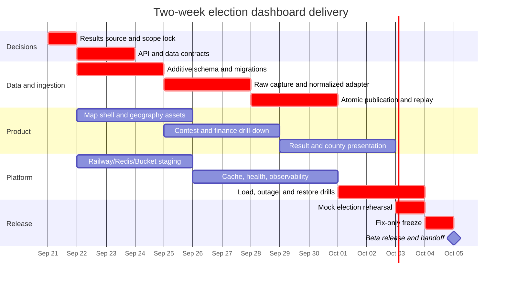

# Election Dashboard — Two-Week Implementation Timeline

**Start:** September 21, 2026  
**Beta deadline:** October 5, 2026  
**Production election date:** November 3, 2026  
**Architecture plan:** [ELECTION_DASHBOARD_RAILWAY_IMPLEMENTATION_PLAN.md](./ELECTION_DASHBOARD_RAILWAY_IMPLEMENTATION_PLAN.md)

## 1. Delivery objective

Ship a deployable federal election-dashboard beta in 14 days with:

- U.S. map navigation from state → congressional district → county → contest.
- 2026 U.S. House and Senate contest pages.
- Candidate profiles and campaign-finance drill-down using the repository's existing FEC pipeline.
- A source-aware result model that supports unofficial, corrected, and certified snapshots.
- Live results for the states covered by the selected provider/adapters.
- Visible source, freshness, coverage, and limitation metadata.
- Railway services for the frontend, API, PostgreSQL, Redis, ingestion worker, result poller, cron jobs, and object storage.
- Automated tests for the highest-risk ingestion and result-publication behavior.
- An operations runbook and a successful recorded mock-election rehearsal.

This is an accelerated beta, not the final November 3 operations posture. October 6–November 2 should remain available for source expansion, load testing, rehearsals, accessibility remediation, security review, and operational hardening.

## 2. Non-negotiable Day 0 decision

Nationwide live results are the critical dependency. The EAC explains that preliminary results originate with local jurisdictions and are aggregated by state election officials; certification timing and process vary by jurisdiction. There is no single federal official election-night feed. See the [EAC results guidance](https://www.eac.gov/where-do-i-find-election-results) and [canvass/certification overview](https://www.eac.gov/election-officials/election-results-canvass-and-certification).

Choose one path by the end of September 21:

| Path | Two-week commitment |
|---|---|
| Licensed national provider | Integrate its contract, test fixtures, redistribution rules, and result-status semantics. This is the only credible path to nationwide live coverage in two weeks. |
| Official state adapters | Ship only states whose adapters pass fixture replay, data-granularity, source-health, and redistribution checks. Publish a coverage matrix. Do not promise all 50 states. |
| No live provider yet | Ship the complete pre-election dashboard plus a replayable mock-results mode. Keep live result ingestion behind a feature flag until a source is approved. |

## 3. Scope lock

### P0 — must ship by October 5

1. Federal House and Senate contests only.
2. State, district, and county map navigation.
3. Existing candidate and FEC finance data integrated into the new dashboard.
4. Separate `FEC_FILED` and `BALLOT_CONFIRMED` states.
5. Source registry, ingestion runs, raw artifacts, result snapshots, reporting units, and candidate vote records.
6. One complete results adapter path that supports fetch → raw artifact → validation → atomic publication → API → map.
7. Railway deployment with health checks, private networking, backups, and an operator runbook.
8. Mock-election replay and source-outage test.

### P1 — include only if P0 remains green

- Independent-expenditure/Schedule E presentation.
- Result-change notifications using SSE.
- Admin UI for parser replay and candidate-identity review.
- Additional state adapters.
- More detailed finance aggregation.

### Explicitly cut from the two-week build

- State legislative, governor, and local races.
- Address-based ballot lookup.
- Candidate issue-position editing.
- Poll aggregation, forecasts, victory probabilities, candidate rankings, or candidate scores.
- Public AI chat.
- User accounts, watchlists, alerts, native apps, and public developer API.
- A 50-state scraping project unless working adapters already exist.

## 4. Parallel agent organization

Use four persistent workstreams. Each agent works in an isolated Git worktree or branch and owns a bounded surface. Cross-lane interface changes require an agreed contract before implementation.

| Lane | Primary ownership | Deliverables |
|---|---|---|
| A — Data platform | Prisma schema, migrations, source registry, result snapshots, read models | Safe additive migrations, repository methods, fixture factories |
| B — Ingestion | Provider adapter, raw artifacts, normalization, validation, replay, queue | One production-grade vertical result pipeline and source-health contract |
| C — Product UI | Map, filters, contest drawer, county view, candidate finance, responsiveness | The user-facing dashboard and accessible interaction states |
| D — Platform/QA | Railway, Redis, Bucket, CI, test harness, observability, load/recovery tests | Deployable services, automated gates, runbook, rehearsals |

One human or designated integration agent owns `main`, contract decisions, migrations, dependency upgrades, and production actions. Feature agents do not independently change shared contracts after they are frozen.

## 5. Daily operating rhythm

All times are America/Detroit.

| Time | Activity |
|---|---|
| 08:00–09:30 | Review overnight results, failed tests, open questions, and agent summaries. Reject or revise unsafe/incomplete changes. |
| 09:30–11:00 | Integrate green work, run full checks, resolve contract conflicts, and deploy the current integration build to staging. |
| 11:00–15:30 | Human decisions, design review, source validation, pair-debugging, and critical-path implementation. |
| 15:30–17:00 | Freeze interfaces needed overnight; write the next set of bounded agent tickets and fixtures. |
| 17:00–18:00 | Commit the integration baseline and assign overnight tasks from that exact SHA. |
| Overnight | Agents implement independent tickets, run scoped checks, record unresolved issues, and stop at defined boundaries. |

Every overnight task must specify:

- Exact objective and non-goals.
- Allowed files/directories.
- Input contracts and fixtures.
- Required tests/build command.
- What constitutes completion.
- Stop conditions that require human judgment.
- A required final summary: files changed, checks run, failures, assumptions, and follow-up work.

Agents must not receive production credentials, deploy to production, approve data-source licenses, delete production data, or apply irreversible migrations overnight.

## 6. Fourteen-day schedule



### Day 0 — Monday, September 21: scope and source lock

**Human decisions**

- Choose licensed provider, official-source subset, or mock-only result mode.
- Confirm redistribution rights, API credentials, source cadence, and permitted retention.
- Confirm the beta definition and explicitly accept the cut list.
- Create a single delivery board with P0/P1 labels and one owner per ticket.

**Agent work overnight**

- Lane A drafts additive Prisma models and migration notes.
- Lane B writes the provider-neutral TypeScript result contract plus representative fixtures.
- Lane C turns the HTML proof of concept into a component/file breakdown for the existing React application.
- Lane D drafts Railway topology, required environment variables, and CI gaps.

**Exit gate:** provider path and beta scope are written down; no unresolved “all 50 states” assumption remains.

### Day 1 — Tuesday, September 22: freeze interfaces

- Freeze normalized contracts for contest, candidacy, reporting unit, result snapshot, source status, and response metadata.
- Freeze API endpoint names and the map manifest shape.
- Add test fixtures before production parsers.
- Add a feature-flag scheme for the new dashboard and each live result source.

**Overnight:** agents implement schema, API stubs, map shell, Redis/Bucket clients, and parser skeletons against the frozen contracts.

**Exit gate:** TypeScript contracts compile across backend and frontend; all lanes use the same fixture.

### Day 2 — Wednesday, September 23: persistence foundation

- Review and merge additive migrations for `DataSource`, `IngestionRun`, `RawArtifact`, `ResultSnapshot`, `ReportingUnit`, and `CandidateVote`.
- Add transaction-level current-snapshot promotion.
- Add content-addressed object keys and hashes for raw artifacts.
- Add unit tests for idempotency and failed-validation behavior.

**Overnight:** Lane B implements fixture ingestion; Lane C implements the national/state map shell; Lane D provisions staging resources.

**Exit gate:** the same fixture can be ingested twice without duplicating public results.

### Day 3 — Thursday, September 24: first data vertical slice

- Complete fetch → raw artifact → parse → validate → stage → publish for one fixture.
- Expose `GET /api/v1/contests/:id/results/current` with source metadata.
- Add liveness/readiness endpoints and source-health state.
- Generate versioned state/district/county geography assets or staging placeholders.

**Overnight:** implement contest list, selected-state URL state, and result read-model cache.

**Exit gate:** a fixture is visible through the API with its source, timestamps, status, and snapshot ID.

### Day 4 — Friday, September 25: first user vertical slice

- Render national map → selected state → selected contest → candidate rows.
- Connect existing candidate/FEC finance endpoints to the new detail panel.
- Display `FEC_FILED` separately from verified ballot status.
- Add loading, empty, stale, unavailable, and mock-data states.

**Overnight/weekend:** agents fill in map interactions, county display contract, response caching, and integration tests.

**Exit gate:** staging supports one complete user journey using fixture results and existing finance data.

### Day 5 — Saturday, September 26: integration stabilization

- Run the entire test/build suite from a clean checkout.
- Resolve migration, generated-client, shared-type, and route-contract conflicts.
- Verify mobile layout and keyboard navigation.
- Add logging fields for source ID, ingestion run, parser version, contest ID, and snapshot ID.

**Exit gate:** no lane depends on unmerged local-only changes; staging is reproducible.

### Day 6 — Sunday, September 27: failure behavior

- Test malformed payload, source timeout, duplicate payload, partial contest, unknown candidate, vote correction, and database retry cases.
- Ensure failure never replaces the last valid snapshot with zero or empty data.
- Add bounded retries and dead-letter handling.
- Draft operator responses for `STALE`, `DEGRADED`, `UNAVAILABLE`, and `NOT_CONFIGURED`.

**Exit gate:** failure states are visible and truthful; last-good data remains intact.

### Day 7 — Monday, September 28: midpoint demo and cut review

- Demonstrate the vertical slice to stakeholders.
- Review the P0 list against actual progress.
- Cut any P1 work that threatens results, map navigation, finance, provenance, deployment, or rehearsal.
- Freeze schema except for critical fixes.

**Overnight:** implement approved results source against recorded payloads; extend map to district/county detail.

**Exit gate:** product, data, and platform tracks are integrated; the remaining critical path fits seven days.

### Day 8 — Tuesday, September 29: real source integration

- Run the approved provider/state adapter against non-production credentials or recorded production-shaped payloads.
- Validate contest and candidate identity mapping.
- Add admin-visible ambiguous match records rather than guessing.
- Record source request/response metadata and checksums.

**Exit gate:** at least one approved source completes the full production-shaped pipeline.

### Day 9 — Wednesday, September 30: district and county correctness

- Verify Census vintage, FIPS/GEOID mapping, district counts, and county–district intersections.
- Prohibit whole-county duplication into multiple House districts.
- Finish district and county selection, result tables, and source limitations.
- Add API query/index checks for map and county endpoints.

**Exit gate:** map geography and result reporting units agree for the configured coverage.

### Day 10 — Thursday, October 1: finance and provenance completion

- Add source/freshness/coverage metadata to candidate finance panels.
- Verify FEC totals, coverage dates, report types, and incomplete itemized backfills.
- Add Schedule E only if the primary result pipeline is already green.
- Remove or hide public candidate scores and replace them with sourced records where available.

**Exit gate:** users can distinguish official ballot data, FEC filings, campaign finance, unofficial results, and unavailable data.

### Day 11 — Friday, October 2: performance and operations

- Precompute bootstrap, state summary, contest, and county read models.
- Add ETags, compression, cache invalidation, and request coalescing.
- Run a production-shaped load test and record the baseline.
- Enable PostgreSQL backups/PITR and create a portable logical dump.
- Verify API, worker, poller, and cron processes deploy independently.

Railway cron jobs have a five-minute minimum interval and skip a run if the prior execution remains active, so election-night polling belongs in the always-on poller rather than cron. See [Railway cron documentation](https://docs.railway.com/cron-jobs).

**Exit gate:** the dashboard stays responsive from cached/read-model paths and scheduled work cannot duplicate when API replicas scale.

### Day 12 — Saturday, October 3: mock election rehearsal

- Replay a timed sequence containing initial totals, normal updates, a source outage, a correction that reduces votes, recovery, and final status.
- Confirm snapshot history, cache invalidation, stale banners, admin health, and rollback.
- Restore a database backup into a separate environment.
- Record all failures and assign only release-blocking fixes.

**Exit gate:** operators can identify the last valid snapshot, replay a payload, and recover without improvised database edits.

### Day 13 — Sunday, October 4: fix-only freeze

- No new features, new adapters, dependency upgrades, or schema changes.
- Fix rehearsal blockers and accessibility failures.
- Run clean builds, migrations on an empty database, integration tests, and smoke tests.
- Complete the state coverage page, known limitations, incident contacts, and rollback commands.

**Exit gate:** release candidate is immutable except for a critical fix approved by the integration owner.

### Day 14 — Monday, October 5: beta release

- Deploy the approved migration, workers, API, admin, and frontend in dependency order.
- Verify health/readiness, data freshness, result-source configuration, map assets, CORS, and cache headers.
- Run the public user journey and admin source-health checklist.
- Tag the release and archive the exact fixtures and parser versions used for acceptance.
- Begin the post-beta hardening backlog for October 6–November 2.

**Exit gate:** beta is available, sourced, observable, reversible, and honest about its live-results coverage.

## 7. Critical path

```text
Results-source decision
  → normalized contracts and fixtures
    → additive database schema
      → raw capture and parser
        → validation and atomic snapshot publication
          → read API and cache
            → map/result presentation
              → timed replay
                → beta deployment
```

Anything that does not shorten or protect this chain is secondary during the two-week build.

## 8. Daily integration gate

No agent branch is merged unless all applicable checks pass:

```bash
cd backend
npm run build

cd ../CODE
npm run lint
npm run build

cd ../admin-dashboard
npm run build
```

Add backend and frontend test commands on Day 1 and include them in this gate. Each migration must also be tested against:

1. A new empty database.
2. A copy of the current schema/data fixture.
3. A rollback or forward-fix procedure documented before merge.

## 9. Overnight agent ticket template

```md
# Objective
Implement [one bounded outcome].

# Starting point
- Base commit: [exact SHA]
- Worktree/branch: [name]

# Allowed scope
- May edit: [directories/files]
- Must not edit: [shared contracts, migrations, production config]

# Inputs
- Contract: [file and type names]
- Fixtures: [paths]

# Required behavior
1. [behavior]
2. [behavior]
3. [failure behavior]

# Required checks
- [command]
- [command]

# Stop and report if
- The contract is insufficient or contradictory.
- A migration would be destructive.
- Source semantics are ambiguous.
- New credentials, licensing decisions, or production changes are required.

# Completion report
- Files changed
- Behavior implemented
- Checks run and results
- Assumptions
- Remaining risks/follow-ups
```

## 10. Beta definition of done

### Product

- A user can navigate nation → state → district/county → contest → candidate.
- Filters and selection are URL-addressable and survive refresh.
- Candidate finance loads from existing backend data.
- Result panels clearly distinguish mock, unavailable, unofficial, corrected, and certified states.
- The interface works on desktop and mobile and is keyboard usable.

### Data

- Every public result has source, source time, ingestion time, result status, and snapshot ID.
- Raw artifacts are hashed and retained.
- Reprocessing is idempotent.
- Invalid input cannot replace the last valid public snapshot.
- Corrections remain auditable.
- Ambiguous candidate matches are reviewed rather than guessed.

### Platform

- API, poller, worker, and cron jobs are separate Railway services.
- PostgreSQL is the source of truth; Redis contains no unique election data.
- Health checks, queue lag, failed ingestion, and source freshness are visible.
- Backups and restore have been tested.
- A rollback procedure has been rehearsed.

### Trust

- Coverage limitations are publicly visible.
- Results link to the official or licensed source.
- FEC filing status is not presented as ballot confirmation.
- No candidate rankings, candidate scores, endorsements, forecasts, or victory probabilities are published.

## 11. October 6–November 2 hardening runway

The beta deadline should not become the final feature deadline. Use the remaining four weeks for:

1. Additional state adapters or provider edge cases.
2. Weekly recorded mock-election rehearsals.
3. Load and failure testing with production traffic assumptions.
4. Accessibility and mobile remediation.
5. Parser changes caused by upstream format changes.
6. Backup/restore and incident-response practice.
7. Production observability, alert tuning, and staffing.
8. A final feature freeze at least one week before November 3.

The two-week plan succeeds when it produces a narrow, complete, rehearsable system. It fails if parallel agents create many disconnected features while the results pipeline, source semantics, or deployment path remains unfinished.
