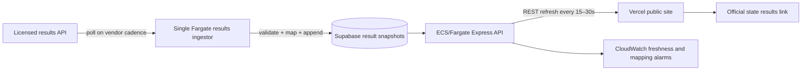

# VoteInformed: Product Ideas and Detailed PRDs

**Authoring perspective:** VP of Product  
**Date:** September 14, 2026  
**Status:** Proposed strategy and requirements; not an approved delivery commitment  
**Product:** VoteInformed / 2026Midterms  
**Planning horizon:** Public launch by October 30, 2026, followed by a durable civic research product

## 1. Product thesis and executive recommendation

VoteInformed should help a person answer four questions: **Which races apply to me? What meaningfully separates the candidates? What evidence supports what I am reading? What should I do next to prepare to vote?**

The repository already provides the ingredients of a useful election research platform. Its opportunity is to make those ingredients understandable together. A candidate directory is useful once; a trusted briefing that remembers where the reader stopped and explains what changed can become a recurring habit.

Recommend three headline experiences:

1. **My Election, in Five Minutes:** a guided federal race briefing with a private research checklist and official voting-resource handoff.
2. **Show Me the Evidence:** candidate comparisons, contextual explanations, and finance stories whose claims open directly to supporting records.
3. **Since Your Last Visit:** a concise account of material changes, including corrections, without requiring a user to reread entire profiles.

Use these experiences to establish usefulness and trust before expanding into institutional distribution, richer simulations, and year-round representative accountability. A successful product helps people make their own decisions; it does not select a candidate for them.

### Timing changes the recommendation

The ordinary 2026 federal general election date is November 3, approximately seven weeks from this document. Race-specific exceptions and changes must come from official election offices. The existing roadmap's multi-month sequence should therefore be treated as a long-term backlog, not a feasible nationwide pre-election commitment. The FEC itself distinguishes campaign-finance jurisdiction from election administration. See the [FEC election calendar](https://www.fec.gov/documents/5910/2026pdates.pdf) and its [updated 2026 reporting-date notices](https://www.fec.gov/help-candidates-and-committees/dates-and-deadlines/2026-reporting-dates/congressional-pre-election-reporting-dates-2026/).

**Pre-election recommendation:** ship evidence/freshness improvements, a narrowly scoped briefing, a federal race guide, and private checklist/print support in a small verified pilot. Make issue comparison a conditional stretch. Defer new live-results infrastructure, broad voter accounts, and open-ended generated political answers until their operating requirements are met.

## 2. What exists, what is proposed, and what remains unknown

This assessment is based on repository inspection, not production testing or user research. A route, component, or database model indicates implementation in source; it does not establish live availability, completeness, or correctness.

| Area | Observed implementation | Product implication |
| --- | --- | --- |
| Public browsing | `CODE/src/App.tsx` exposes election, race, candidate, and voter-resource routes | Build new journeys around existing records and navigation |
| Comparisons | `CandidateComparison.tsx` compares candidates and retrieves financial data | Extend a working comparison surface instead of creating another isolated destination |
| Finance | Candidate financials, committees, receipts, disbursements, and finance/lobby services exist | Finance interpretation is a plausible differentiator, subject to reconciliation |
| Ballot verification | `CandidateElection.ballotStatus` exists; race pages warn about unconfirmed candidates | Verification infrastructure is partial, not a blank slate; do not call every FEC filer a ballot candidate |
| Research | Authenticated race/history/simulation endpoints exist | Research expansion can reuse existing data and access controls |
| Saved research | `SavedSimulation` exists, but inspected research routes do not expose saved-scenario CRUD | Persistence requires an end-to-end workflow, not merely a new table |
| Assistant | `chat.controller.ts` sends conversation messages to Gemini; inspected flow has no source retrieval/citation layer | Evidence-grounded answers require substantive backend changes |
| Administration | Separate admin application and deadline/sync capabilities exist | Extend administration to editorial review and coverage operations |
| Prior strategy | `feature_roadmap.md` already proposes 13 broad feature areas | This document adds differentiated experiences, explicit acceptance tests, sequencing, and operating decisions |

**Not yet validated:** deployed behavior, active user counts, source completeness, content rights, editorial capacity, vendor terms, production cost, accessibility conformance, and partner willingness to pay.

**Relationship to existing plans:** this document supplements `feature_roadmap.md`; it does not replace deployment, reliability, or security implementation plans. New entity and endpoint names below are proposed contracts, not claims about existing APIs.

## 3. Users, jobs, and boundaries

| User | Job to be done | Current friction hypothesis | Desired outcome |
| --- | --- | --- | --- |
| Time-constrained voter | Understand my federal races quickly | Too many pages and unfamiliar terminology | Finish a concise briefing with clear sources and next steps |
| Evidence-seeking voter | Compare candidates on a few issues | Statements, records, and finance live separately | Compare equivalent evidence without inferred positions |
| Returning reader | Find out whether anything important changed | Rechecking complete profiles is expensive | See a short, dated, explainable change list |
| Journalist or researcher | Reproduce and share an analysis | Exports and scenarios lack a complete reproducibility workflow | Publish a versioned, cited artifact |
| Library or civic publisher | Offer reliable election information to its audience | Maintaining local content is costly | Embed an accessible, current guide |
| Editor or data operator | Find and fix high-impact gaps | Technical sync status does not explain public information quality | Resolve prioritized coverage and correctness issues |

These are research hypotheses. Recruit across levels of civic knowledge, age, device access, language needs, and assistive-technology usage. Do not infer political preferences to customize persuasion or rank candidates.

### Product boundaries

- Federal scope first. Label House/Senate coverage explicitly; state and local ballot completeness requires separate verified sources.
- No candidate endorsements, ideology-based recommendations, persuasion optimization, public voting-intention profiles, or sale of political preferences.
- No registration submission or assurance of eligibility; link to official systems and clearly distinguish a user's checklist from official confirmation.
- No unsupported claims that funding proves influence, that a speech proves future behavior, or that a simulation predicts an election.
- Public research remains accessible without an account. Private notes, reminders, and cross-device persistence are optional layers.

## 4. Portfolio and prioritization

Priorities reflect repository fit, near-term voter value, data readiness, and operating burden. Confidence is qualitative because actual usage and team velocity are unknown. Estimates are **incremental engineer-weeks after shared prerequisites**, including feature QA; content acquisition, translation, procurement, and ongoing operations are additional. Parallel work is not assumed automatically.

| ID | Feature | Distinctive moment | Priority / horizon | Incremental effort | Confidence |
| --- | --- | --- | --- | --- | --- |
| P01 | Five-Minute Election Briefing | A race becomes a short, sourced story | P0 / pilot before election | 2–3 | Medium |
| P02 | My Federal Ballot and Readiness Kit | Research becomes a private, printable plan | P0 / pilot before election | 3–5 | Medium |
| P03 | Evidence Lens and Issue Compare | Every comparison cell opens its evidence | P1 / narrow stretch, otherwise later | 4–7 | Medium |
| P04 | Money Trail Stories | Explain where reported campaign money comes from | P1 / after finance validation | 4–6 | Medium |
| P05 | Since Your Last Visit | Read only meaningful changes | P1 / after revision infrastructure | 3–5 | Medium |
| P06 | Ask With Receipts | Answers arrive with inspectable supporting passages | P2 / controlled beta | 5–8 | Low–medium |
| P07 | Office Powers Explorer | Understand what this office can actually do | P1 / low-data expansion | 2–4 | Medium |
| P08 | Portable Civic Guide | Take the guide offline or share a source-preserving card | P1 / print first, richer modes later | 4–7 | Medium |
| P09 | Reproducible Scenario Studio | Save, compare, and explain a hypothetical outcome | P2 / research release | 4–6 | Medium |
| P10 | Civic Publisher Kit | A library or newsroom embeds a maintained guide | P2 / partner pilot | 5–8 | Low–medium |
| P11 | Coverage and Corrections Desk | Editors see what voters cannot safely rely on yet | P0 / foundation | 3–5 | High for need, medium for scope |
| P12 | Promise-to-Action Ledger | Follow a representative's documented actions after election day | P2 / post-election discovery | 6–10 | Low–medium |

**Shared prerequisite estimate:** 4–6 engineer-weeks for a bounded source/revision contract, publication states, instrumentation, and pilot readiness. P11's estimate covers the operational UI/workflow on top of that contract. Do not sum all rows into a promised launch schedule.

## 5. Shared product requirements

These requirements apply to every PRD below, including exports and embeds.

### 5.1 Evidence and editorial contract

Every substantive published claim needs a stable claim ID, subject ID, source URL/publisher, source date where available, retrieval timestamp, review state, revision ID, and a distinction between source facts, campaign statements, calculations, and editorial explanation. Dates without a known publication time must not acquire an invented one.

Proposed publication states: `draft → in_review → published → superseded` or `withdrawn`. Corrections create new revisions; publication history is not overwritten. Critical voter instructions require an official source and human review. A broken source link should retain the record's identity and mark availability; it must not turn a formerly sourced claim into a fabricated replacement.

Candidate ordering is disclosed and consistent, such as alphabetical by display name. All candidates receive the same fields, evidence requirements, and opportunities for inclusion. Missing evidence means “Not documented in our reviewed sources,” not opposition, agreement, or zero.

### 5.2 Privacy and user control

Default to anonymous access and session-only use. Device persistence requires an explicit “Remember on this device” action and a clear-data control. Do not collect intended vote choices. Private research notes are local-only in initial scope and excluded from exports unless individually selected.

Street addresses must not enter analytics, application logs, URLs, or durable storage. If address resolution is introduced, review provider retention and proxy logging before launch. Prefer district IDs after resolution. Do not send issue selections, candidate reading histories, chat text, notes, email addresses, or raw locations to third-party analytics. Public-content aggregate counters may be collected without persistent cross-session identifiers.

### 5.3 Accessibility and presentation

Target WCAG 2.2 AA as a design/QA objective, not an unverified certification. All key journeys must support keyboard and screen-reader use, visible focus, reduced motion, 200% zoom, and a 320 CSS-pixel viewport. Charts require text/table equivalents. No swipe-only completion, color-only party encoding, or forced timer. Print must preserve caveats and sources.

### 5.4 Performance, measurement, and rollback

Proposed targets: p75 LCP ≤2.5 seconds on representative mobile traffic for core reading pages; p95 internal read APIs ≤750 ms excluding third-party calls; no blank page when one source is unavailable. Instrument targets before interpreting them as attained.

Feature flags must support disabling a module by feature and affected jurisdiction/content cohort. A rollback must preserve safe existing browse paths and already published correction notices. Critical correctness defects block expansion regardless of engagement gains.

### 5.5 Common definition of done

A feature is complete only when its owner has approved the user flow, applicable content is reviewed, its acceptance scenarios pass, analytics exclude sensitive payloads, error/empty/stale states work, the operating owner can maintain it, and rollback has been exercised. Each estimate includes its own verification; production-wide reliability work is a separate dependency.

## 6. P01 — Five-Minute Election Briefing

### Problem, outcome, and hypothesis

A voter arriving on a race page sees facts but must assemble a coherent understanding. Offer a short guided reading path that introduces the office, contestants, available evidence, money, and official next steps. Hypothesis: a structured briefing increases useful task completion without reducing comprehension or hiding uncertainty.

**Primary user:** time-constrained voter. **Owner:** Voter Experience PM; frontend lead; editorial counterpart. **Entry points:** homepage, state election page, race page. **Existing roadmap relationship:** a concrete entry experience spanning My Ballot, comparison, and evidence features.

### Experience and scope

The user selects a race and chooses “Quick overview” or “Explore in depth.” The overview has five sections: office responsibilities; candidate roster/status; documented differences if reviewed evidence exists; reported campaign-finance overview; official voting resources. Every section can expand into sources. A local progress marker lets the user resume when they explicitly enable device storage.

MVP uses reviewed structured content and deterministic templates. Estimated reading time is descriptive, not a countdown. Do not require completion to access details. Exclude generated daily articles, polling forecasts, and nationwide issue coverage from MVP.

### Functional requirements

- **P01-R1:** Generate the briefing from a versioned manifest of approved content blocks. Show race, election date, scope, and last reviewed time above the first block.
- **P01-R2:** Include every officially confirmed candidate in the roster; separately label unconfirmed filers. If no authoritative roster is available, title the section “Known federal filings” and state the limitation.
- **P01-R3:** Use identical fields and depth limits for candidates. A missing position receives a visible missing-data state; it must not disappear from comparison.
- **P01-R4:** Finance blocks use the same cycle and explicitly display coverage periods; explain when periods differ instead of suggesting direct equivalence.
- **P01-R5:** Provide “Show source,” “Explore this topic,” and “Report a problem” actions at block level.
- **P01-R6:** If a block is withdrawn, stop serving it and explain that the briefing was updated. Resume progress must be reconciled against the new version.

### Data and implementation

Add `BriefingManifest` with race ID, locale, version, ordered block IDs, publication state, and source revision references. Proposed API: `GET /api/races/:id/briefing`. Reuse `RaceDetail`, candidate cards, and existing finance reads; use one aggregated read contract to avoid increasing candidate-by-candidate network calls.

### Acceptance scenarios

1. Given a race with three confirmed candidates and one unconfirmed filer, all appear with correct status and none is silently omitted for missing finance.
2. Given no issue evidence, the briefing explains the gap and remains usable through office, roster, finance, and resources.
3. Given a withdrawn source-dependent block, a returning reader sees the updated version and a change notice.
4. A keyboard-only user can traverse, expand sources, and finish the guide without a timer or pointer gesture.

### Measurement and rollout

Events: `briefing_started`, `briefing_section_completed`, `briefing_completed`, `briefing_source_opened`; collect section type and aggregate cohort, not private reading profiles. Pilot target: ≥50% of starts reach the last section and ≥80% of moderated participants correctly identify the office, source freshness, and a next step. These are proposed thresholds, not baselines.

Launch in 10–20 verified races selected for data completeness and roster diversity. Expand only after a 20-briefing editorial sample has no material unsupported claim. If engagement rises while comprehension falls, simplify and retest rather than expand. Dependency: P11 and source contracts. Open decision: select pilot races after a coverage audit, not by assumed political competitiveness.

## 7. P02 — My Federal Ballot and Readiness Kit

### Problem, outcome, and hypothesis

State-level browsing does not reliably tell a voter which House race applies to them or preserve the next steps in preparing to vote. Build a federal race guide and private checklist. Hypothesis: users who can connect their race research to official voting resources find the product more actionable.

**Primary user:** voter preparing for an election. **Owner:** Voter Experience PM and elections data lead. **Relationship:** a deliberately narrowed, shippable specification of the existing My Ballot concept.

### Experience and scope

Start with state and known congressional district; offer an official district-lookup handoff if the user is unsure. Show applicable verified House/Senate races, a coverage banner, and a checklist: review races, check registration through the official system, review available voting methods, save official resources. User checkmarks mean “I marked this done,” never “the government confirmed this.”

Address lookup is an optional later phase behind a vetted provider and boundary-validity gate. MVP excludes local contests, eligibility adjudication, automatic registration checks, server-side voter accounts, and a stored candidate-choice ballot.

### Functional requirements

- **P02-R1:** Distinguish state, district, election event, and office identifiers. Support at-large districts and more than one Senate contest where applicable.
- **P02-R2:** Never resolve a ZIP code to a single congressional district when it is ambiguous. Provide manual selection and official lookup instead.
- **P02-R3:** Display “Federal races covered by VoteInformed” with an official full-ballot link; never claim complete ballot coverage.
- **P02-R4:** Build checklist entries only from reviewed jurisdiction-specific resources. Separate registration, request, receipt, and postmark deadlines when published.
- **P02-R5:** Allow anonymous printing and explicit device save/delete. Changing district prompts the user to review and reset affected items.
- **P02-R6:** Calendar export is optional and only available for verified dates. Use date-only events for date-only rules, jurisdiction-local time for timed deadlines, stable event IDs, and revision markers.
- **P02-R7:** A changed deadline invalidates the old on-site task and displays a correction. Explain that downloaded static calendar files cannot be remotely updated.

### Data and implementation

Propose `JurisdictionElection`, `OfficialVotingResource`, `VotingRuleRevision`, and a versioned local `ReadinessPlan`. Extend the existing `Deadline` model only after checking compatibility. Proposed read: `GET /api/voter-guide?state=XX&district=YY&electionId=...`; no raw address in query parameters. If later needed, address resolution is a transient `POST` with redacted logging.

### Acceptance scenarios

1. A split ZIP never produces a confident single-district assignment.
2. A state with an additional Senate contest renders distinct events rather than overwriting one race.
3. A deadline retains its intended calendar date when viewed from another time zone.
4. Stale rules show a warning and official handoff; the app does not manufacture a date.
5. “Clear my data” removes locally saved checklist/location preferences, and shared/printed guides omit private state by default.

### Measurement and rollout

Events: `federal_guide_opened`, `official_lookup_opened`, `plan_created`, `plan_printed`, `official_resource_opened`. Pilot target: ≥85% of moderated users identify the correct supported race using known-district input; ≥30% of guide sessions open an official resource or save a plan. Do not equate these actions with registration or turnout.

Start with one to three jurisdictions with a named content owner. P11 is required; address vendor integration is not on the MVP critical path. Stop expansion after any confirmed incorrect jurisdiction mapping until corrected and regression-tested. Open decision: which jurisdictions can maintain reviewed rules through election day?

## 8. P03 — Evidence Lens and Issue Compare

### Problem, outcome, and hypothesis

A finance-first comparison does not answer how candidates differ on issues, while simple stance labels can erase nuance. Let users compare documented evidence and inspect exactly why each summary appears. Hypothesis: an evidence-first comparison improves understanding of both differences and uncertainty.

**Primary user:** evidence-seeking voter. **Owner:** Candidate Experience PM and editorial lead. **Relationship:** extends the current comparison component and prior source-backed positions proposal.

### Experience and scope

Select up to three topics, then compare candidates in the same race. Each cell contains a short reviewed summary, evidence type, date, and a source drawer. On mobile, a topic-first view presents candidates sequentially with the same structure. Preferences reorder topics only; they do not generate a candidate fit score.

MVP covers three topics in the pilot races. Exclude automated ideological scoring, inferred positions, unsupported “flip-flop” labels, and ranking a candidate for a user.

### Functional requirements

- **P03-R1:** Use a versioned topic/question taxonomy so all candidates are compared against equivalent questions.
- **P03-R2:** Distinguish a campaign statement, recorded vote, sponsorship, and editorial explanation. A sponsorship is not a floor vote.
- **P03-R3:** Link a legislative action to bill version, date, action type, and contextual explanation; do not infer a complete policy position from a bill title.
- **P03-R4:** Allow multiple or conflicting evidence records. Display dated evidence together when positions evolve or cannot be reconciled.
- **P03-R5:** “Show differences” may hide only rows that editors have marked substantively equivalent; unknown cells remain visible.
- **P03-R6:** Do not publish a candidate-specific topic narrative before the same evidence-search protocol has been attempted for every candidate in that pilot race.
- **P03-R7:** Source drawer includes excerpt or permitted paraphrase, publisher, relevant date, review date, and correction action.

### Data and implementation

Propose `IssueTopic`, `IssueQuestion`, `CandidateEvidence`, and `ReviewedPositionSummary`, keyed to candidate, cycle, topic version, and source revision. API: `GET /api/races/:id/issue-comparison?topics=...`. Extend `CandidateComparison`; keep full citations available in print. Editorial queue must capture attempted searches and missing coverage without publishing internal notes.

### Acceptance scenarios

1. A candidate with no reviewed statement remains present with an explicit unknown state.
2. Two opposing statements from different dates can coexist without an automatically asserted reversal.
3. A withdrawn evidence item removes dependent summaries from the published comparison until reviewed.
4. Topic ordering does not change candidate ordering, candidate visibility, or answer wording.

### Measurement and rollout

Events: `comparison_opened`, `evidence_drawer_opened`, `comparison_printed`; exclude per-user topic histories. Target: ≥80% of moderated participants can distinguish a statement from a legislative action; 100% of published cells have evidence or an explicit missing state. Editorial sample must contain zero material attribution errors.

Dependency: P11, taxonomy review, licensed/allowed source use. Pilot editorial workload must be measured before scaling: record minutes per candidate-topic review and multiply by intended coverage and refresh frequency. Open decision: which three topics can be covered fairly with available staff?

## 9. P04 — Money Trail Stories

### Problem, outcome, and hypothesis

Campaign-finance totals are difficult to interpret without a denominator, period, and explanation of the money's path. Turn financial records into interactive explanations such as “Where reported receipts came from” and “How the latest report changed the picture.” Hypothesis: a small number of transparent stories outperforms an unstructured dashboard in comprehension.

**Primary user:** voter or journalist inspecting funding. **Owner:** Finance PM/data lead. **Relationship:** a user-facing narrative layer over Follow the Money and later outside-spending work.

### Experience and scope

A candidate page offers three cards: sources of reported receipts, spending/cash context, and changes between comparable reports. Select a card to see a flow/table and inspect source filings. Begin with committee-level and category aggregates; outside-spending edges arrive only after independent ingestion and reconciliation.

Exclude donor prospecting, individual contributor maps, employer-as-donor assertions, influence scores, and a combined number that adds outside spending to candidate receipts.

### Functional requirements

- **P04-R1:** Show cycle, report period, committee scope, denominator, last ingestion, and underlying filing IDs for every number.
- **P04-R2:** Distinguish true zero, not reported, unavailable, and partially ingested values. Preserve refunds, loans, transfers, and negative adjustments according to documented calculation rules.
- **P04-R3:** Handle amended reports as replacements or reconciled revisions under a documented filing policy; do not add original and amended totals together.
- **P04-R4:** Keep money raised by a candidate and independent support/opposition spending in separate categories and explanatory views.
- **P04-R5:** Industry/employer-derived groupings disclose classification method and unknown share. Contributions by employees must not be described as contributions by their employer.
- **P04-R6:** Each flow edge opens a source-backed aggregate table. An accessible table conveys all information available in the diagram.
- **P04-R7:** Use reviewed sentence templates, for example “X% of categorized receipts in this period came from category Y,” with a visible uncategorized remainder.

### Data and implementation

Build versioned `FinanceAggregateSnapshot` and `FinanceStory` records referencing filing lineage, category taxonomy, and reconciliation results. API: `GET /api/candidates/:id/finance-stories?cycle=2026`. Reuse finance/lobby services after validating aggregation semantics.

The FEC notes that newly filed summary data can take up to 48 hours to appear. Therefore “real time” is not an appropriate general promise for these stories. See [FEC data availability](https://www.fec.gov/data/browse-data/) and [amendment guidance](https://www.fec.gov/help-candidates-and-committees/filing-amendments/).

### Acceptance scenarios

1. An original filing and amendment produce one correctly reconciled current story with visible revision history.
2. Categories plus the uncategorized remainder reconcile to the stated denominator within declared rounding tolerance.
3. A partial import cannot publish a “complete” money trail.
4. Different reporting periods are flagged before a cross-candidate comparison renders.

### Measurement and rollout

Target: ≥80% of research participants correctly distinguish campaign receipts from outside spending; 100% of released aggregates pass reconciliation. Track `money_story_opened` and aggregate source drill-down rate. Gate on finance data integrity, not visual completion. Pilot one story type and expand only after two successful reporting updates. Open decision: which existing aggregates can be reproduced directly from source filings?

## 10. P05 — Since Your Last Visit

### Problem, outcome, and hypothesis

Returning visitors cannot easily find a revised finance report, candidate status change, or corrected voter resource. Provide a compact, explainable delta feed. Hypothesis: readers return when the platform saves rereading effort, without requiring sensational news or constant alerts.

**Primary user:** returning reader. **Owner:** Retention PM and platform lead. **Relationship:** sharpens the existing change-feed/watchlist proposal around version comparison.

### Experience and scope

A race page shows “What changed” and, with explicit device storage, “Since your last visit.” Each event shows the previous and current state, source, effective/source date, publication date, and why it appears. First-time visitors get a dated recent-changes view, not a fictional last visit.

MVP is on-site, anonymous, and limited to structured published changes. Defer email, push, accounts, social posts, sentiment feeds, and unreviewed candidate news.

### Functional requirements

- **P05-R1:** Generate events only from published revision transitions; ingestion timestamps alone do not constitute public changes.
- **P05-R2:** Classify events as ballot status, finance filing, issue evidence, official resource, or correction. Corrections are always eligible; cosmetic edits are excluded.
- **P05-R3:** Give each event an idempotency key derived from entity, revision, and event type to prevent duplicate import messages.
- **P05-R4:** Define materiality per type: new/amended finance filing, changed verified status, changed reviewed instruction, or newly published/substantively revised evidence. Do not use political sentiment as a ranking signal.
- **P05-R5:** Retain retractions as correction events. Readers must not lose the explanation when the old claim is withdrawn.
- **P05-R6:** Bound local visit markers and offer deletion. Changing device or clearing storage returns to the generic feed.
- **P05-R7:** If delivery channels are added later, require independent opt-in, unsubscribe, retries, and a durable delivery ledger before launch.

### Data and implementation

Propose `PublishedChangeEvent` with before/after revision IDs and event category. Generate via a transactional outbox after publication. API: `GET /api/races/:id/changes?after=...`, with opaque pagination and bounded windows. Last visit remains local for MVP.

### Acceptance scenarios

1. Reprocessing the same source produces no duplicate public event.
2. A corrected deadline is prominent even if its original publication predates the visit marker.
3. A first visit displays actual publication dates and does not say “since you last visited.”
4. A source retrieval with no semantic change creates no feed item.

### Measurement and rollout

Track aggregate `changes_opened`, `change_source_opened`, and an optional usefulness response. Target: ≥70% of feedback calls the feed useful; fewer than 5% of sampled events are duplicates or cosmetic noise, and zero missed critical corrections in replay tests. Measure cross-session return only in an explicitly consented research cohort. P11/revisions are required. Open decision: set display caps and category precedence through testing, while keeping corrections visible.

## 11. P06 — Ask With Receipts

### Problem, outcome, and hypothesis

The current chat flow can generate answers without a repository evidence-retrieval contract. A useful research assistant needs to answer from reviewed records and admit gaps. Hypothesis: inspectable citations and explicit abstention make natural-language research useful enough to justify its cost and complexity.

**Primary user:** reader asking follow-up questions about a race. **Owner:** AI Experience PM, backend lead, editorial reviewer. **Relationship:** a new trust-oriented redesign of the existing chat experience.

### Experience and scope

From a race, ask “What have these candidates said about transportation?” The answer contains a concise comparison, claim-level citations, dates, and missing evidence. Opening a citation reveals the supporting passage, not just a generic homepage. Unsupported questions return available sources and an explanation of the gap.

MVP retrieves only reviewed structured records/passages for the selected race and office explainers. No unrestricted web answering, personalized candidate recommendations, eligibility determinations, or generated voting deadlines.

### Functional requirements

- **P06-R1:** Resolve named candidates and race context before retrieval. Ambiguous identities require clarification rather than a guess.
- **P06-R2:** Retrieve only published, nonwithdrawn revisions. The model receives source text as data and cannot follow instructions embedded in sources.
- **P06-R3:** Require structured output with factual claim spans and evidence IDs. Validate evidence existence and access on the server before rendering.
- **P06-R4:** Unsupported substantive claims cause abstention or fallback to reviewed source cards. Citation existence alone is insufficient; evaluate whether the passage supports the claim.
- **P06-R5:** Return official-resource cards for voting logistics from validated data; do not synthesize a rule from model memory.
- **P06-R6:** Rate-limit and bound input, retrieval, history, and output. Use server-issued session identifiers and isolation; provide session clear and a defined expiration.
- **P06-R7:** Do not retain conversation text by default or use it for political profiling. Any research transcript collection needs separate explicit consent and retention rules.

### Data and implementation

Propose `EvidencePassage` indexed by entity, topic, source revision, and publication state. Add retrieval, structured answer validation, citation rendering, and model-independent evaluation around the current controller. Endpoint: `POST /api/research-assistant/answer`; response includes answer blocks, evidence IDs, abstention state, and corpus version. Model/vendor selection is a later engineering decision based on evaluation and approved data handling, not this document's assumption.

### Acceptance scenarios

1. A question outside corpus coverage returns an explicit gap without an invented answer.
2. A source containing “ignore previous instructions” cannot change the assistant's behavior.
3. Withdrawn evidence cannot appear in new answers; cached answers are invalidated by source revision.
4. Two sessions cannot read or clear each other's history.
5. A request to recommend a candidate returns neutral comparison help instead.

### Measurement and rollout

Before beta, evaluate at least 200 balanced questions spanning supported answers, ambiguous names, missing data, conflicting sources, logistics, and adversarial input. Proposed gates: ≥98% factual-claim support in human review, ≥95% appropriate abstention on unsupported questions, zero incorrect voting instructions, and p95 response time under 10 seconds at pilot load. Track cost per supported answer with a proposed $0.05 ceiling to validate, not a vendor pricing claim.

Start with a closed beta and source-card fallback. If quality or cost gates fail, retain source search without generation. Dependency: P03/P11 evidence corpus. Open decision: whether generated prose adds enough value over structured retrieval to ship at all.

## 12. P07 — Office Powers Explorer

### Problem, outcome, and hypothesis

Voters encounter campaign promises without knowing which office has authority to act. Explain the office's powers and the institutional steps required for a policy change. Hypothesis: connecting proposals to process improves civic understanding and makes the rest of the product easier to interpret.

**Primary user:** reader unfamiliar with federal responsibilities. **Owner:** Civic Education PM and qualified content reviewer. **Relationship:** a new educational layer that supports briefing and issue comparison.

### Experience and scope

Select an office and a broad topic. See “What this office can do,” “What requires other institutions,” and a short process map. A House example might show introduction, committee consideration, chamber votes, and executive action, with relevant exceptions explained in reviewed content rather than forced into one universal diagram.

MVP contains office-level educational explainers and links to authoritative sources. Exclude predictions about legislation passing, candidate capability scores, and personalized financial/legal outcomes.

### Functional requirements

- **P07-R1:** Content is jurisdiction/office-specific, versioned, reviewed, and sourced before publication.
- **P07-R2:** Distinguish proposing, sponsoring, voting, oversight, implementation, and judicial review when relevant.
- **P07-R3:** Candidate statements link to an applicable process explainer; the linkage does not imply feasibility or endorsement.
- **P07-R4:** Interactive steps expose full text and equivalent linear reading mode.
- **P07-R5:** An optional knowledge check gives explanatory feedback without storing a user ability score.
- **P07-R6:** Unknown or disputed authority questions receive a qualified explanation and sources, not a definitive generated answer.

### Data and implementation

Add `OfficeExplainer` and `PolicyProcessStep` keyed to office, topic, locale, and revision. Read-only endpoint: `GET /api/offices/:office/explainers`. Reuse content blocks in P01 and evidence drawers. Editorial research into current official institutional sources is a release dependency; illustrative examples here are not publication-ready articles.

### Acceptance scenarios

1. A Senate-specific explainer cannot be displayed as a House responsibility by route fallback.
2. A user can read the complete process without interacting with a diagram.
3. Changing a source invalidates affected translations and flags linked briefing blocks for review.
4. A campaign proposal does not acquire a “will happen” label through its process mapping.

### Measurement and rollout

Target: a 20-percentage-point improvement between short pre/post comprehension checks in moderated testing, with results interpreted cautiously given small samples. Track `office_explainer_opened` and voluntary completion in aggregate. Start with House/Senate basics and three topics. No feature-specific user database is required. Open decision: appoint the qualified reviewer and define a recurring content-review interval before expanding topics.

## 13. P08 — Portable Civic Guide

### Problem, outcome, and hypothesis

Research often needs to leave the website: printing at home, accessing content with limited connectivity, or sharing a concise explanation. Produce a portable guide that preserves context and sources. Hypothesis: portability broadens practical usefulness without forcing account creation or social growth mechanics.

**Primary user:** mobile reader, library visitor, or person with unreliable connectivity. **Owner:** Voter Experience lead with accessibility and translation partners. **Relationship:** packages the existing multilingual/offline idea as a deliberately versioned artifact.

### Experience and scope

Select “Take this guide with me,” choose public sections, and preview a printable version or explicit offline save. A neutral source card can be shared with a canonical link, publication date, and revision. The user sees what will be included before creating it.

Phase A is accessible browser print and public source cards. Phase B adds offline storage and reviewed translations. Exclude private voting choices, invisible tracking links, auto-posting, and automatic caching of all browsing activity.

### Functional requirements

- **P08-R1:** Artifacts display race, federal scope, publication/review date, coverage gaps, canonical link, and version. Include visible URLs as well as optional QR codes.
- **P08-R2:** Private notes/checklist state are excluded by default; a user must explicitly select each supported private section for local printing.
- **P08-R3:** Offline mode requires explicit save, size feedback, last-refresh display, and delete control. Never cache chat, address submissions, authentication tokens, or supposedly live status.
- **P08-R4:** Label offline rules as saved information and instruct the user to verify official sources when reconnected. Mark content stale once its configured review deadline passes.
- **P08-R5:** Critical translated voting content needs human review; source revisions invalidate dependent translations. Show language fallback explicitly.
- **P08-R6:** Share links resolve to current content with visible revision history. Immutable artifacts show that they are snapshots and may be outdated.

### Data and implementation

Use a versioned `GuideManifest` with content/source revisions, locale, and generated time. Start with print CSS and public artifact previews; later add service-worker caching restricted to selected manifests. Do not require a PDF generation backend for Phase A. Translation statuses and source dependencies share P11's publication workflow.

### Acceptance scenarios

1. Printing a long multi-candidate guide preserves headings, source references, and coverage warnings without clipped text.
2. A saved guide loads with the network disabled and prominently identifies its saved time.
3. Deleting offline data removes both cached content and its index.
4. A revised source marks the old translation stale instead of silently presenting it as current.
5. A shared public guide contains no checklist state or private notes from its creator.

### Measurement and rollout

Track aggregate `guide_printed`, `offline_save_completed`, `public_card_created`; do not treat opening the native print dialog as confirmed printing. Target: ≥90% task success in a small device/accessibility/offline test matrix and zero private-state leaks in exported fixtures. Roll out print first; add one additional language only with funded review capacity. Dependencies: P01/P02 and reviewed content. Open decision: prioritize language expansion using observed user needs and partner input, not inferred ethnicity.

## 14. P09 — Reproducible Scenario Studio

### Problem, outcome, and hypothesis

The repository has a simple swing simulator and saved-simulation schema, but a research tool needs reproducible inputs, explicit assumptions, and shareable comparisons. Hypothesis: a transparent research artifact is more valuable than an increasingly elaborate simulation with unclear assumptions.

**Primary user:** researcher, journalist, or civic educator. **Owner:** Research PM and data-methodology lead. **Relationship:** specifies the highest-value slice of Research Lab 2.0.

### Experience and scope

Open a baseline, change supported aggregate swing inputs, save a named scenario, and compare it with another. The result includes exactly what changed, model limits, included races, and an exportable methodological receipt. Display “Hypothetical scenario” prominently.

MVP retains the aggregate swing model after validating edge cases. Exclude win probabilities, demographic targeting, turnout persuasion strategy, precinct recommendations, and claims of forecast calibration.

### Functional requirements

- **P09-R1:** Save model version, dataset version/checksum, boundary version, inputs, output snapshot, creator, visibility, and timestamps.
- **P09-R2:** A saved scenario never silently reruns against new data; “Rerun with current data” creates a new version.
- **P09-R3:** Compare only compatible scenarios or clearly explain incompatible baseline, boundary, or model assumptions.
- **P09-R4:** Private is the default. Sharing creates a read-only, revocable public artifact; collaborators cannot edit the original through that link.
- **P09-R5:** Ties have an explicit tie state. An aggregate “other” category must not be treated as a named candidate or a single party winner.
- **P09-R6:** Invalid, incomplete, redistricted, or uncontested baselines receive explicit treatment. Do not map county totals to districts without validated district-specific allocation.
- **P09-R7:** Export inputs, results, inclusion/exclusion rules, and citations. Chamber control cannot be claimed from a partial subset of races.

### Data and implementation

Extend `SavedSimulation` and add immutable dataset/model metadata. Implement authenticated create/list/read/duplicate/delete and versioned rerun endpoints under `/api/research/simulations`. Reuse research authentication but verify ownership on every operation. Inspect and fix tie/other-party semantics in `simulation.service.ts` before publishing enhanced output.

### Acceptance scenarios

1. Reloading a saved scenario reproduces its stored output after the active dataset changes.
2. A second researcher cannot access or delete a private scenario by guessing its ID.
3. An equal-share fixture returns a tie, not the first party checked by code.
4. A multi-party “other” aggregate cannot be displayed as a specific party winning.
5. Revoking a share link prevents subsequent access through that link.

### Measurement and rollout

Target: 100% reproducibility across a versioned fixture set and ≥80% of pilot researchers successfully save, compare, and export without assistance. Track `scenario_saved`, `scenario_compared`, and `scenario_exported` without logging private inputs. Launch with 5–10 researchers after interviews; ongoing support is required. Open decision: whether the baseline datasets have sufficient boundary provenance for valid district comparisons.

## 15. P10 — Civic Publisher Kit

### Problem, outcome, and hypothesis

Libraries, campus civic programs, and local newsrooms need useful election information but may lack maintenance capacity. Offer source-preserving embeds and guide exports. Hypothesis: institutional distribution can reach users who will not independently discover a new election website.

**Primary user:** civic publisher/editor. **Owner:** Partnerships PM and platform lead. **Relationship:** a scoped product/operating model for the existing publisher toolkit proposal.

### Experience and scope

A partner selects a verified jurisdiction, chooses a race-guide or comparison module, previews desktop/mobile, and copies an embed snippet. The module retains VoteInformed attribution, sources, freshness, and correction behavior. Partner analytics are aggregate views/official-resource handoffs, not political preference data.

MVP is one read-only embed format for three design partners. Exclude arbitrary custom ranking, white-label removal of caveats, bulk donor exports, campaign targeting tools, and a general-purpose paid API.

### Functional requirements

- **P10-R1:** Allow branding around the module, but not removal of candidate coverage, provenance, or uncertainty labels.
- **P10-R2:** Serve versioned embed configuration with allowed jurisdictions, locale, and accessible theme tokens.
- **P10-R3:** Enforce origin configuration, bounded traffic, caching, and operational quotas; never put secret credentials in public embed markup.
- **P10-R4:** A withdrawn claim or corrected rule propagates to online embeds within a proposed 15-minute publication/cache window.
- **P10-R5:** If upstream service fails, show a dated safe snapshot only when still publishable; otherwise show a clear unavailable state and canonical/official fallback.
- **P10-R6:** Separate partner traffic metrics from voter identity. No third-party cookies or cross-site reading profiles.
- **P10-R7:** Provide an accessibility guide, installation instructions, status contact, and source/license inventory for the partner pilot.

### Data and implementation

Propose `Partner`, `EmbedConfiguration`, and aggregate usage buckets. Use a read-only embed endpoint backed by published content snapshots; isolate partner configuration access from public embed reads. Begin with iframe isolation and explicit sizing/accessible title; validate against each partner's actual CMS and content security policy.

### Acceptance scenarios

1. A partner cannot configure away an inconvenient candidate or the “partial coverage” banner.
2. A critical correction appears in online pilot embeds within the defined propagation window.
3. Embedded browsing does not set cross-site tracking identifiers.
4. A partner page remains usable when the module times out or exceeds quota.

### Measurement and rollout

Pilot success: all three partners embed without custom engineering, at least two want continued use, and aggregate official-resource handoff rate is comparable to the first-party guide. Track support hours per partner and delivery cost per 1,000 views. Treat paid service as a discovery hypothesis: test willingness to pay for support/custom integrations, while keeping core voter information free.

Dependencies: stable P01/P02/P11, documented rights for redistribution, and named support ownership. Open decision: whether partner demand supports a sustainable service before building billing or API tiers.

## 16. P11 — Coverage and Corrections Desk

### Problem, outcome, and hypothesis

A successful data sync does not guarantee that voters can rely on a race page. Editors need to see missing candidate evidence, unverified rosters, expired rules, and source-dependent content affected by corrections. Hypothesis: visible coverage operations reduce public errors and permit responsible expansion.

**Primary user:** editor/data operator. **Owner:** Trust PM and operations lead. **Relationship:** consolidates the prior trust/corrections proposal into the portfolio's enabling product.

### Experience and scope

An operator opens a dashboard by jurisdiction/race and sees unverified rosters, overdue reviews, missing candidate-topic cells, broken sources, and pending public reports. Selecting a problem shows its affected pages/artifacts, ownership, and change history. Publishing a correction updates downstream content and generates a public notice when material.

MVP supports the pilot's content types and manual triage. Exclude automated truth verdicts, unreviewed public comments, and a single numeric “trust score.”

### Functional requirements

- **P11-R1:** Compute separate coverage dimensions: roster verification, evidence completeness, finance coverage, rule freshness, and translation validity. Never collapse them into a misleading complete/incomplete badge.
- **P11-R2:** Accept structured correction reports against public content IDs with optional source URL and contact details. Redact contact details from public records and analytics.
- **P11-R3:** Provide assignment, severity, due time, status, duplicate linking, and full audit history. Reports are allegations until reviewed.
- **P11-R4:** Critical voter instructions require a second reviewer before publication. A designated operator may immediately withdraw potentially harmful content without waiting for replacement approval.
- **P11-R5:** Revision impact analysis identifies dependent briefings, comparisons, assistant passages, translations, offline manifest versions, and embeds.
- **P11-R6:** Show source publication, last retrieval, last review, and next-review deadline separately. A fresh fetch does not reset an editorial review date.
- **P11-R7:** Restrict publishing permissions and test public/reviewer/publisher/admin access. No unaudited direct database edit should be needed for routine correction work.

### Data and implementation

Propose `SourceRecord`, `ContentRevision`, `EvidenceDependency`, `ReviewTask`, and `CorrectionReport`, with domain-specific links where stronger integrity is needed. Extend `admin-dashboard` with queues, review forms, diff preview, and publish/withdraw actions. Publish via an atomic transaction plus outbox event; public reads consume approved revisions only.

### Acceptance scenarios

1. Withdrawing a rule identifies every dependent online surface and triggers cache invalidation.
2. A reviewer without publishing permission cannot make a draft public through API calls.
3. Refreshing an unchanged source does not falsely mark an overdue claim reviewed.
4. Duplicate reports are linked without deleting their audit trail or exposing reporter details.
5. A public coverage indicator cannot show fully verified when any required dimension is unknown.

### Measurement and rollout

Proposed staffed-period targets: triage critical logistics/identity reports within one hour and resolve, withdraw, or clearly mark affected content within four hours; triage ordinary reports within two business days. These are staffing-dependent targets, not an implied 24/7 promise. Publish support hours and designate election-period escalation coverage before launch.

Track `review_task_resolved`, overdue critical items, correction age, and reviewed candidate-topic coverage. Release gate: every pilot page has an owner and reviewed status; no unresolved critical correctness issue. Open decision: assign actual editorial and backup owners before adding jurisdictions.

## 17. P12 — Promise-to-Action Ledger

### Problem, outcome, and hypothesis

An election site risks becoming irrelevant after voting ends. Preserve documented campaign statements and connect them to later official actions without reducing complicated governance to a simplistic score. Hypothesis: continuity from candidate research to representative research supports year-round usefulness.

**Primary user:** constituent or journalist following a representative. **Owner:** Accountability PM and legislative-data/editorial lead. **Relationship:** a new post-election extension of issue positions and voting records.

### Experience and scope

Open a representative's issue timeline: campaign statement, later sponsorships, recorded votes, and relevant official actions. Each event has source/date/type and a reviewed explanation of its relationship. Users can see “No relevant action found in reviewed coverage,” with explicit dates and sources searched.

MVP follows a small cohort and three topics after officeholders and records are verified. Exclude an automatic promises-kept score, causal claims about motives, financial-influence judgments, and an assumption that inaction proves a broken promise.

### Functional requirements

- **P12-R1:** Preserve campaign statements as immutable, dated evidence revisions tied to the correct election cycle and speaker.
- **P12-R2:** Link official actions through reviewed relationships: relevant, partially relevant, or contextual. Do not infer fulfillment from keyword overlap.
- **P12-R3:** Keep proposed legislation, passage in one chamber, enactment, and implementation distinct.
- **P12-R4:** Provide a scope window and list covered action types. “No action found” describes the dataset search, not all possible actions.
- **P12-R5:** Conflicting evidence and later clarifications remain visible in chronological order.
- **P12-R6:** Apply equivalent monitoring rules to all included officeholders; publish cohort selection and coverage methodology.
- **P12-R7:** Corrections retain the old interpretation in audit history and update public downstream summaries with an appropriate notice.

### Data and implementation

Propose `CampaignStatement`, `OfficialAction`, and `ReviewedStatementActionLink`, referencing shared evidence and stable officeholder identifiers. API: `GET /api/officeholders/:id/issue-timeline?topic=...`. Identity mapping must handle candidates who do not win, office changes, special elections, and namesakes without merging people.

### Acceptance scenarios

1. A bill introduction is labeled introduction, never enactment or policy implementation.
2. A namesake's action cannot attach to the wrong representative based on text matching alone.
3. A coverage gap does not generate a “promise broken” conclusion.
4. A corrected relationship updates the timeline while preserving the reviewed revision trail.

### Measurement and rollout

Target: ≥80% of moderated users distinguish a campaign claim from legislative progress; 100% of published statement/action links are human-reviewed in MVP. Track aggregate `accountability_timeline_opened` and source inspection, plus minutes of editorial effort per relationship. Proceed beyond a small pilot only if that operating cost is sustainable and users demonstrate recurring interest.

Dependencies: P03/P11, verified officeholder identity, authoritative action feeds, and a post-election editorial budget. Open decision: discover which timeline questions constituents repeatedly need before choosing the cohort size.

## 18. Ship plan: September 14 through October 30, 2026

### Architecture decision

Use **Vercel + Supabase + Amazon ECS/Fargate** for this launch. Supabase is the managed PostgreSQL backend; it does not replace the existing Express/Prisma compute layer. The repository's API starts a permanent HTTP listener and an in-process `node-cron` scheduler, while its nationwide FEC sync can run for several minutes. Fargate preserves that container model without requiring the team to maintain EC2 hosts. Moving the backend into request-scoped Vercel Functions before October would add avoidable conversion and database-connection risk.

| Layer | Launch choice | Repository mapping | Decision rationale |
| --- | --- | --- | --- |
| Public website | Vercel project | `CODE/` | Vite static delivery, preview deployments, quick rollback, and an October-friendly operating model |
| Admin website | Separate protected Vercel project | `admin-dashboard/` | Independent deployment and access control for the staff surface |
| Database | Supabase Postgres, paid production project | `backend/prisma/` | Managed PostgreSQL, backups, monitoring, and compatibility with the existing Prisma schema |
| HTTP API | ECS Express Mode on Fargate behind its managed HTTPS endpoint/load balancer | `backend/` and its Dockerfile | Preserves the current long-running Express server, adds health checks and autoscaling, and avoids host maintenance |
| Scheduled ingestion | EventBridge Scheduler invoking one-off Fargate tasks | `npm run sync:all` and ideology sync | Jobs run independently of web replicas and support retries plus a dead-letter queue |
| Election-night ingestion | A separate single-replica Fargate worker, activated only for rehearsals and election operations | New provider adapter and normalization worker | Polls the licensed results provider without coupling upstream availability to public requests |
| DNS | `www`, `api`, and `admin` hostnames | Vercel and backend service | Stable URLs make CORS, rollback, and provider changes manageable |

Create the public and admin Vercel apps as separate projects connected to the same repository, with root directories `CODE` and `admin-dashboard`. Vercel documents this as its normal [monorepo deployment model](https://vercel.com/docs/monorepos).

Use Supabase as PostgreSQL through Prisma for the first release. Do not add direct browser-to-database access, Supabase Auth, Storage, Realtime, or Edge Functions to the critical path. If the Data API remains enabled, every exposed `public` table needs explicit grants and Row Level Security; the simpler launch posture is to turn the Data API off because both frontends already use Express. For a persistent container, use the direct database endpoint when the runtime has IPv6 or Supavisor session mode when it needs IPv4. Use a separate direct connection for Prisma migrations. Supabase's current [connection guidance](https://supabase.com/docs/guides/database/connecting-to-postgres) and [Prisma guide](https://supabase.com/docs/guides/database/prisma) distinguish persistent connections from transaction pooling for serverless clients.

Do **not** put the current API and ingestion jobs on Vercel Functions for this deadline. Vercel Functions have bounded invocation duration and payload limits, even though current paid plans support longer functions. Those constraints are a poor match for the existing process scheduler and full FEC sync. See [Vercel Function limits](https://vercel.com/docs/functions/limitations).

Use **ECS Express Mode on Fargate** for the API unless the team needs custom networking that requires a standard ECS service. AWS's [Express Mode workflow](https://docs.aws.amazon.com/AmazonECS/latest/developerguide/express-service-first-run.html) creates a container service with health, scaling, secrets, networking, and CloudWatch settings from an ECR image. Use EventBridge Scheduler to run the existing recurring imports as [scheduled ECS tasks](https://docs.aws.amazon.com/AmazonECS/latest/developerguide/tasks-scheduled-eventbridge-scheduler.html), with retries and an SQS dead-letter queue.

Do **not** use a raw EC2 instance for the October launch. It would require ownership of OS patching, instance recovery, process supervision, reverse proxy/TLS configuration, deploy orchestration, and scaling. EC2 is a reasonable later choice only if the team already operates it and needs host-level control. This supersedes the frontend choice in `AWS_SUPABASE_DEPLOYMENT_PLAN.md`; Vercel replaces Amplify, while that plan's recommendation for ECS/Fargate and against EC2 remains sound.

### Scope commitment

Assume three engineers, one product designer, a PM, one elections/content editor, and part-time QA/accessibility support. This is a planning assumption, not a statement about staffing. The immovable deadline is **Friday, October 30**, leaving the weekend before the ordinary federal election on Tuesday, November 3 for monitoring and content corrections rather than feature work.

Commit to a reliable core release:

- Existing election, race, candidate, finance, voter-resource, admin, and researcher paths work in production.
- P11's minimum coverage/freshness/withdrawal workflow is operational.
- P01 Five-Minute Election Briefing ships for a verified pilot cohort.
- P02 ships as manual state/district selection, official resource handoff, local checklist, and print view.
- Public and admin apps deploy through Vercel previews and production promotion.
- Supabase contains the migrated/rebuilt production data with verified backup and restore steps.
- The Express API runs on ECS/Fargate and scheduled ingestion runs as independent one-off Fargate tasks.

P03 issue comparison is stretch scope for a few fully reviewed topics. P04–P12 remain post-launch unless they are already substantially complete. Nationwide issue research, account creation, new AI chat behavior, address geocoding, and a serverless backend migration are outside the October commitment.

Election-night results are a **conditional November 3 release**, separate from the October 30 core launch. They enter committed scope only if a provider contract, redistribution rights, test credentials, full 2026 federal-race coverage details, rate limits, and support/escalation terms are confirmed by September 18. If that gate is missed, the product launches with prominent links to official result sources and does not display copied, scraped, or incomplete totals.

### Calendar timeline

| Dates | Milestone | Product and engineering work | Exit gate / accountable owner |
| --- | --- | --- | --- |
| **Sep 14–18** | Scope lock and deployment baseline | Name owners; choose 10–20 pilot races; inventory env vars and data sources; create Supabase staging/production projects; connect Vercel preview projects; deploy the unchanged backend to nonproduction ECS/Fargate; establish a launch risk log; finish the live-results provider procurement gate | All three applications build; staging health endpoint reaches Supabase; pilot coverage audit is complete; results workstream has a signed go/no-go. Product and engineering leads sign the scope lock |
| **Sep 21–25** | Database and pipeline rehearsal | Apply Prisma migrations to staging; run candidate/finance ingestion; validate counts and amendment behavior; configure pooled/direct URLs correctly; move schedules to EventBridge-triggered Fargate tasks; establish backup, restore, logs, uptime checks, and error alerts | A clean staging rebuild is repeatable; one backup restore is proven; two scheduled tasks finish without overlap. Backend/data lead owns the gate |
| **Sep 28–Oct 2** | Trust foundation | Build minimum P11 review states, freshness/source display, correction/withdraw behavior, and admin permissions; remove or clearly label unsupported promises and incomplete surfaces; add privacy-safe product events | Every pilot race has an owner and coverage state; a staged correction propagates through the public UI; no secret is exposed in either Vercel bundle. Editorial and platform leads own the gate |
| **Oct 5–9** | Core voter experience | Implement P01 briefing and narrowed P02 state/district guide, local checklist, official-resource links, and print layout; connect them to reviewed pilot content | End-to-end happy paths work on staging; unknown/unverified data has explicit states; no federal guide claims full-ballot coverage. Product/design lead owns the gate |
| **Oct 12–16** | Integration and content freeze | Finish pilot content; run mobile, keyboard, screen-reader, 200% zoom, time-zone, CORS, auth, and migration tests; perform load tests against cached public reads; decide whether any P03 stretch slice qualifies | **Feature and content freeze: Friday, Oct 16.** Zero open critical correctness or privacy defects. QA/editorial lead owns the gate |
| **Oct 19–23** | Release candidate and rehearsal | Promote an immutable release candidate; rehearse production database migration/rebuild, rollback, source withdrawal, backend outage, scheduled sync failure, and Vercel rollback; finalize support runbook and status messaging | **Code freeze: Friday, Oct 23.** Rollback completes within 15 minutes in rehearsal; production go/no-go checklist is signed. Engineering lead owns the gate |
| **Oct 26** | Soft launch | Open production to the team and a small invited cohort; validate real DNS, TLS, CORS, database connections, ingestion, analytics, and admin correction workflow | No Sev-1/Sev-2 issue during the first operating window; data and official links pass sampling |
| **Oct 27–28** | Stabilization | Fix only launch-blocking defects and content errors; increase traffic gradually; compare logs, latency, connection count, and support volume to thresholds | Go/no-go review at 4:00 p.m. ET on Oct 28; rollback remains immediately available |
| **Oct 29** | Production promotion | Promote the tested Vercel deployments and backend image; verify public/admin/API hostnames; take a prelaunch database backup; run smoke checks from mobile and desktop | Formal launch approval after smoke tests and editorial signoff |
| **Oct 30** | Public launch | Announce availability through owned channels; monitor uptime, API errors, database connections, sync status, and correction queue | Public launch complete by noon ET; feature changes stop and election-period operations begin |
| **Oct 31–Nov 2** | Election readiness | Monitoring and reviewed data corrections only; daily official-link sample; provider connection checks and final results rehearsal if the conditional track passed; on-call coverage; no unrelated feature releases | Known critical errors are withdrawn or corrected within the staffed response target; results feed has a signed readiness decision; official results links remain the fallback |
| **Nov 3** | Election-night mode | Activate live ingestion before the vendor's prescribed window; show unofficial totals, source, last update, reporting measure, and separately sourced race calls; staff engineering and editorial/data operations until the defined closeout time | Feed freshness and mapping alarms remain healthy; any unreliable race automatically falls back to its official source rather than serving stale or mismatched totals |

### Conditional election-night results workstream

This feature should be described as **live election results**, not a livestream. The likely vendor contract is a polling API: the AP Elections API, for example, instructs integrators to poll regularly for updated vote totals and race calls. The user experience can still update automatically every 15–30 seconds without claiming a push stream that the provider does not supply.

Shortlist the [AP Elections API](https://developer.ap.org/ap-elections-api/) and [Decision Desk HQ Results API](https://results-api-docs.decisiondeskhq.com/). The FEC API is a campaign-finance source and must not be used as an election-night results provider. Select the vendor on verified federal-race coverage, testing windows, update cadence, correction behavior, race-call fields, redistribution rights, availability commitments, technical support, and total cost. Do not combine calls from one vendor with vote totals from another unless the UI and data model preserve that distinction.

Prefer short REST polling from the browser for the first election night. It is easier to cache, test, autoscale, and recover than adding WebSockets or Server-Sent Events under this deadline. The Application Load Balancer supports persistent WebSocket connections, but a multi-task streaming design also needs shared fan-out, reconnect behavior, and additional load testing. Streaming can follow after the snapshot pipeline proves reliable.

The ingestor runs as a separate Fargate service with desired count `1` so only one process polls the provider. It writes append-only snapshots and advances a current-result pointer transactionally. The public API never calls the provider in a voter request. This isolates vendor latency and rate limits, preserves the most recent valid snapshot, and creates an audit trail for corrections. Scale the read-only API independently from the ingestor.

Proposed results records include `ElectionResultFeed`, `ProviderRaceMapping`, `RaceResultSnapshot`, `CandidateResult`, and `RaceCall`. Preserve provider race/candidate IDs, VoteInformed race/candidate IDs, source update time, received time, result type (`test`, `live`, or `certified`), reporting type, votes, percentage, reporting measure/value, call status/time, revision, and raw-payload checksum. Encrypt or tightly restrict retained raw payloads according to the license.

Required display rules:

- Label totals **Unofficial** until the authoritative certification state is received and supported.
- Show “last updated” from the source and “received by VoteInformed” separately.
- Show the provider's actual reporting measure. Do not relabel estimated vote percentage as precincts reporting.
- Show “leading” separately from “called.” A numerical leader is not a declared winner.
- Preserve uncontested-race semantics; a zero vote total may be intentional rather than missing.
- Never combine results from different update timestamps into a single unexplained race snapshot.
- When the feed is stale, malformed, unmapped, or corrected backward, freeze the last valid snapshot with a warning or replace the race with its official-source link.
- Keep test data physically or logically isolated from live reads. Production must require both the correct vendor result mode and an explicit election-mode flag.

| Deadline | Results deliverable | Hard gate |
| --- | --- | --- |
| **Sep 18** | Provider selected; contract/rights, credentials, coverage, rate limits, testing schedule, and support confirmed | No contract and test access means official-links-only on election night |
| **Sep 25** | Provider adapter, mapping tables, append-only snapshot model, and test/live isolation in staging | Sample payloads validate without unmapped pilot candidates or silent field coercion |
| **Oct 2** | First vendor test feed ingested; results UI behind a disabled feature flag | Test totals, updates, corrections, uncontested races, and reporting types render correctly |
| **Oct 9** | Autoscaling read path, freshness alarms, stale fallback, and operator dashboard | Provider outage and malformed-payload exercises preserve the last valid state |
| **Oct 16** | Historical or vendor-provided election replay at projected peak load | No duplicate calls, regressed totals without notice, cross-race mappings, or exhausted Supabase connections |
| **Oct 23** | Full dress rehearsal using the vendor's test program | Engineering and editorial/data operators complete activation, correction, and shutdown runbooks |
| **Oct 28** | Final go/no-go | Any failed correctness or recovery gate disables VoteInformed totals and retains official links |
| **Nov 3** | Controlled activation and staffed operations | Begin before the vendor's prescribed live window; retain logs and snapshots through closeout |

This workstream requires at least one dedicated backend/data engineer from September 21 through the dress rehearsal plus an election-night operator. If that staffing would displace database recovery, candidate correctness, security, or the October 30 core launch, choose official links for 2026 and build the results system for the next election cycle.

### Weekly operating cadence

- Monday: milestone review, coverage report, and risk decisions.
- Tuesday–Thursday: implementation and content review; each merge produces Vercel previews for both affected frontends.
- Friday: integrated staging demo and gate review. Incomplete scope is cut rather than carried invisibly.
- Daily from October 19: 15-minute launch triage for blockers, content risk, database health, and deploy status.
- October 26 onward: one named engineering on-call and one named editorial escalation owner during published support hours.

### Infrastructure acceptance checklist

1. Vercel has distinct preview and production variables for `VITE_API_URL`; production builds reference only `https://api.<domain>`.
2. Backend CORS allows exact public/admin production origins and necessary preview testing origins through a controlled configuration; it does not use a production wildcard.
3. Supabase production is on a paid plan with daily backups confirmed. Take an off-platform logical backup before public launch and document restore ownership. Supabase documents daily backups for paid projects in its [backup guide](https://supabase.com/docs/guides/platform/backups).
4. Prisma runtime connections use the correct Supabase endpoint and an intentionally small pool. Migrations use the direct migration URL. Monitor database and pooler connections during load testing.
5. The Supabase Data API is disabled if unused. If enabled, exposed tables have explicit grants, RLS, and reviewed policies; no service-role or database credential enters frontend variables.
6. The API service does not run the in-process scheduler after EventBridge schedules are enabled. Each recurring import starts a one-off Fargate task, and the database lease remains the final duplicate-run safeguard.
7. Health checks distinguish a live process from database readiness; alerts cover API error rate, failed scheduled sync, stale finance data, Supabase capacity, and Vercel build failure.
8. Every production deploy is tied to a Git commit. The prior frontend deployment and backend image remain available for rollback.
9. Public smoke tests cover homepage, state/race lookup, candidate/finance pages, voter resources, admin login, correction workflow, API health, and one scheduled sync result.
10. DNS time-to-live is lowered before cutover and raised after the deployment is stable.

### Launch decision rules

Launch on October 30 only if there are no unresolved critical errors in candidate identity, ballot status, dates, official links, access control, or private-data handling; production backup/restore and rollback have been rehearsed; every pilot page has a named content owner; and the scheduled sync has completed successfully twice against production-like infrastructure.

If a gate fails, reduce the pilot cohort or hide the affected feature behind a flag. Keep the verified core available. Do not move the deadline by accepting ambiguous election information or an untested database recovery path.

Election-specific schedules remain data-driven; do not hard-code every race to November 3. If staffing is smaller than assumed, prioritize the infrastructure migration, P11's minimum workflow, and P01 for a handful of verified races before attempting P02 personalization.

### Critical dependency sequence

1. Publication/evidence contract and content ownership enable P11.
2. Reviewed pilot content plus existing race data enable P01 and narrowed P02.
3. Candidate-topic evidence enables P03 and later P06/P12.
4. Reconciled filing history enables P04; published revisions enable P05.
5. Stable content manifests enable P08/P10; immutable historical datasets enable P09.

### Explicitly defer

- **Unlicensed or unrehearsed nationwide live results:** display VoteInformed totals only if the conditional provider, correctness, incident-coverage, and load-replay gates above pass. Otherwise retain official results links for 2026.
- **Polling average or prediction product:** needs dataset rights and a reviewed methodology; the existing simulator is not a substitute.
- **All state/local contests:** requires jurisdiction-specific roster and ballot data; federal scope cannot imply full-ballot completeness.
- **Social discussion/debate network:** moderation and abuse operations would compete directly with near-term information quality.
- **Candidate match percentages:** create false precision and unnecessary political profiling.
- **Paid consumer research access:** premature without retention evidence and could obstruct the civic mission.

## 19. Discovery and validation plan

### First ten working days

1. Audit a proposed pilot for roster verification, evidence quality, finance reconciliation, official-resource freshness, and editorial effort. Produce a go/no-go list by race.
2. Conduct 8–12 voter interviews/usability sessions, including participants using mobile and assistive technology. Test existing browsing before introducing the new concepts.
3. Prototype P01/P02/P03 with real reviewed pilot records and clearly labeled sample states. Measure time to identify a race, interpret a source, and find an official next step.
4. Interview 3–5 editors/researchers and three potential civic partners. Validate P09/P10 demand without building billing, broad exports, or integrations first.
5. Establish the minimum metrics and data-retention contract. Record actual baseline task performance before setting improvement claims.
6. Time editorial tasks: verifying a race, reviewing a candidate-topic, and processing a correction. Use observed workload to set coverage, not aspirations.

### Experiment design

Compare the current race page with a briefing prototype on equivalent tasks. Randomize assignment where practical and recruit across civic familiarity. Evaluate correct answers and task completion alongside preference ratings. Do not choose winners based only on time on site or emotional engagement.

Early small-sample sessions establish usability direction, not statistical certainty. If traffic supports a controlled product experiment later, define its primary outcome, minimum detectable effect, sample size, and guardrails before launch. Do not run experiments that change substantive facts, candidate inclusion, or deadline accuracy.

### Reasons to stop or narrow a feature

- P01: readers finish quickly but misunderstand scope or candidate status.
- P02: mapping/rules cannot be maintained; retain manual lookup and official links.
- P03/P12: equivalent editorial treatment exceeds staffing capacity; reduce coverage with visible boundaries.
- P04: reconciliations fail; display validated source totals without narrative calculations.
- P05: feed is mostly noise; tighten eligible change types.
- P06: supported-answer quality fails; ship source retrieval only.
- P09: boundary provenance is insufficient; restrict supported datasets.
- P10: partner support cost exceeds demonstrated value; stop at a small design-partner pilot.

## 20. Success metrics and business model

### North-star measure

**Weekly informed-action sessions:** unique anonymous sessions that view a substantive briefing/comparison/evidence block and then either open an official voting resource or create/export a readiness guide. Count each qualifying session once; deduplicate with a short-lived first-party session identifier. Exclude bots/internal traffic and do not connect sessions into political-interest profiles.

This is a behavioral proxy for usefulness, not proof of informed voting or turnout. Pair it with consented comprehension studies and correctness audits. After the election, revisit the measure for representative/research workflows instead of treating a seasonal decline as failure.

### Scorecard

| Dimension | Measure | Initial decision rule |
| --- | --- | --- |
| Usefulness | Task completion and informed-action sessions | Improve on measured baseline without comprehension regression |
| Trust | Unsupported claims; incorrect official instructions | Zero known critical errors at release; withdraw affected content promptly |
| Coverage | Verified roster and reviewed candidate-topic coverage | Publish clear denominators; expand only with named ownership |
| Accessibility | Key-journey completion and blocking defects | No unresolved blocking issue in release journeys |
| Content operations | Review time, correction age, overdue tasks | Coverage must remain within actual staffed capacity |
| Research value | Reproducible saved/exported scenarios | Reproducibility is required before growth |
| Partner value | Active maintained embeds; support hours | Pilot renewal interest precedes paid-service investment |
| AI viability | Supported-answer quality, abstention, cost | All P06 quality gates precede traffic expansion |

### Revenue hypotheses

Keep core voter information free. Explore institutional subscriptions for supported embeds, custom integrations, versioned research exports, and service commitments only after validating demand and source rights. Grants or institutional sponsorship could fund public coverage; funding arrangements must not alter candidate treatment or editorial decisions. Do not monetize intended votes, reading profiles, reminders, or contributor prospect lists.

No revenue forecast is justified from the repository alone. The next commercial milestone is documented partner demand and a cost-to-serve estimate, not a pricing page.

## 21. Risks, ownership, and decisions

| Risk | Why it matters | Response | Accountable role |
| --- | --- | --- | --- |
| Data appears more complete than it is | Misleads users about candidates or applicable races | Field-level status, verified pilot boundaries, official handoffs | Elections data lead |
| Editorial workload grows faster than coverage | Reviews become stale | Measure review effort; cap race/topic scope; fund backup coverage | Editorial lead |
| Finance narrative overstates meaning | Damages trust and misrepresents records | Reconciliation, denominators, separate categories, reviewed wording | Finance data lead |
| Generated answers outpace evidence | Unsupported claims become easy to consume | Restricted corpus, claim checks, abstention, source-only fallback | AI/backend lead |
| Private preferences leak through telemetry/export | Exposes sensitive user behavior | Local defaults, explicit export preview, payload audit | Platform lead |
| Election demand exceeds operational capacity | Slow pages and delayed corrections | Cached published reads, load rehearsal, flags, staffed escalation | Engineering lead |
| Seasonal traffic disappears | Product loses relevance | Validate research/partner/accountability demand before expansion | Product lead |
| Redistribution rights are unclear | Embeds/exports may be unusable | Source-by-source rights review before distribution | Partnerships/data owner |

### Decisions required at planning kickoff

1. Confirm actual engineering and editorial capacity; choose the feasible pre-election subset.
2. Select pilot jurisdictions/races based on verifiable coverage and operational ownership.
3. Assign a publication authority, correction backup, and election-period support schedule.
4. Approve anonymous/local-first scope and a minimal telemetry inventory.
5. Choose three candidate-comparison topics only if equivalent source research is affordable.
6. Select the first post-election hypothesis: deeper voter research, institutional distribution, or representative accountability.

These are planning decisions for the team; this document does not authorize implementation, vendor procurement, public publication, or outreach.

## 22. Initial epic breakdown

| Epic | Concrete deliverables | Dependencies | Exit condition |
| --- | --- | --- | --- |
| E01: Published evidence | Source/revision schema, read contract, source/freshness UI, withdrawal propagation | Content owner and source policy | A corrected source updates dependent public content in a tested workflow |
| E02: Pilot operations | Coverage matrix, editor queue, review/publish permissions, critical report handling | E01 | Every pilot race has accountable review status and correction ownership |
| E03: Briefing | Manifest read, five-section flow, equal candidate treatment, source drawers, telemetry | E01/E02 | P01 acceptance and comprehension gates pass |
| E04: Readiness | Manual district selection, verified official resources, private checklist, print | E01/E02 | P02 mapping/date/privacy scenarios pass |
| E05: Release readiness | Accessibility checks, mobile QA, outage/correction rehearsal, support runbook | E03/E04 | No blocking correctness issue; rollback exercised |
| E06: Evidence expansion | Topic taxonomy, editorial corpus, comparison cells and evidence lens | Capacity after pilot | P03 can be maintained fairly for the selected cohort |

Each epic should be decomposed into design, data/content, implementation, verification, instrumentation, and operating tasks. User stories and requirement IDs in the corresponding PRD provide acceptance traceability.

## 23. Evidence and reference notes

### Repository references

- [Project purpose](../../README.md)
- [Existing feature roadmap](../../feature_roadmap.md)
- [Public application routes](../../CODE/src/App.tsx)
- [Race detail and ballot-status presentation](../../CODE/src/pages/RaceDetail.tsx)
- [Current candidate comparison](../../CODE/src/components/candidates/CandidateComparison.tsx)
- [Data schema](../../backend/prisma/schema.prisma)
- [Current chat controller](../../backend/src/controllers/chat.controller.ts)
- [Research endpoints](../../backend/src/routes/research.routes.ts)
- [Simulation model](../../backend/src/services/simulation.service.ts)
- [Administrative application](../../admin-dashboard/src/App.tsx)

### External references consulted September 14, 2026

- [FEC 2026 congressional election calendar](https://www.fec.gov/documents/5910/2026pdates.pdf): general planning date and election-administration distinction; the PDF itself has an earlier data date and warns that schedules can change.
- [FEC updated 2026 congressional reporting notices](https://www.fec.gov/help-candidates-and-committees/dates-and-deadlines/2026-reporting-dates/congressional-pre-election-reporting-dates-2026/): supports keeping event-specific dates configurable and checking official state notices.
- [FEC browse-data guidance](https://www.fec.gov/data/browse-data/): categories of reported data and summary-publication delay.
- [FEC filing amendments](https://www.fec.gov/help-candidates-and-committees/filing-amendments/): source context for revision-aware finance requirements.
- [Supabase connection guidance](https://supabase.com/docs/guides/database/connecting-to-postgres): connection-mode guidance for persistent and serverless compute.
- [Supabase Prisma guide](https://supabase.com/docs/guides/database/prisma): current Prisma connection and pooler guidance.
- [Supabase backup guide](https://supabase.com/docs/guides/platform/backups): current managed backup behavior by plan.
- [Vercel monorepo deployments](https://vercel.com/docs/monorepos): separate projects and root directories for applications in one repository.
- [Vercel Function limits](https://vercel.com/docs/functions/limitations): current execution, size, and connection constraints relevant to the backend decision.
- [Amazon EC2 overview](https://docs.aws.amazon.com/AWSEC2/latest/UserGuide/concepts.html): EC2 provides virtual machines whose operating lifecycle remains the team's responsibility.
- [Amazon ECS Express Mode](https://docs.aws.amazon.com/AmazonECS/latest/developerguide/express-service-first-run.html): managed setup for the backend container, health checks, autoscaling, secrets, and CloudWatch logs.
- [Scheduled Fargate tasks](https://docs.aws.amazon.com/AmazonECS/latest/developerguide/tasks-scheduled-eventbridge-scheduler.html): EventBridge Scheduler support for recurring and one-time ECS tasks, retries, and dead-letter queues.
- [AP Elections API](https://developer.ap.org/ap-elections-api/): real-time vote updates and race calls delivered through regular API polling.
- [Decision Desk HQ Results API](https://results-api-docs.decisiondeskhq.com/): alternative live-results API considered for procurement and integration testing.

All feature concepts, effort ranges, priorities, staffing assumptions, and numerical success targets are product proposals. They are not observed results, market benchmarks, legal conclusions, or verified production capabilities.
